# <a name="test-windows-uwp-apps-with-coded-ui-tests"></a>Test des applications Windows UWP avec des tests codés de l’interface utilisateur

Utilisez cette procédure pas à pas pour créer des tests de l’interface utilisateur pour des applications UWP et des applications 8.1 en XAML. 
  
## <a name="create-a-simple-uwp-app"></a>Créer une application UWP simple  
  
1.  Si vous voulez exécuter des tests codés de l’interface utilisateur pour vos applications UWP en XAML, vous devez [définir une propriété Automation unique qui identifie chaque contrôle](../test/set-a-unique-automation-property-for-windows-store-controls-for-testing.md).  
  
     Dans le menu **Outils** , pointez sur **Options** , choisissez **Éditeur de texte**, **XAML**, puis **Divers**.  
  
     Cochez la case pour nommer automatiquement les éléments interactifs lors de leur création.  
  
     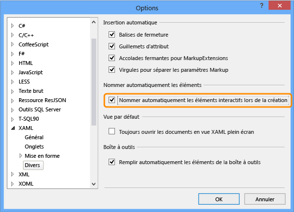  
  
2.  Créez un projet pour une application UWP en XAML en utilisant un modèle Visual C# ou Visual Basic.  
  
     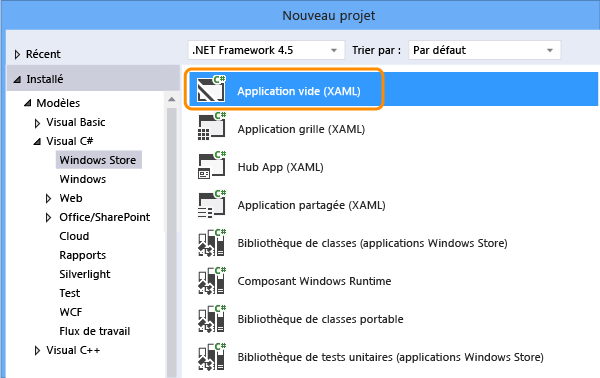  
  
3.  Dans l’Explorateur de solutions, ouvrez MainPage.xaml. Dans la barre d’outils, faites glisser un contrôle bouton et un contrôle textbox sur l’aire de conception.  
  
     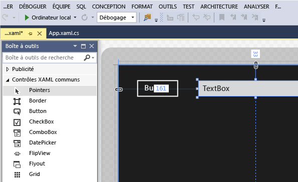  
  
4.  Double-cliquez sur le contrôle bouton et ajoutez le code suivant :  
  
    ```csharp  
    private void button_Click_1(object sender, RoutedEventArgs e)  
    {  
        this.textBox.Text = this.button.Name;  
    }  
  
    ```  
  
    ```vb  
    Public NotInheritable Class MainPage  
        Inherits Page  
  
        Private Sub button_Click(sender As Object, e As RoutedEventArgs) Handles Button.Click  
            Me.textBox.Text = Me.button.Name  
        End Sub  
    End Class  
    ```  
  
5.  Appuyez sur F5 pour exécuter votre application UWP.  
  
## <a name="create-and-run-a-coded-ui-test-for-the-uwp-app"></a>Créer et exécuter un test codé de l’interface utilisateur pour l’application UWP  

[Comment créer des tests codés de l’interface utilisateur pour les applications de plateforme Windows universelle (UWP) ?](#uwpapps)
  
1.  Créez un projet de test codé de l’interface utilisateur pour l’application UWP.  
  
     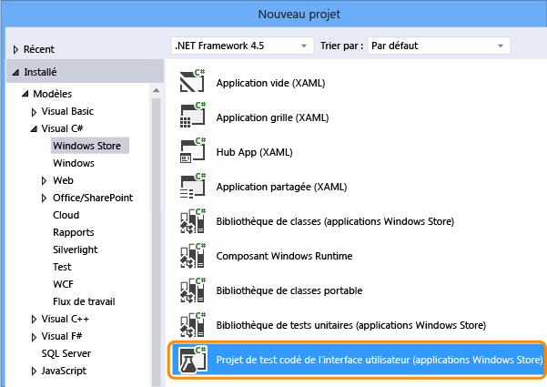  
  
2.  Choisissez de modifier le mappage d’IU à l’aide de la croix.  
  
     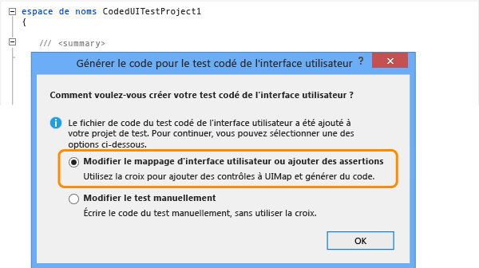  
  
3.  Utilisez la croix dans le Générateur de test codé de l’interface utilisateur pour sélectionner la vignette de l’application, cliquez avec le bouton droit sur **AutomationId** et choisissez **Copier la valeur dans le Presse-papiers**. La valeur dans le Presse-papiers sera utilisée ultérieurement pour l’écriture de l’action de lancement de l’application pour le test.  
  
     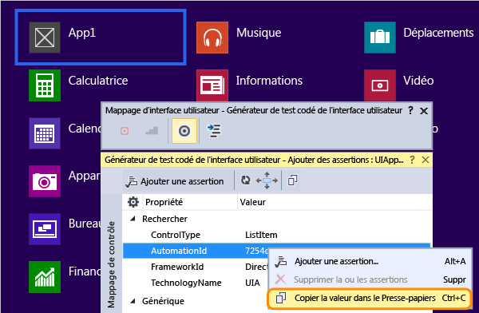  
  
4.  Dans l’application UWP en cours d’exécution, utilisez la croix pour sélectionner le contrôle bouton et le contrôle textbox. Après avoir ajouté chaque contrôle, choisissez le bouton **Ajouter le contrôle au mappage de contrôle d’interface utilisateur** dans la barre d’outils du Générateur de test codé de l’interface utilisateur.  
  
     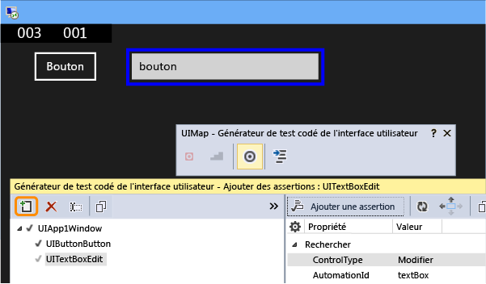  
  
5.  Choisissez le bouton **Générer le code** dans la barre d’outils du Générateur de test codé de l’interface utilisateur, puis choisissez **Générer** pour créer le code pour les modifications du mappage de contrôle d’interface utilisateur.  
  
     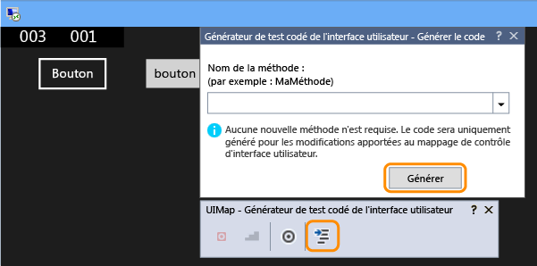  
  
6.  Choisissez le bouton pour définir une valeur dans le contrôle textbox.  
  
     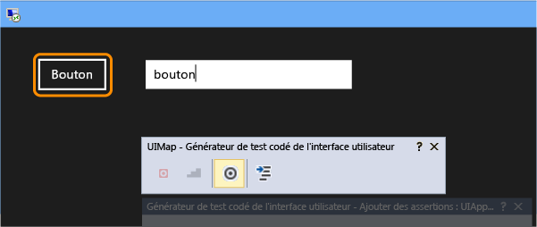  
  
7.  Utilisez la croix pour sélectionner le contrôle textbox, puis sélectionnez la propriété **Texte**.  
  
     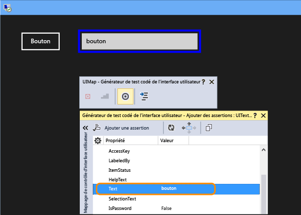  
  
8.  Ajoutez une assertion. Elle sera utilisée lors du test pour vérifier que la valeur est correcte.  
  
     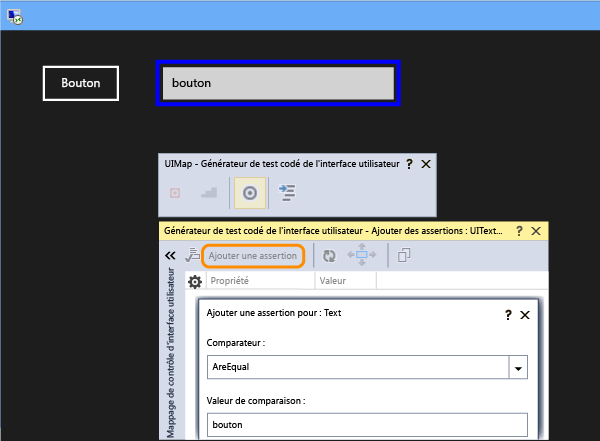  
  
9. Ajoutez et générez le code pour l’assertion.  
  
     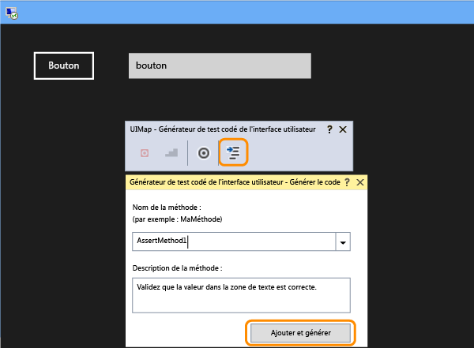  
  
10. **Visual C#**  
  
     Dans l’Explorateur de solutions, ouvrez le fichier UIMap.Designer.cs pour afficher le code ajouté pour la méthode assert et les contrôles.  
  
     **Visual Basic**  
  
     Dans l’Explorateur de solutions, ouvrez le fichier le code CodedUITest1.vb puis, dans le code de la méthode de test CodedUITestMethod1(), cliquez avec le bouton droit sur l’appel à la méthode d’assertion qui a été ajouté automatiquement `Me.UIMap.AssertMethod1()` et choisissez **Atteindre la définition**. Le fichier UIMap.Designer.vb s’ouvre dans l’éditeur de code, ce qui vous permet de voir le code ajouté pour la méthode assert et les contrôles.  
  
    > [!WARNING]
    >  Ne modifiez pas le fichier UIMap.Designer.cs ou UIMap.Designer.vb directement. Si vous le faites, les modifications apportées au fichier seront remplacées à chaque génération du test.  
  
     **Méthode Assert**  
  
    ```csharp  
    public void AssertMethod1()  
    {  
        #region Variable Declarations  
        XamlEdit uITextBoxEdit = this.UIApp1Window.UITextBoxEdit;  
        #endregion  
  
        // Verify that the 'Text' property of 'textBox' text box equals 'button'  
        Assert.AreEqual(this.AssertMethod3ExpectedValues.UITextBoxEditText, uITextBoxEdit.Text);  
    }  
    ```  
  
    ```vb  
    Public Sub AssertMethod1()  
        Dim uITextBoxEdit As XamlEdit = Me.UIApp2Window.UITextBoxEdit  
  
        'Verify that the 'Text' property of 'textBox' text box equals 'button'  
        Assert.AreEqual(Me.AssertMethod1ExpectedValues.UITextBoxEditText, uITextBoxEdit.Text)  
    End Sub  
    ```  
  
     **Contrôles**  
  
    ```csharp  
    #region Properties  
    public XamlButton UIButtonButton  
    {  
        get  
        {  
            if ((this.mUIButtonButton == null))  
            {  
                this.mUIButtonButton = new XamlButton(this);  
                #region Search Criteria  
                this.mUIButtonButton.SearchProperties[XamlButton.PropertyNames.AutomationId] = "button";  
                this.mUIButtonButton.WindowTitles.Add("App1");  
                #endregion  
            }  
            return this.mUIButtonButton;  
        }  
    }  
  
    public XamlEdit UITextBoxEdit  
    {  
        get  
        {  
            if ((this.mUITextBoxEdit == null))  
            {  
                this.mUITextBoxEdit = new XamlEdit(this);  
                #region Search Criteria  
                this.mUITextBoxEdit.SearchProperties[XamlEdit.PropertyNames.AutomationId] = "textBox";  
                this.mUITextBoxEdit.WindowTitles.Add("App1");  
                #endregion  
            }  
            return this.mUITextBoxEdit;  
        }  
    }  
    #endregion  
  
    #region Fields  
    private XamlButton mUIButtonButton;  
  
    private XamlEdit mUITextBoxEdit;  
    #endregion  
    ```  
  
    ```vb  
    #Region "Properties"  
    Public ReadOnly Property UIButtonButton() As XamlButton  
        Get  
            If (Me.mUIButtonButton Is Nothing) Then  
                Me.mUIButtonButton = New XamlButton(Me)  
                Me.mUIButtonButton.SearchProperties(XamlButton.PropertyNames.AutomationId) = "button"  
                Me.mUIButtonButton.WindowTitles.Add("App2")  
            End If  
            Return Me.mUIButtonButton  
        End Get  
    End Property  
  
    Public ReadOnly Property UITextBoxEdit() As XamlEdit  
        Get  
            If (Me.mUITextBoxEdit Is Nothing) Then  
                Me.mUITextBoxEdit = New XamlEdit(Me)  
                Me.mUITextBoxEdit.SearchProperties(XamlEdit.PropertyNames.AutomationId) = "textBox"  
                Me.mUITextBoxEdit.WindowTitles.Add("App2")  
            End If  
            Return Me.mUITextBoxEdit  
        End Get  
    End Property  
    #End Region  
  
    #Region "Fields"  
    Private mUIButtonButton As XamlButton  
  
    Private mUITextBoxEdit As XamlEdit  
    #End Region  
    ```  
  
11. Dans l’Explorateur de solutions, ouvrez le fichier CodedUITest1.cs ou CodedUITest1.vb. Vous pouvez maintenant ajouter du code à la méthode CodedUTTestMethod1 pour les actions nécessaires à l’exécution du test à l’aide des contrôles ajoutés à l’UIMap :  
  
    1.  Lancez l’application UWP en utilisant la propriété d’ID Automation que vous avez copiée précédemment dans le Presse-papiers :  
  
        ```csharp  
        XamlWindow.Launch("8ebca7c4-effe-4c86-9998-068daccee452_cyrqexqw8cc7c!App")  
        ```  
  
        ```vb  
        XamlWindow myAppWindow = XamlWindow.Launch("7254db3e-20a7-424e-8e05-7c4dabf4f28d_cyrqexqw8cc7c!App");  
        ```  
  
    2.  Ajoutez un mouvement pour appuyer sur le contrôle bouton :  
  
        ```csharp  
        Gesture.Tap(this.UIMap.UIApp1Window. UIButtonButton);  
        ```  
  
        ```vb  
        Gesture.Tap(Me.UIMap.UIApp2Window. UIButtonButton)  
        ```  
  
    3.  Vérifiez que l’appel à la méthode assert généré automatiquement se produit après le lancement de l’application et le mouvement d’appui sur le bouton :  
  
        ```csharp  
        this.UIMap.AssertMethod1();  
        ```  
  
        ```vb  
        Me.UIMap.AssertMethod1()  
        ```  
  
     Une fois le code ajouté, la méthode de test CodedUITestMethod1 doit ressembler à ce qui suit :  
  
    ```csharp  
    [TestMethod]  
    public void CodedUITestMethod1()  
    {  
        // To generate code for this test, select "Generate Code for Coded UI Test" from the shortcut menu and select one of the menu items.  
  
        // Launch the app.  
        XamlWindow myAppWindow = XamlWindow.Launch("7254db3e-20a7-424e-8e05-7c4dabf4f28d_cyrqexqw8cc7c!App");  
  
        // Tap the button.  
        Gesture.Tap(this.UIMap.UIApp1Window.UIButtonButton);  
  
        this.UIMap.AssertMethod1();  
    }  
    ```  
  
    ```vb  
    <CodedUITest(CodedUITestType.WindowsStore)>  
    Public Class CodedUITest1  
  
        <TestMethod()>  
        Public Sub CodedUITestMethod1()  
            '              
            ' To generate code for this test, select "Generate Code for Coded UI Test" from the shortcut menu and select one of the menu items.  
            '  
  
            ' Launch the app.  
            XamlWindow.Launch("8ebca7c4-effe-4c86-9998-068daccee452_cyrqexqw8cc7c!App")  
  
            '// Tap the button.  
            Gesture.Tap(Me.UIMap.UIApp2Window.UIButtonButton)  
  
            Me.UIMap.AssertMethod1()  
        End Sub  
    ```  
  
12. Générez votre test et exécutez-le à l’aide de l’Explorateur de tests.  
  
     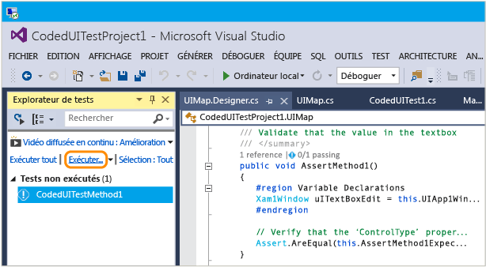  
  
     L’application UWP démarre, l’action d’appui sur le bouton est effectuée, et la propriété Texte du contrôle textbox est remplie et validée avec la méthode assert.  
  
     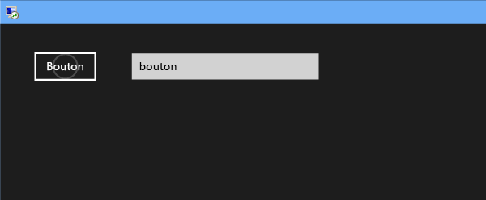  
  
     Une fois le test terminé, l’Explorateur de tests confirme que le test a réussi.  
  
     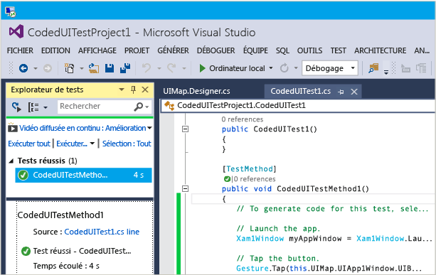  
  
## <a name="q--a"></a>Questions et réponses  
  
#### <a name="q-why-dont-i-see-the-option-to-record-my-coded-ui-test-in-the-generate-code-for-a-coded-ui-test-dialog"></a>Q : Pourquoi l’option d’enregistrement de mon test codé de l’interface utilisateur ne figure-t-elle pas dans la boîte de dialogue Générer le code pour le test codé de l’interface utilisateur ?**  
  
**R** : L’option d’enregistrement n’est pas prise en charge pour les applications UWP.  
  
#### <a name="q-can-i-create-a-coded-ui-test-for-my-uwp-apps-based-on-winjs"></a>Q : Puis-je créer un test codé de l’interface utilisateur pour mes applications UWP basées sur WinJS ?**  

**R**: Non, seules les applications XAML sont prises en charge.  
  
#### <a name="q-can-i-create-coded-ui-tests-for-my-uwp-apps-on-a-system-that-is-not-running-windows-81-or-windows-10"></a>Q : Puis-je créer des tests codés de l’interface utilisateur pour mes applications UWP sur un système qui n’exécute pas Windows 8.1 ou Windows 10 ?**  
  
**R**: non, les modèles Projet de test codé de l’interface utilisateur sont disponibles seulement sur Windows 8.1 et Windows 10. Pour créer l’automation pour les applications de plateforme Windows universelle, vous aurez besoin de Windows 10.  

<a name="uwpapps"></a>  
#### <a name="q-how-do-i-create-coded-ui-tests-for-universal-windows-platform-uwp-apps"></a>Q : Comment créer des tests codés de l’interface utilisateur pour les applications de plateforme Windows universelle ?**  
  
**R**: selon la plateforme où vous testez votre application de plateforme Windows universelle, créez le projet de test codé de l’interface utilisateur de l’une des façons suivantes :  
  
- Une application UWP s’exécutant sur un ordinateur local s’exécutera comme une application UWP. Pour tester, vous devez utiliser le modèle **Projet de test codé de l’interface utilisateur (Windows)** . Pour trouver ce modèle quand vous créez un projet, accédez au nœud **Windows**, **Universel** . Vous pouvez aussi accéder au nœud **Windows**, **Windows 8**, **Windows** .  
  
- Une application de plateforme Windows universelle s’exécutant sur un appareil mobile ou un émulateur s’exécutera comme une application Windows Phone. Pour tester, vous devez utiliser le modèle **Projet de test codé de l’interface utilisateur (Windows Phone)** . Pour trouver ce modèle quand vous créez un projet, accédez au nœud **Windows**, **Universel** . Vous pouvez aussi accéder au nœud **Windows**, **Windows 8**, **Windows Phone** .  
  
Une fois le projet créé, la création d’un test se fait de la même façon qu’auparavant.  
  
#### <a name="q-why-cant-i-modify-the-code-in-the-uimapdesigner-file"></a>Q : Pourquoi ne puis-je pas modifier le code du fichier UIMap.Designer ?**  
  
**R**: toutes les modifications de code que vous effectuez dans le fichier UIMapDesigner.cs sont remplacées chaque fois que vous générez du code dans UIMap - Générateur de test codé de l’interface utilisateur. Si vous devez modifier une méthode enregistrée, vous devez la copier dans le fichier UIMap.cs et la renommer. Le fichier UIMap.cs peut être utilisé pour remplacer les méthodes et les propriétés dans le fichier UIMapDesigner.cs. Vous devez supprimer la référence à la méthode d’origine dans le fichier Coded UITest.cs et la remplacer par le nom de la méthode renommée.  
  
## <a name="see-also"></a>Voir aussi  
 [Utiliser UI Automation pour tester votre code](../test/use-ui-automation-to-test-your-code.md)   
 [Définir une propriété Automation unique pour les contrôles UWP à des fins de test](../test/set-a-unique-automation-property-for-windows-store-controls-for-testing.md)
