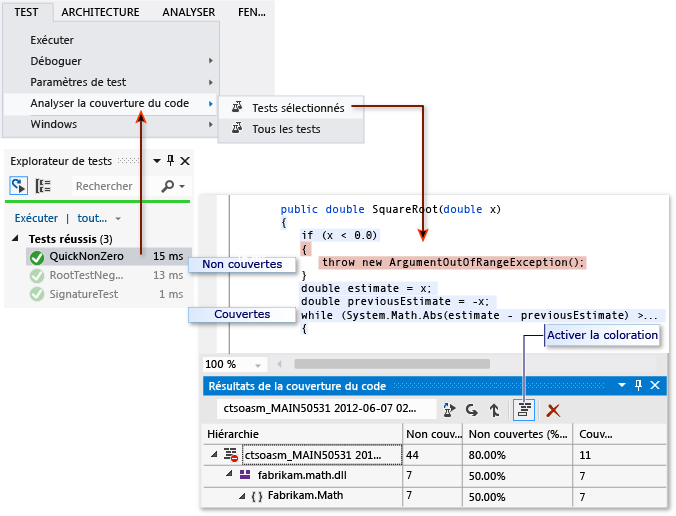

# Dépannage de la couverture du code
L'outil d'analyse de couverture du code dans Visual Studio collecte des données pour le code natif et les assemblys managés (fichiers .dll ou .exe). Toutefois, dans certains cas, la fenêtre Résultats de la couverture du code affiche une erreur semblable à « Des résultats vides ont été générés : … » Plusieurs raisons possibles expliquent pourquoi cela peut se produire. Cette rubrique est conçue pour aider à résoudre ces problèmes.  
  
## Ce que vous devriez voir  
 Si vous choisissez une commande **Analyser la couverture du code** dans le menu Test, et que la génération et les tests s’exécutent correctement, une liste de résultats doit s’afficher dans la fenêtre Couverture du code. Vous devrez peut-être développer les éléments pour afficher les détails.  
  
   
  
 Pour plus d’informations, consultez [Utilisation de la couverture du code pour déterminer la quantité de code testé](../test/using-code-coverage-to-determine-how-much-code-is-being-tested.md).  
  
## Raisons pouvant justifier qu'aucun résultat ne s'affichent, ou que seuls des résultats anciens s'affichent  
  
### Utilisez-vous l'édition appropriée de Visual Studio ?  
 Vous avez besoin de Visual Studio Enterprise.  
  
### Aucun test n'a été exécuté  
 Analyse  
 Vérifiez votre fenêtre de sortie. Dans la liste déroulante **Afficher la sortie à partir de**, choisissez **Tests**. Vérifiez si des avertissements ou des erreurs sont enregistrés.  
  
 Explication  
 L'analyse de la couverture du code est effectuée pendant l'exécution des tests. Elle inclut uniquement les assemblys chargés en mémoire lorsque les tests s'exécutent. Si aucun des tests n'est exécuté, la couverture du code n'a rien a signaler.  
  
 Résolution  
 Dans l’Explorateur de tests, choisissez **Exécuter tout** pour vérifier que l’exécution des tests a réussi. Corrigez toutes les erreurs avant d’utiliser **Analyser la couverture du code**.  
  
### Vous consultez un résultat antérieur  
 Lorsque vous modifiez et exécutez à nouveau vos tests, un résultat de couverture du code antérieur peut être visible, y compris la coloration du code de cette exécution antérieure.  
  
1.  Exécutez Analyser la couverture du code.  
  
2.  Vérifiez que vous avez sélectionné le jeu de résultats le plus récent dans la fenêtre Résultats de la couverture du code.  
  
### Les fichiers .pdb (symbole) ne sont pas disponibles  
 Analyse  
 Ouvrez le dossier cible de compilation (généralement le dossier bin\debug) et vérifiez que, pour chaque assembly, il existe un fichier .pdb dans le même répertoire que le fichier .dll ou .exe.  
  
 Explication  
 Le moteur de couverture du code requiert que chaque assembly possède son fichier .pdb associé accessible pendant l'exécution du test. S'il n'existe aucun fichier .pdb pour un assembly particulier, il ne sera pas analysé.  
  
 Le fichier .pdb doit être généré à partir de la même version que les fichiers .dll ou .exe.  
  
 Résolution  
 Vérifiez que vos paramètres de génération génèrent le fichier .pdb. Si les fichiers .pdb ne sont pas mis à jour quand le projet est généré, ouvrez les propriétés du projet, sélectionnez la page **Générer**, choisissez **Avancé** et examinez **Informations de débogage**.  
  
 Si les fichiers .pdb et .dll ou .exe sont dans des endroits différents, copiez le fichier .pdb dans le même dossier. Il est également possible de configurer le moteur de couverture du code pour rechercher les fichiers .pdb dans un autre emplacement. Pour plus d’informations, consultez [Personnalisation de l’analyse de couverture du code](../test/customizing-code-coverage-analysis.md).  
  
### À l'aide d'un fichier binaire instrumenté ou optimisé  
 Analyse  
 Déterminez si le fichier binaire a subi une forme d'optimisation avancée telle que l'Optimisation guidée par profil, ou s'il a été fourni par un outil de profilage tel que vsinstr.exe ou vsperfmon.exe.  
  
 Explication  
 Si un assembly a déjà été instrumenté ou optimisé par un autre outil de profilage, l'assembly est omis de l'analyse de couverture du code.  
  
 L'analyse de la couverture du code ne peut pas être exécutée sur ce type d'assemblys.  
  
 Résolution  
 Désactivez l'optimisation et utilisez une nouvelle build.  
  
### Le code n'est pas managé (.NET) ou le code est natif (C++)  
 Analyse  
 Vérifiez que vous exécutez des tests sur du code managé ou C++.  
  
 Explication  
 L'analyse de la couverture du code dans Visual Studio est uniquement disponible sur du code managé ou natif (C++). Si vous utilisez des outils tiers, une partie ou la totalité du code peut s'exécuter sur une plateforme différente.  
  
 Résolution  
 Aucune solution n'est disponible.  
  
### L'assembly a été installé par NGen  
 Analyse  
 Vérifiez que l'assembly n'est pas chargé à partir du cache des images natives.  
  
 Explication  
 Pour des raisons de performance, les assemblys d'image natives ne sont pas analysés. Pour plus d’informations, consultez [Ngen.exe (Native Image Generator)](/dotnet/framework/tools/ngen-exe-native-image-generator).  
  
 Résolution  
 Utilisez une version MSIL de l'assembly. Ne pas le traiter avec NGen.  
  
### Fichier personnalisé .runsettings comportant une syntaxe incorrecte  
 Analyse  
 Si vous utilisez un fichier .runsettings personnalisé, il peut contenir une erreur de syntaxe.  
  
 Cela empêche l'exécution de la couverture du code. Soit la fenêtre de couverture du code ne s'ouvre pas à l'issue de l'exécution du test, soit elle affiche d'anciens résultats.  
  
 Explication  
 Vous pouvez exécuter vos tests unitaires avec un fichier .runsettings personnalisé pour configurer des options de couverture du code. Les options vous permettent d'inclure ou d'exclure des fichiers. Pour plus d’informations, consultez [Personnalisation de l’analyse de couverture du code](../test/customizing-code-coverage-analysis.md).  
  
 Résolution  
 Il existe deux types d'erreurs possibles :  
  
-   **Erreur XML**  
  
     Ouvrez le fichier .runsettings dans l'éditeur XML de Visual Studio. Recherchez les indications des erreurs.  
  
-   **Erreur d’expressions régulières**  
  
     Chaque chaîne du fichier est une expression régulière. Vérifiez la présence d’erreurs pour chaque expression régulière. Recherchez en particulier :  
  
    -   Parenthèses non appariées (…) ou parenthèses sans séquence d’échappement \\(...\\). Si vous souhaitez faire correspondre une parenthèse dans la chaîne de recherche, vous devez l'échapper. Par exemple, pour faire correspondre à une fonction, utilisez : `.*MyFunction\(double\)`  
  
    -   Astérisque ou plus au début d'une expression. Pour faire correspondre à n'importe quelle chaîne de caractères, utilisez un point suivi d'un astérisque : `.*`  
  
### Fichier .runsettings personnalisé avec des exclusions non valides  
 Analyse  
 Si vous utilisez un fichier .runsettings personnalisé, assurez-vous qu'il inclut votre assembly.  
  
 Explication  
 Vous pouvez exécuter vos tests unitaires avec un fichier .runsettings personnalisé pour configurer des options de couverture du code. Les options vous permettent d'inclure ou d'exclure des fichiers. Pour plus d’informations, consultez [Personnalisation de l’analyse de couverture du code](../test/customizing-code-coverage-analysis.md).  
  
 Résolution  
 Supprimez tous les nœuds `Include` du fichier .runsettings, puis supprimez tous les nœuds `Exclude`. Si cela résout le problème, remettez-les en étapes.  
  
 Assurez-vous que le nœud DataCollectors spécifie la couverture du code. Comparez-le avec l’exemple dans [Personnalisation de l’analyse de la couverture du code](../test/customizing-code-coverage-analysis.md).  
  
## Du code est toujours affiché comme non couvert  
  
### Le code d'initialisation dans les DLL natives est exécuté avant instrumentation  
 Analyse  
 Dans le code natif lié statiquement, une partie de la fonction d’initialisation **DllMain** et le code qu’elle appelle est parfois affiché comme non couvert, même si le code a été exécuté.  
  
 Explication  
 L'outil de couverture du code fonctionne en insérant l'instrumentation dans un assembly juste avant que l'application commence à s'exécuter. Dans n’importe quel assembly chargé au préalable, le code d’initialisation dans **DllMain** s’exécute dès le chargement de l’assembly, et avant l’exécution de l’application. Ce code apparaîtra comme étant non couvert.  
  
 En général, cela s'applique aux assemblys chargés statiquement.  
  
 Résolution  
 Aucun.  
  
## Voir aussi  
 [Utilisation de la couverture du code pour déterminer la quantité de code testé](../test/using-code-coverage-to-determine-how-much-code-is-being-tested.md)
