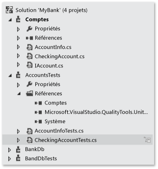
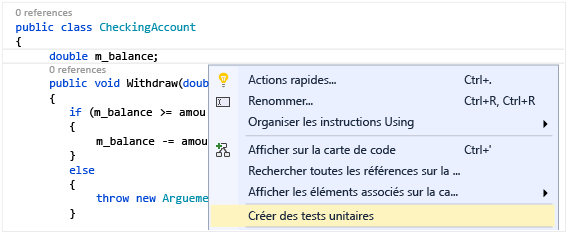
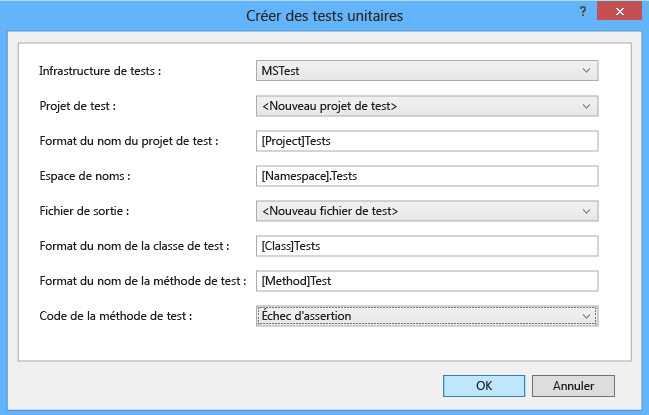
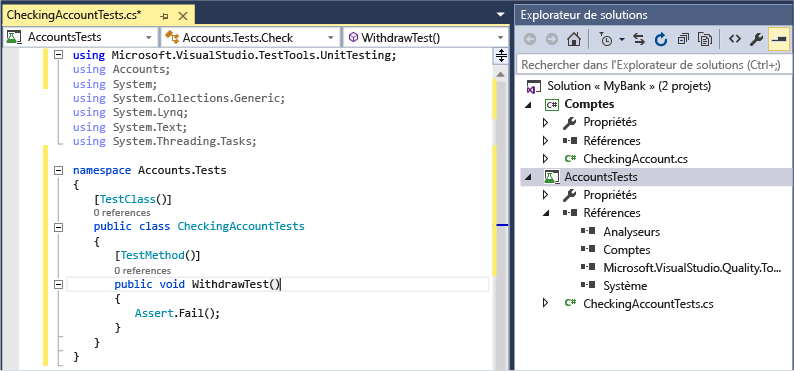
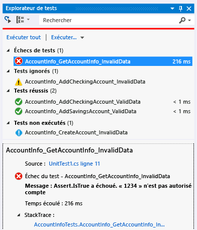
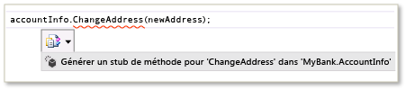
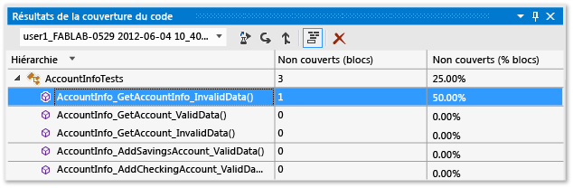

# <a name="unit-test-basics"></a>Notions de base des tests unitaires
Vérifiez que votre code fonctionne comme prévu en créant et en exécutant des tests unitaires. Un test unitaire consiste à décomposer les fonctionnalités de votre programme en comportements testables discrets que vous pouvez tester en tant qu’*unités* individuelles. L’explorateur de tests de Visual Studio offre un moyen souple et efficace d’exécuter vos tests unitaires et d’afficher leurs résultats dans Visual Studio. Visual Studio installe les infrastructures de tests unitaires Microsoft pour le code managé et le code natif. Utilisez une *infrastructure de tests unitaires* pour créer des tests unitaires, les exécuter et signaler les résultats de ces tests. Réexécutez des tests unitaires quand vous apportez des modifications pour vérifier que votre code fonctionne toujours correctement. Quand vous utilisez Visual Studio Enterprise, vous pouvez exécuter automatiquement des tests après chaque génération.  
  
 Les tests unitaires ont le plus d’effet sur la qualité du code quand ils font partie intégrante du flux de travail de votre développement logiciel. Dès que vous écrivez une fonction ou un autre bloc de code d’application, créez des tests unitaires pour vérifier le comportement du code en réponse aux cas standard, limite et incorrects des données d’entrée, ainsi que les hypothèses explicites ou implicites du code. Avec le *développement axé sur des tests*, comme vous créez les tests unitaires avant d’écrire le code, vous utilisez les tests unitaires comme documentation de conception et spécifications fonctionnelles.  
  
 Vous pouvez générer rapidement des projets de test et méthodes de test à partir de votre code, ou créer manuellement les tests quand vous le souhaitez. Quand vous utilisez IntelliTest pour explorer votre code .NET, vous pouvez générer des données de test et une suite de tests unitaires. Pour chaque instruction dans le code, une entrée de test est générée pour exécuter cette instruction. Découvrez comment [générer des tests unitaires pour votre code](http://msdn.microsoft.com/library/dn823749.aspx).  
  
 L’explorateur de tests peut également exécuter des infrastructures de tests unitaires tierces et open source ayant implémenté les interfaces des composants additionnels de l’explorateur de tests. Vous pouvez ajouter la plupart de ces frameworks dans le gestionnaire d’extensions de Visual Studio et la galerie Visual Studio. Consultez [Installer des frameworks de tests unitaires tiers](../test/install-third-party-unit-test-frameworks.md).  
  
-   [Démarrages rapides](#BKMK_Quick_starts)  
  
-   [Exemple de solution MyBank](#BKMK_The_MyBank_Solution_example)  
  
-   [Créer des projets de test unitaire et des méthodes de test](#BKMK_Creating_the_unit_test_projects)  
  
-   [Écrire vos tests](#BKMK_Writing_your_tests)  
  
-   [Exécuter des tests dans l’explorateur de tests](#BKMK_Running_tests_in_Test_Explorer)  
  
-   [Exécuter et afficher des tests](#BKMK_Running_and_viewing_tests_from_the_Test_Explorer_toolbar)  
  
##  <a name="BKMK_Unit_testing_overview"></a> Vue d’ensemble des tests unitaires  
  
###  <a name="BKMK_Quick_starts"></a> Démarrages rapides  
 Pour obtenir une introduction aux tests unitaires qui vous conduit directement dans le code, consultez l’une des rubriques suivantes :  
  
-   [Procédure pas à pas : création et exécution de tests unitaires pour le code managé](../test/walkthrough-creating-and-running-unit-tests-for-managed-code.md)  
  
-   [Démarrage rapide : développement piloté par les tests avec l’Explorateur de tests](../test/quick-start-test-driven-development-with-test-explorer.md)  
  
-   [Tests unitaires de code natif avec l’Explorateur de tests](http://msdn.microsoft.com/en-us/8a09d6d8-3613-49d8-9ffe-11375ac4736c)  
  
##  <a name="BKMK_The_MyBank_Solution_example"></a> Exemple de solution MyBank  
 Dans cette rubrique, nous utilisons comme exemple le développement d’une application fictive, appelée `MyBank` . Vous n’avez pas besoin du code réel pour suivre les explications fournies dans cette rubrique. Les méthodes de test sont écrites en C# et présentées à l’aide du framework de tests unitaires Microsoft pour le code managé. Cependant, les concepts peuvent être facilement transférés vers d’autres langages et frameworks.  
  
   
  
 Notre première tentative de conception de l’application `MyBank` inclut un composant Accounts (Comptes) qui représente un compte individuel et ses transactions avec la banque et un composant Database (Base de données) qui correspond à la fonction d’agrégation et de gestion des comptes individuels.  
  
 Nous créons une solution `MyBank` qui contient deux projets :  
  
-   `Accounts`  
  
-   `BankDb`  
  
 Notre première tentative de conception du projet `Accounts` comporte une classe destinée à détenir les informations de base d’un compte, une interface qui spécifie les fonctionnalités courantes de n’importe quel type de compte, comme le dépôt ou le retrait, et une classe dérivée de l’interface qui représente un compte courant. Nous commençons les projets Accounts (Comptes) en créant les fichiers sources suivants :  
  
-   `AccountInfo.cs` définit les informations de base d’un compte.  
  
-   `IAccount.cs` définit une interface `IAccount` standard pour un compte, y compris les méthodes pour déposer de l’argent sur un compte ou en retirer, et pour récupérer le solde du compte.  
  
-   `CheckingAccount.cs` contient la classe `CheckingAccount` qui implémente l’interface `IAccounts` d’un compte courant.  
  
 Nous savons par expérience qu’un retrait sur un compte courant doit s’assurer que le montant retiré est inférieur au solde du compte. Aussi, nous remplaçons la méthode `IAccount.Withdaw` de `CheckingAccount` par une méthode qui vérifie cette condition. La méthode peut ressembler à ceci :  
  
```csharp  
  
public void Withdraw(double amount)  
{  
    if(m_balance >= amount)  
    {  
        m_balance -= amount;  
    }  
    else  
    {  
        throw new ArgumentException(amount, "Withdrawal exceeds balance!")  
    }  
}  
  
```  
  
 Maintenant que nous avons le code, il est temps de le tester.  
  
##  <a name="BKMK_Creating_the_unit_test_projects"></a> Créer des projets de test unitaire et des méthodes de test  
 Il est souvent plus rapide de générer le projet de test unitaire et les stubs de test unitaire à partir de votre code. Vous pouvez également choisir de créer le projet de test unitaire et les tests manuellement selon vos besoins.  
  
 **Créer un projet de test unitaire et des stubs de test unitaire**  
  
1.  Dans la fenêtre de l’éditeur de code, cliquez avec le bouton droit et choisissez **Créer des tests unitaires** dans le menu contextuel.  
  
       
  
2.  Cliquez sur OK pour accepter les valeurs par défaut pour créer vos tests unitaires, ou modifiez les valeurs utilisées pour créer et nommer le projet de test unitaire et les tests unitaires. Vous pouvez sélectionner le code qui est ajouté par défaut aux méthodes de test unitaire.  
  
       
  
3.  Les stubs de test unitaire sont créés dans un nouveau projet de test unitaire pour toutes les méthodes dans la classe.  
  
       
  
4.  Poursuivez votre lecture pour savoir comment [ajouter du code aux méthodes de test unitaire](#BKMK_Writing_your_tests) et rendre votre test unitaire explicite, et des tests unitaires supplémentaires que vous pouvez ajouter pour tester votre code de manière approfondie.  
  
 **Créer le projet de test unitaire et les tests unitaires manuellement**  
  
 Un projet de test unitaire reflète généralement la structure d’un seul projet de code. Dans l’exemple MyBank, vous ajoutez deux projets de test unitaire nommés `AccountsTests` et `BankDbTests` à la solution `MyBanks` . Les noms des projets de test sont arbitraires, mais l’adoption d’une convention d’affectation de noms standard est une bonne idée.  
  
 **Pour ajouter un projet de test unitaire à une solution :**  
  
1.  Dans le menu **Fichier** , choisissez **Nouveau** , puis **Projet** (Ctrl+Maj+N).  
  
2.  Dans la boîte de dialogue Nouveau projet, développez le nœud **Installé** , choisissez le langage que vous voulez utiliser pour votre projet de test, puis sélectionnez **Test**.  
  
3.  Pour utiliser l’une des infrastructures de tests unitaires Microsoft, choisissez **Projet de test unitaire** dans la liste des modèles de projet. Sinon, choisissez le modèle de projet de l’infrastructure de tests unitaires que vous souhaitez utiliser. Pour tester le projet `Accounts` de notre exemple, vous devez le nommer `AccountsTests`.  
  
    > [!WARNING]
    >  Certaines infrastructures de tests unitaires tierces et open source ne fournissent pas de modèle de projet Visual Studio. Pour plus d’informations sur la création d’un projet, consultez la documentation relative à l’infrastructure.  
  
4.  Dans votre projet de test unitaire, ajoutez une référence au projet de code testé : le projet Accounts (Comptes) dans notre exemple.  
  
     Pour créer la référence au projet de code :  
  
    1.  Sélectionnez le projet dans l’Explorateur de solutions.  
  
    2.  Dans le menu **Projet** , choisissez **Ajouter une référence**.  
  
    3.  Dans la boîte de dialogue Gestionnaire de références, ouvrez le nœud **Solution** et choisissez **Projets**. Sélectionnez le nom du projet de code et fermez la boîte de dialogue.  
  
 Chaque projet de test unitaire contient les classes qui reflètent les noms des classes du projet de code. Dans notre exemple, le projet `AccountsTests` contient les classes suivantes :  
  
-   la classe`AccountInfoTests` contient les méthodes de test unitaire pour la classe `AccountInfo` du projet `BankAccount` ;  
  
-   la classe`CheckingAccountTests` contient les méthodes de test unitaire pour la classe `CheckingAccount` .  
  
##  <a name="BKMK_Writing_your_tests"></a> Écrire vos tests  
 L’infrastructure de tests unitaires que vous utilisez et Visual Studio IntelliSense vous guident lors de l’écriture du code des tests unitaires pour un projet de code. Pour s’exécuter dans l’explorateur de tests, la plupart des infrastructures nécessitent que vous ajoutiez des attributs spécifiques pour identifier les méthodes de test unitaire. Les infrastructures fournissent également un moyen, généralement par le biais d’instructions assert ou d’attributs de méthode, pour indiquer si la méthode de test a réussi ou échoué. D’autres attributs identifient les méthodes facultatives d’installation lors de l’initialisation des classes et avant chaque méthode de test, ainsi que les méthodes de démontage qui sont exécutées après chaque méthode de test et avant la destruction de la classe.  
  
 Le modèle AAA (Arrange, Act, Assert) est un moyen couramment utilisé pour écrire les tests unitaires d’une méthode testée.  
  
-   La section **Arrange** d’une méthode de test unitaire initialise les objets et définit la valeur des données transmises à la méthode testée.  
  
-   La section **Act** appelle la méthode testée avec les paramètres triés.  
  
-   La section **Assert** vérifie que l’action de la méthode testée se comporte comme prévu.  
  
 Pour tester la méthode `CheckingAccount.Withdraw` de notre exemple, nous pouvons écrire deux tests : l’un qui vérifie le comportement standard de la méthode et l’autre qui vérifie qu’un retrait supérieur au solde échouera. Dans la classe `CheckingAccountTests` , nous ajoutons les méthodes suivantes :  
  
```csharp  
[TestMethod]  
public void Withdraw_ValidAmount_ChangesBalance()  
{  
    // arrange  
    double currentBalance = 10.0;  
    double withdrawal = 1.0;  
    double expected = 9.0;  
    var account = new CheckingAccount("JohnDoe", currentBalance);  
    // act  
    account.Withdraw(withdrawal);  
    double actual = account.Balance;  
    // assert  
    Assert.AreEqual(expected, actual);  
}  
  
[TestMethod]  
[ExpectedException(typeof(ArgumentException))]  
public void Withdraw_AmountMoreThanBalance_Throws()  
{  
    // arrange  
    var account = new CheckingAccount("John Doe", 10.0);  
    // act  
    account.Withdraw(20.0);  
    // assert is handled by the ExpectedException  
}  
  
```  
  
 notez que `Withdraw_ValidAmount_ChangesBalance` utilise une instruction `Assert` explicite pour déterminer si la méthode de test réussit ou échoue, tandis que `Withdraw_AmountMoreThanBalance_Throws` utilise l’attribut `ExpectedException` pour déterminer la réussite de la méthode testée. En coulisses, une infrastructure de tests unitaires encapsule les méthodes de test dans les instructions try/catch. Dans la plupart des cas, si une exception est interceptée, la méthode de test échoue et l’exception est ignorée. L’attribut `ExpectedException` entraîne la réussite de la méthode de test si l’exception spécifiée est levée.  
  
 Pour plus d’informations sur les frameworks de tests unitaires Microsoft, consultez l’une des rubriques suivantes :  
  
-   [Écriture de tests unitaires pour le .NET Framework à l’aide du framework de tests unitaires Microsoft pour le code managé](../test/writing-unit-tests-for-the-dotnet-framework-with-the-microsoft-unit-test-framework-for-managed-code.md)  
  
-   [Écriture de tests unitaires pour C/C++ à l’aide du framework de tests unitaires Microsoft pour C++](../test/writing-unit-tests-for-c-cpp-with-the-microsoft-unit-testing-framework-for-cpp.md)  
  
## <a name="set-timeouts-for-unit-tests"></a>Définir des délais d’attente pour les tests unitaires  
 Pour définir un délai d’attente sur une méthode de test :  
  
```csharp  
[TestMethod]  
[Timeout(2000)]  // Milliseconds  
public void My_Test()  
{ ...  
}  
```  
  
```vb  
  
```  
  
 Pour affecter au délai d’attente la valeur maximale autorisée :  
  
```csharp  
[TestMethod]  
[Timeout(TestTimeout.Infinite)]  // Milliseconds  
public void My_Test ()  
{ ...  
}  
```  
  
##  <a name="BKMK_Running_tests_in_Test_Explorer"></a> Exécuter des tests dans l’explorateur de tests  
 Quand vous générez le projet de test, les tests s’affichent dans l’explorateur de tests. Si l’explorateur de tests n’est pas visible, sélectionnez **Test** dans le menu Visual Studio et choisissez **Fenêtres**, puis **Explorateur de tests**.  
  
   
  
 Tandis que vous exécutez, écrivez et réexécutez vos tests, par défaut l’explorateur de tests affiche les résultats par groupes : **Échecs de tests**, **Tests réussis**, **Tests ignorés** et **Tests non exécutés**. Vous pouvez choisir un en-tête de groupe pour ouvrir la vue qui affiche tous les tests de ce groupe.  
  
 Vous pouvez également filtrer les tests de n’importe quelle vue sur le texte de la zone de recherche au niveau global ou en sélectionnant l’un des filtres prédéfinis. Vous pouvez exécuter une sélection des tests à tout moment. Les résultats d’une série de tests sont immédiatement visibles dans la barre réussite/échec en haut de la fenêtre de l’explorateur. Les détails d’un résultat de méthode de test sont affichés quand vous sélectionnez le test.  
  
###  <a name="BKMK_Running_and_viewing_tests_from_the_Test_Explorer_toolbar"></a> Exécuter et afficher des tests  
 La barre d’outils de l’explorateur de tests vous permet de découvrir, d’organiser et d’exécuter les tests qui vous intéressent.  
  
   
  
 Vous pouvez choisir **Exécuter tout** pour exécuter tous vos tests ou **Exécuter** pour sélectionner un sous-ensemble de tests à exécuter. Après que vous avez exécuté un ensemble de tests, un résumé de la série de tests s’affiche en bas de la fenêtre Explorateur de tests. Sélectionnez un test pour en afficher les détails dans le volet inférieur. Choisissez **Ouvrir un test** dans le menu contextuel (ou F12) pour afficher le code source du test sélectionné.  
  
 Si les tests individuels n’ont aucune dépendance qui les empêche d’être exécutés dans n’importe quel ordre, activez l’exécution parallèle des tests avec le bouton bascule  dans la barre d’outils. Cela peut réduire sensiblement le temps nécessaire pour exécuter tous les tests.  
  
###  <a name="BKMK_Running_tests_after_every_build"></a> Exécuter des tests après chaque génération  
  
> [!WARNING]
>  L’exécution de tests unitaires après chaque génération est prise en charge uniquement dans Visual Studio Enterprise.  
  
|||  
|-|-|  
||Pour exécuter vos tests unitaires après chaque génération locale, choisissez **Test** dans le menu standard, puis **Exécuter les tests après la génération** dans la barre d’outils de l’explorateur de tests.|  
  
###  <a name="BKMK_Filtering_and_grouping_the_test_list"></a> Regrouper et filtrer la liste de tests  
 Quand vous avez un grand nombre de tests, vous pouvez entrer une chaîne dans la zone de recherche de l’explorateur de tests pour filtrer la liste sur la chaîne spécifiée. Vous pouvez limiter votre filtre encore plus en choisissant parmi la liste des filtres.  
  
   
  
|||  
|-|-|  
||Pour regrouper vos tests par catégorie, choisissez le bouton **Grouper par** .|  
  
 Pour plus d’informations, consultez [Exécuter des tests unitaires avec l’Explorateur de tests](../test/run-unit-tests-with-test-explorer.md).  
  
## <a name="qa"></a>Questions et réponses  
 **Q : Comment déboguer des tests unitaires ?**  
  
 **R :** Utilisez l’explorateur de tests pour démarrer une session de débogage de vos tests. L’exécution pas à pas de votre code avec le débogueur Visual Studio vous conduit de manière transparente à des allers et retours entre les tests unitaires et le projet testé. Pour démarrer le débogage :  
  
1.  Dans l’éditeur Visual Studio, définissez un point d’arrêt dans une ou plusieurs méthodes de test que vous souhaitez déboguer.  
  
    > [!NOTE]
    >  Comme les méthodes de test peuvent s’exécuter dans n’importe quel ordre, définissez les points d’arrêt dans toutes les méthodes de test que vous souhaitez déboguer.  
  
2.  Dans l’explorateur de tests, sélectionnez les méthodes de test, puis choisissez **Déboguer les tests sélectionnés** dans le menu contextuel.  
  
 En savoir plus sur le [débogage des tests unitaires](../debugger/debugging-in-visual-studio.md).  
  
 **Q : Si j’utilise le développement axé sur des tests, comment générer du code à partir de mes tests ?**  
  
 **R :** Utilisez IntelliSense pour générer des classes et méthodes dans votre code de projet. Écrivez une instruction dans une méthode de test qui appelle la classe ou la méthode que vous souhaitez générer, puis ouvrez le menu IntelliSense dans le cadre de l’appel. Si l’appel concerne un constructeur de la nouvelle classe, choisissez **Générer un nouveau type** dans le menu et suivez l’Assistant pour insérer la classe dans votre projet de code. Si l’appel concerne une méthode, choisissez **Générer une nouvelle méthode** à partir du menu IntelliSense.  
  
   
  
 **Q : Puis-je créer des tests unitaires qui utilisent plusieurs groupes de données en entrée pour exécuter le test ?**  
  
 **R :** Oui. Les*méthodes de test pilotées par les données* vous permettent de tester une plage de valeurs avec une méthode de test unitaire unique. Utilisez un attribut `DataSource` pour la méthode de test qui spécifie la source de données et la table contenant les valeurs des variables que vous voulez tester.  Dans le corps de la méthode, vous affectez les valeurs de ligne aux variables à l’aide de l’indexeur `TestContext.DataRow[`*ColumnName*`]` .  
  
> [!NOTE]
>  Ces procédures s’appliquent uniquement aux méthodes de test que vous écrivez à l’aide du framework de tests unitaires Microsoft pour le code managé. Si vous utilisez un autre framework, consultez sa documentation pour obtenir des fonctionnalités équivalentes.  
  
 Par exemple, supposons que nous ajoutions une méthode superflue à la classe `CheckingAccount` nommée `AddIntegerHelper`. `AddIntegerHelper` ajoute deux entiers.  
  
 Pour créer un test piloté par les données pour la méthode `AddIntegerHelper` , nous créons d’abord une base de données Access intitulée `AccountsTest.accdb` et une table nommée `AddIntegerHelperData`. La table `AddIntegerHelperData` définit les colonnes pour spécifier les premier et deuxième opérandes de l’addition, et une colonne pour spécifier le résultat attendu. Nous remplissons un certain nombre de lignes avec les valeurs appropriées.  
  
```csharp  
  
[DataSource(  
    @"Provider=Microsoft.ACE.OLEDB.12.0;Data Source=C:\Projects\MyBank\TestData\AccountsTest.accdb",   
    "AddIntegerHelperData"  
)]  
[TestMethod()]  
public void AddIntegerHelper_DataDrivenValues_AllShouldPass()  
{  
    var target = new CheckingAccount();  
    int x = Convert.ToInt32(TestContext.DataRow["FirstNumber"]);  
    int y = Convert.ToInt32(TestContext.DataRow["SecondNumber"]);   
    int expected = Convert.ToInt32(TestContext.DataRow["Sum"]);  
    int actual = target.AddIntegerHelper(x, y);  
    Assert.AreEqual(expected, actual);  
}  
  
```  
  
 La méthode attribuée s’exécute une fois pour chaque ligne de la table. L’explorateur de tests indique un échec du test de la méthode si l’une des itérations échoue. Le volet Détails des résultats du test de la méthode vous indique le statut réussite/échec pour chaque ligne de données.  
  
 En savoir plus sur les [tests unitaires pilotés par les données](../test/how-to-create-a-data-driven-unit-test.md).  
  
 **Q : Puis-je afficher la quantité de code testée par mes tests unitaires ?**  
  
 **R :** Oui. Vous pouvez déterminer la quantité de code qui est réellement testée par vos tests unitaires à l’aide de l’outil de couverture du code Visual Studio. Les langages natifs et managés ainsi que toutes les infrastructures de tests unitaires qui peuvent être exécutés par l’infrastructure de tests unitaires sont pris en charge.  
  
 Vous pouvez exécuter la couverture de code sur les tests sélectionnés ou sur tous les tests d’une solution. La fenêtre Résultats de la couverture du code affiche le pourcentage des blocs du code du produit qui ont été testés par ligne, fonction, classe, espace de noms et module.  
  
 Pour exécuter la couverture du code pour les méthodes de test dans une solution, choisissez **Tests** dans le menu Visual Studio, puis **Analyser la couverture du code**.  
  
 Les résultats de la couverture apparaissent dans la fenêtre Résultats de la couverture du code.  
  
   
  
 Découvrez plus en détail la [couverture du code](../test/using-code-coverage-to-determine-how-much-code-is-being-tested.md).  
  
 **Q : Comment puis-je tester des méthodes de mon code qui ont des dépendances externes ?**  
  
 **R :** Oui. Si vous disposez de Visual Studio Enterprise, Microsoft Fakes peut être utilisé avec les méthodes de test que vous écrivez à l’aide des infrastructures de tests unitaires pour le code managé.  
  
 Microsoft Fakes utilise deux approches pour créer des classes de substitution pour les dépendances externes.  
  
1.  Les*stubs* génèrent des classes de substitution dérivées de l’interface parente de la classe de dépendance cible. Les méthodes stub peuvent être remplacées par des méthodes virtuelles publiques de la classe cible.  
  
2.  Les*shims* utilisent l’instrumentation du runtime pour rediriger les appels à une méthode cible vers une méthode shim de substitution pour les méthodes non virtuelles.  
  
 Dans les deux approches, vous utilisez les délégués générés des appels à la méthode de dépendance pour spécifier le comportement souhaité dans la méthode de test.  
  
 En savoir plus sur l’ [isolement des méthodes de test unitaire avec Microsoft Fakes](../test/isolating-code-under-test-with-microsoft-fakes.md).  
  
 **Q : Puis-je utiliser d’autres infrastructures de tests unitaires pour créer des tests unitaires ?**  
  
 **R :** Oui, suivez ces étapes pour [rechercher et installer d’autres infrastructures](../test/install-third-party-unit-test-frameworks.md). Après le redémarrage de Visual Studio, rouvrez votre solution pour créer vos tests unitaires, puis sélectionnez vos frameworks installés ici :  
  
   
  
 Vos stubs de test unitaire seront créés à l’aide du framework sélectionné.

