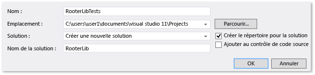
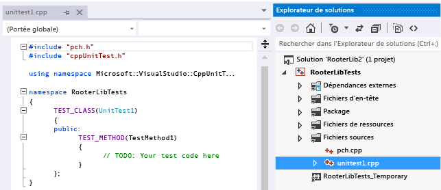
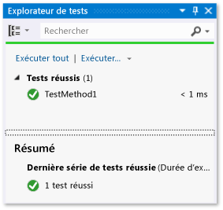
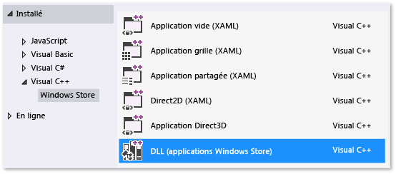
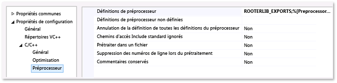
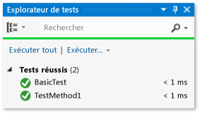
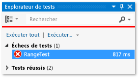
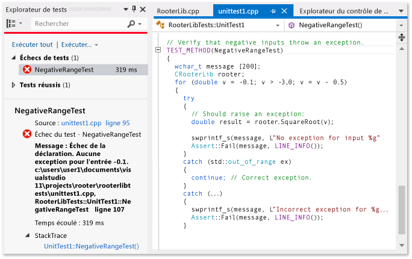
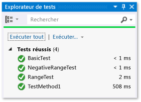

# <a name="how-to-test-a-c-dll"></a>Comment tester une DLL C++

Cette rubrique décrit une manière de créer des tests unitaires pour une DLL C++ destinée à des applications de plateforme Windows universelle (UWP) avec le framework de test Microsoft pour C++. La DLL RooterLib illustre de vagues souvenirs de la théorie de limite du calcul en implémentant une fonction qui calcule une estimation de la racine carrée d'un nombre donné. La DLL peut ensuite être incluse dans une application UWP pour montrer à l’utilisateur les choses amusantes qu’il est possible de faire avec les mathématiques.

Cette rubrique vous montre comment utiliser les tests unitaires comme première étape du développement. Dans cette approche, vous écrivez d'abord une méthode de test qui vérifie un comportement spécifique dans le système que vous testez, puis vous écrivez le code qui réussit le test. En modifiant l'ordre des procédures suivantes, vous pouvez inverser cette stratégie de manière à écrire d'abord le code que vous souhaitez tester, puis à écrire les tests unitaires.

Cette rubrique crée également une solution Visual Studio unique et des projets distincts pour les tests unitaires et la DLL que vous souhaitez tester. Vous pouvez également inclure les tests unitaires directement dans le projet DLL, ou vous pouvez créer des solutions distinctes pour les tests unitaires et la DLL. Consultez la page [Ajout de tests unitaires aux applications C++ existantes](../test/how-to-use-microsoft-test-framework-for-cpp.md) pour obtenir des conseils sur la structure à utiliser.

## <a name="create-the-solution-and-the-unit-test-project"></a><a name="Create_the_solution_and_the_unit_test_project"></a> Créer la solution et le projet de test unitaire

::: moniker range=">=vs-2019"

Commencez par créer un projet de test. Dans le menu **Fichier**, choisissez **Nouveau** > **Projet**. Dans la boîte de dialogue **Créer un projet**, tapez « test » dans la zone de recherche, puis définissez **Langage** sur C++. Choisissez ensuite **Application de tests unitaires (Windows universel)** dans la liste des modèles de projet.

   

::: moniker-end

::: moniker range="vs-2017"

Commencez par créer un projet de test. Dans le menu **Fichier**, choisissez **Nouveau** > **Projet**. Dans la boîte de dialogue **Nouveau projet**, développez **Installé** > **Visual C++**, puis choisissez **Windows universel**. Choisissez ensuite **Application de tests unitaires (Windows universel)** dans la liste des modèles de projet.

::: moniker-end

1. Dans la boîte de dialogue Nouveau projet, développez **Installé** > **Visual C++**, puis choisissez **Windows universel**. Choisissez ensuite **Application de tests unitaires (Windows universel)** dans la liste des modèles de projet.

2. Nommez le projet `RooterLibTests`, spécifiez l’emplacement, nommez la solution `RooterLib`, puis vérifiez que la case **Créer le répertoire pour la solution** est cochée.

     

3. Dans le nouveau projet, ouvrez **unittest1.cpp**.

     

     Sachez que :

    - Chaque test est défini à l'aide de `TEST_METHOD(YourTestName){...}`.

         Vous n'avez pas à écrire une signature de fonction classique. La signature est créée par la macro TEST_METHOD. La macro génère une fonction d'instance qui retourne void. Elle génère également une fonction statique qui retourne des informations sur la méthode de test. Ces informations permettent à l'Explorateur de tests de trouver la méthode.

    - Les méthodes de test sont regroupées en classes à l'aide de `TEST_CLASS(YourClassName){...}`.

         Lorsque les tests sont exécutés, une instance de chaque classe de test est créée. Les méthodes de test sont appelées dans un ordre non défini. Vous pouvez définir des méthodes spéciales qui sont appelées avant et après chaque module, classe ou méthode. Pour plus d’informations, consultez [Utilisation de Microsoft.VisualStudio.TestTools.CppUnitTestFramework](how-to-use-microsoft-test-framework-for-cpp.md).

## <a name="verify-that-the-tests-run-in-test-explorer"></a><a name="Verify_that_the_tests_run_in_Test_Explorer"></a> Vérifier que les tests s’exécutent dans l’Explorateur de tests

1. Insérez le code de test :

    ```cpp
    TEST_METHOD(TestMethod1)
    {
        Assert::AreEqual(1,1);
    }
    ```

     Notez que la classe `Assert` fournit plusieurs méthodes statiques que vous pouvez utiliser pour vérifier les résultats dans les méthodes de test.

2. Dans le menu **Test**, choisissez **Exécuter**, puis **Exécuter tout**.

     Le projet de test est généré et exécuté. La fenêtre **Explorateur de tests** s’affiche et le test est listé sous **tests réussis**. Le volet **Résumé** en bas de la fenêtre fournit des détails supplémentaires sur le test sélectionné.

     

## <a name="add-the-dll-project-to-the-solution"></a><a name="Add_the_DLL_project_to_the_solution"></a> Ajouter le projet DLL à la solution

::: moniker range=">=vs-2019"

Dans **l’Explorateur de solutions**, choisissez le nom de la solution. Dans le menu contextuel, choisissez **Ajouter**, puis **Nouveau projet**. Dans la boîte de dialogue **Ajouter un nouveau projet**, définissez **Langage** sur C++ et tapez « DLL » dans la zone de recherche. Dans la liste des résultats, choisissez **Application de test unitaire (Windows universelle - C++/CX)**.


::: moniker-end

::: moniker range="vs-2017"
Dans **l’Explorateur de solutions**, choisissez le nom de la solution. Dans le menu contextuel, choisissez **Ajouter**, puis **Nouveau projet**.



::: moniker-end

1. Dans la boîte de dialogue **Ajouter un nouveau projet**, choisissez **DLL (applications UWP)**.

2. Ajoutez le code suivant au fichier *RooterLib.h* :

    ```cpp
    // The following ifdef block is the standard way of creating macros which make exporting
    // from a DLL simpler. All files within this DLL are compiled with the ROOTERLIB_EXPORTS
    // symbol defined on the command line. This symbol should not be defined on any project
    // that uses this DLL. This way any other project whose source files include this file see
    // ROOTERLIB_API functions as being imported from a DLL, whereas this DLL sees symbols
    // defined with this macro as being exported.
    #ifdef ROOTERLIB_EXPORTS
    #define ROOTERLIB_API  __declspec(dllexport)
    #else
    #define ROOTERLIB_API __declspec(dllimport)
    #endif //ROOTERLIB_EXPORTS

    class ROOTERLIB_API CRooterLib {
    public:
        CRooterLib(void);
        double SquareRoot(double v);
    };
    ```

     Les commentaires expliquent la signification du bloc ifdef non seulement au développeur de la DLL, mais aussi à toute personne qui référence la DLL dans son projet. Vous pouvez ajouter le symbole ROOTERLIB_EXPORTS à la ligne de commande en utilisant les propriétés du projet de la DLL.

     La classe `CRooterLib` déclare un constructeur et la méthode d'estimation `SqareRoot`.

3. Ajoutez le symbole ROOTERLIB_EXPORTS à la ligne de commande.

    1. Dans **l’Explorateur de solutions**, choisissez le projet **RooterLib**, puis **Propriétés** dans le menu contextuel.

         

    2. Dans la boîte de dialogue **Page de propriétés de RooterLib**, développez **Propriétés de configuration**, **C++**, puis choisissez **Préprocesseur**.

    3. Choisissez dans **\<Edit...>** la liste **définitions de préprocesseur** , puis ajoutez `ROOTERLIB_EXPORTS` dans la boîte de dialogue Définitions de **préprocesseur** .

4. Ajoutez des implémentations minimales des fonctions déclarées. Ouvrez *RooterLib.cpp*, puis ajoutez le code suivant :

    ```cpp
    // constructor
    CRooterLib::CRooterLib()
    {
    }

    // Find the square root of a number.
    double CRooterLib::SquareRoot(double v)
    {
        return 0.0;
    }

    ```

## <a name="make-the-dll-functions-visible-to-the-test-code"></a><a name="make_the_dll_functions_visible_to_the_test_code"></a> Rendre les fonctions DLL visibles par le code de test

1. Ajoutez RooterLib au projet RooterLibTests.

   1. Dans **l’Explorateur de solutions**, choisissez le projet **RooterLibTests**, puis **Ajouter** > **Référence** dans le menu contextuel.

   1. Dans la boîte de dialogue **Ajouter une référence**, choisissez **Projets**. Sélectionnez ensuite l’élément **RouterLib**.

2. Incluez le fichier d’en-tête RooterLib dans *unittest1.cpp*.

   1. Ouvrez *unittest1.cpp*.

   2. Ajoutez le code suivant sous la ligne `#include "CppUnitTest.h"` :

       ```cpp
       #include "..\RooterLib\RooterLib.h"
       ```

3. Ajoutez un test qui utilise la fonction importée. Ajoutez le code suivant à *UnitTest1. cpp*:

   ```cpp
   TEST_METHOD(BasicTest)
   {
       CRooterLib rooter;
       Assert::AreEqual(
           // Expected value:
           0.0,
           // Actual value:
           rooter.SquareRoot(0.0),
           // Tolerance:
           0.01,
           // Message:
           L"Basic test failed",
           // Line number - used if there is no PDB file:
           LINE_INFO());
   }
   ```

4. Générez la solution.

    Le nouveau test s’affiche dans l' **Explorateur de tests** dans le nœud **tests non exécutés** .

5. Dans l' **Explorateur de tests**, choisissez **exécuter tout**.

    

   Vous avez configuré le test et les projets de code, et vérifié que vous pouviez exécuter des tests exécutant les fonctions du projet de code. Maintenant, vous pouvez commencer à écrire le code et les tests réels.

## <a name="iteratively-augment-the-tests-and-make-them-pass"></a><a name="Iteratively_augment_the_tests_and_make_them_pass"></a> Augmenter itérativement les tests et les faire passer

1. Ajoutez un nouveau test :

    ```cpp
    TEST_METHOD(RangeTest)
    {
        CRooterLib rooter;
        for (double v = 1e-6; v < 1e6; v = v * 3.2)
        {
            double expected = v;
            double actual = rooter.SquareRoot(v*v);
            double tolerance = expected/1000;
            Assert::AreEqual(expected, actual, tolerance);
        }
    };
    ```

    > [!TIP]
    > Nous vous recommandons de ne pas modifier les tests ayant réussi. Ajoutez à la place un nouveau test, mettez à jour le code afin que le test réussisse, puis ajoutez un autre test, et ainsi de suite.
    >
    > Lorsque vos utilisateurs modifient leurs spécifications, désactivez les tests qui ne sont plus corrects. Écrivez de nouveaux tests et utilisez-les l'un après l'autre, de la même façon incrémentielle.

2. Dans l' **Explorateur de tests**, choisissez **exécuter tout**.

3. Le test échoue.

     

    > [!TIP]
    > Vérifiez que chaque test échoue immédiatement après que vous l'avez écrit. Vous évitez ainsi de commettre l'erreur d'écrire un test qui n'échoue jamais.

4. Améliorez le code testé afin que le nouveau test réussisse. Ajoutez ce qui suit à *RooterLib.cpp* :

    ```cpp
    #include <math.h>
    ...
    // Find the square root of a number.
    double CRooterLib::SquareRoot(double v)
    {
        double result = v;
        double diff = v;
        while (diff > result/1000)
        {
            double oldResult = result;
            result = result - (result*result - v)/(2*result);
            diff = abs (oldResult - result);
        }
        return result;
    }

    ```

5. Générez la solution, puis, dans l' **Explorateur de tests**, choisissez **exécuter tout**.

     Les deux tests réussissent.

> [!TIP]
> Développez le code en ajoutant les tests individuellement. Assurez-vous que tous les tests réussissent après chaque itération.

## <a name="debug-a-failing-test"></a><a name="Debug_a_failing_test"></a> Déboguer un test ayant échoué

1. Ajoutez un autre test à *unittest1.cpp* :

   ```cpp
   // Verify that negative inputs throw an exception.
    TEST_METHOD(NegativeRangeTest)
    {
      wchar_t message[200];
      CRooterLib rooter;
      for (double v = -0.1; v > -3.0; v = v - 0.5)
      {
        try
        {
          // Should raise an exception:
          double result = rooter.SquareRoot(v);

          swprintf_s(message, L"No exception for input %g", v);
          Assert::Fail(message, LINE_INFO());
        }
        catch (std::out_of_range ex)
        {
          continue; // Correct exception.
        }
        catch (...)
        {
          swprintf_s(message, L"Incorrect exception for %g", v);
          Assert::Fail(message, LINE_INFO());
        }
      }
   };
   ```

2. Dans l' **Explorateur de tests**, choisissez **exécuter tout**.

    Le test échoue. Choisissez le nom du test dans l' **Explorateur de tests**. L'échec d'assertion est mis en surbrillance. Le message d’échec est visible dans le volet d’informations de l' **Explorateur de tests**.

    

3. Pour voir pourquoi le test échoue, parcourez la fonction :

   1. Définissez un point d'arrêt au début de la fonction `SquareRoot`.

   2. Dans le menu contextuel du test ayant échoué, choisissez **Déboguer les tests sélectionnés**.

        Lorsque l'exécution s'arrête au point d'arrêt, parcourez le code.

   3. Ajoutez du code à *RooterLib.cpp* pour intercepter l’exception :

       ```cpp
       #include <stdexcept>
       ...
       double CRooterLib::SquareRoot(double v)
       {
           //Validate the input parameter:
           if (v < 0.0)
           {
             throw std::out_of_range("Can't do square roots of negatives");
           }
       ...

       ```

   1. Dans l' **Explorateur de tests**, choisissez **exécuter tout** pour tester la méthode corrigée et assurez-vous que vous n’avez pas introduit une régression.

   Toutes les tests réussissent maintenant.

   

## <a name="refactor-the-code-without-changing-tests"></a><a name="Refactor_the_code_without_changing_tests"></a> Refactoriser le code sans modifier les tests

1. Simplifiez le calcul central dans la fonction `SquareRoot` :

    ```csharp
    // old code
    //result = result - (result*result - v)/(2*result);
    // new code
    result = (result + v/result) / 2.0;
    ```

2. Choisissez **Exécuter tout** pour tester la méthode refactorisée et vérifier que vous n’avez pas introduit une régression.

    > [!TIP]
    > Un ensemble stable de tests unitaires corrects est l'assurance que vous n'avez pas créé de bogues lors de la modification du code.
    >
    > Maintenez la refactorisation distincte des autres modifications.
