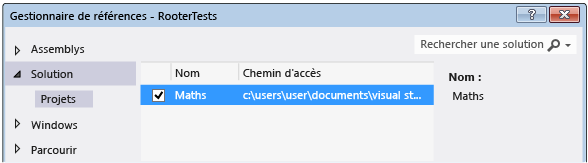

# <a name="unit-test-c-code"></a>Test unitaire du code C#

Cet article décrit une méthode permettant de créer des tests unitaires pour une classe C# dans une application UWP.

La classe **racine** , qui est la classe testée, implémente une fonction qui calcule une estimation de la racine carrée d’un nombre donné.

Cet article illustre le *développement piloté par les tests*. Dans cette approche, vous écrivez d’abord un test qui vérifie un comportement spécifique dans le système que vous testez, puis vous écrivez le code qui réussit le test.

## <a name="create-the-solution-and-the-unit-test-project"></a>Créer la solution et le projet de test unitaire

1. Dans le menu **Fichier**, choisissez **Nouveau** > **Projet**.

2. Recherchez et sélectionnez le modèle de projet **Application vide (Windows universel)**.

3. Nommez les **maths**du projet.

4. Dans **Explorateur de solutions**, cliquez avec le bouton droit sur la solution et choisissez **Ajouter**  >  **nouveau projet**.

5. Recherchez et sélectionnez le modèle de projet **Application de tests unitaires (Windows universel)**.

6. Nommez le projet de test **RooterTests**.

## <a name="verify-that-the-tests-run-in-test-explorer"></a>Vérifier l'exécution des tests dans l'explorateur de tests

1. Insérez du code de test dans **TestMethod1** dans le fichier *UnitTest.cs* :

   ```csharp
   [TestMethod]
   public void TestMethod1()
   {
       Assert.AreEqual(0, 0);
   }
   ```

   La <xref:Microsoft.VisualStudio.TestTools.UnitTesting.Assert> classe fournit plusieurs méthodes statiques que vous pouvez utiliser pour vérifier les résultats dans les méthodes de test.

::: moniker range="vs-2017"

2. Dans le menu **Test**, choisissez **Exécuter** > **Tous les tests**.

::: moniker-end

::: moniker range=">=vs-2019"

2. Dans le menu **test** , choisissez **exécuter tous les tests**.

::: moniker-end

   Le projet de test est généré et exécuté. Soyez patient, car cela peut prendre un peu de temps. La fenêtre **Explorateur de tests** s’affiche et le test est listé sous **tests réussis**. Le volet **Résumé** en bas de la fenêtre fournit des détails supplémentaires sur le test sélectionné.

## <a name="add-the-rooter-class-to-the-maths-project"></a>Ajouter la classe Rooter au projet Maths

1. Dans **Explorateur de solutions**, cliquez avec le bouton droit sur le projet **maths** , puis choisissez **Ajouter**une  >  **classe**.

2. Nommez le fichier de classe *Rooter.cs*.

3. Ajoutez le code suivant au fichier *Rooter.cs* de classe **racine** :

   ```csharp
   public Rooter()
   {
   }

   // estimate the square root of a number
   public double SquareRoot(double x)
   {
       return 0.0;
   }
   ```

   La classe **racine** déclare un constructeur et la méthode d’estimateur de **SquareRoot** . La méthode **SquareRoot** n’est qu’une implémentation minimale, juste assez pour tester la structure de base de la configuration des tests.

4. Ajoutez le `public` mot clé à la déclaration de classe du **rooteur** afin que le code de test puisse y accéder.

   ```csharp
   public class Rooter
   ```

## <a name="add-a-project-reference"></a>Ajouter une référence au projet

1. Ajoutez une référence du projet RooterTests à l’application maths.

    1. Dans **Explorateur de solutions**, cliquez avec le bouton droit sur le projet **RooterTests** , puis choisissez **Ajouter**une  >  **référence**.

    2. Dans la boîte de dialogue **Ajouter une référence - RooterTests**, développez **Solution**, puis choisissez **Projets**. Sélectionnez le projet **maths** .

        

2. Ajoutez une `using` instruction au fichier *UnitTest.cs* :

    1. Ouvrez *UnitTest.cs*.

    2. Ajoutez le code suivant sous la ligne `using Microsoft.VisualStudio.TestTools.UnitTesting;` :

       ```csharp
       using Maths;
       ```

3. Ajoutez un test qui utilise la fonction **Rooter** . Ajoutez le code suivant à *UnitTest.cs*:

   ```csharp
   [TestMethod]
   public void BasicTest()
   {
       Maths.Rooter rooter = new Rooter();
       double expected = 0.0;
       double actual = rooter.SquareRoot(expected * expected);
       double tolerance = .001;
       Assert.AreEqual(expected, actual, tolerance);
   }
   ```

   Le nouveau test s’affiche dans l' **Explorateur de tests** dans le nœud **tests non exécutés** .

4. Pour éviter une erreur « la charge utile contient deux fichiers ou plus avec le même chemin de destination », dans **Explorateur de solutions**, développez le nœud **Propriétés** sous le projet **maths** , puis supprimez le fichier *Default.rd.xml* .

::: moniker range="vs-2017"

6. Dans l' **Explorateur de tests**, choisissez **exécuter tout**.

   La solution est générée et les tests sont exécutés et réussis.

   

::: moniker-end

::: moniker range=">=vs-2019"

6. Dans l' **Explorateur de tests**, choisissez **exécuter tous les tests**.

   La solution est générée et les tests sont exécutés et réussis.

   

::: moniker-end

Vous avez configuré les projets de test et d’application et vérifié que vous pouvez exécuter des tests qui appellent des fonctions dans le projet d’application. Maintenant, vous pouvez commencer à écrire le code et les tests réels.

## <a name="iteratively-augment-the-tests-and-make-them-pass"></a>Augmenter itérativement les tests et les faire réussir

1. Ajoutez un nouveau test appelé **rangetest a échoué**:

   ```csharp
   [TestMethod]
   public void RangeTest()
   {
       Rooter rooter = new Rooter();
       for (double v = 1e-6; v < 1e6; v = v * 3.2)
       {
           double expected = v;
           double actual = rooter.SquareRoot(v*v);
           double tolerance = expected/1000;
           Assert.AreEqual(expected, actual, tolerance);
       }
   }
   ```

   > [!TIP]
   > Nous vous recommandons de ne pas modifier les tests ayant réussi. Ajoutez un nouveau test à la place.

2. Exécutez le test **rangetest a échoué** et assurez-vous qu’il échoue.

   

   > [!TIP]
   > Immédiatement après avoir écrit un test, exécutez-le pour vérifier qu’il échoue. Vous évitez ainsi de commettre l'erreur d'écrire un test qui n'échoue jamais.

3. Améliorez le code testé afin que le nouveau test réussisse. Remplacez la fonction **SquareRoot** dans *Rooter.cs* par ce qui suit :

   ```csharp
   public double SquareRoot(double x)
   {
       double estimate = x;
       double diff = x;
       while (diff > estimate / 1000)
       {
           double previousEstimate = estimate;
           estimate = estimate - (estimate * estimate - x) / (2 * estimate);
           diff = Math.Abs(previousEstimate - estimate);
       }
       return estimate;
   }
   ```

::: moniker range="vs-2017"

4. Dans l' **Explorateur de tests**, choisissez **exécuter tout**.

::: moniker-end

::: moniker range=">=vs-2019"

4. Dans l' **Explorateur de tests**, choisissez **exécuter tous les tests**.

::: moniker-end

   Les trois tests réussissent maintenant.

> [!TIP]
> Développez le code en ajoutant les tests individuellement. Assurez-vous que tous les tests réussissent après chaque itération.

## <a name="refactor-the-code"></a>Refactoriser le code

Dans cette section, vous refactorisez à la fois l’application et le code de test, puis réexécutez les tests pour vous assurer qu’ils réussissent encore.

### <a name="simplify-the-square-root-estimation"></a>Simplifier l’estimation de la racine carrée

1. Simplifiez le calcul central dans la fonction **SquareRoot** en modifiant une ligne de code, comme suit :

    ```csharp
    // Old code
    //estimate = estimate - (estimate * estimate - x) / (2 * estimate);

    // New code
    estimate = (estimate + x/estimate) / 2.0;
    ```

2. Exécutez tous les tests pour vous assurer que vous n’avez pas introduit une régression. Ils doivent tous réussir.

> [!TIP]
> Un ensemble stable de tests unitaires corrects est l'assurance que vous n'avez pas créé de bogues lors de la modification du code.

### <a name="eliminate-duplicated-code"></a>Éliminer le code dupliqué

La méthode **rangetest a échoué** code en dur le dénominateur de la variable de *tolérance* qui est transmise à la <xref:Microsoft.VisualStudio.TestTools.UnitTesting.Assert> méthode. Si vous envisagez d’ajouter des tests supplémentaires qui utilisent le même calcul de tolérance, l’utilisation d’une valeur codée en dur dans plusieurs emplacements rend le code plus difficile à gérer.

1. Ajoutez une méthode d’assistance privée à la classe **UnitTest1** pour calculer la valeur de tolérance, puis appelez cette méthode à partir de **rangetest a échoué**.

    ```csharp
    private double ToleranceHelper(double expected)
    {
        return expected / 1000;
    }

    ...

    [TestMethod]
    public void RangeTest()
    {
        ...
        // Old code
        // double tolerance = expected/1000;

        // New code
        double tolerance = ToleranceHelper(expected);
    }
    ...
    ```

2. Exécutez **rangetest a échoué** pour vous assurer qu’il est toujours transmis.

> [!TIP]
> Si vous ajoutez une méthode d’assistance à une classe de test et que vous ne souhaitez pas qu’elle apparaisse dans l' **Explorateur de tests**, n’ajoutez pas l' <xref:Microsoft.VisualStudio.TestTools.UnitTesting.TestMethodAttribute> attribut à la méthode.

## <a name="see-also"></a>Voir aussi

- [Procédure pas à pas : développement piloté par les tests à l’aide de l’Explorateur de tests](quick-start-test-driven-development-with-test-explorer.md)
