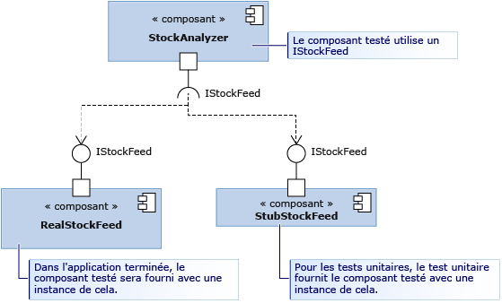

# <a name="using-stubs-to-isolate-parts-of-your-application-from-each-other-for-unit-testing"></a>Utilisation de stubs pour isoler des parties de votre application les unes des autres pour des tests unitaires
Les *types de stub* représentent l’une des deux technologies fournies par le framework Microsoft Fakes pour vous permettre d’isoler facilement un composant que vous testez d’autres composants appelés. Un stub est une petite partie de code qui remplace un autre composant pendant les tests. L'utilisation d'un stub présente l'avantage de retourner des résultats cohérents, ce qui rend le test plus facile à écrire. Vous pouvez également effectuer des tests même si les autres composants ne fonctionnent pas encore.  
  
 Pour obtenir une vue d’ensemble et un guide de démarrage rapide de Fakes, consultez [Isolation du code sous test avec Microsoft Fakes](../test/isolating-code-under-test-with-microsoft-fakes.md).  
  
 Pour utiliser les stubs, vous devez écrire votre composant de manière à ce qu'il utilise uniquement des interfaces, et non classes, pour faire référence à d'autres parties de l'application. Il s'agit d'une pratique de conception efficace, car elle apporte des modifications dans une partie dans laquelle il est moins probable que des modifications soient nécessaires. Pour le test, elle vous permet de remplacer un stub pour un composant réel.  
  
 Dans le schéma, le composant StockAnalyzer est celui que nous souhaitons tester. Il utilise normalement un autre composant, RealStockFeed. Cependant, RealStockFeed retourne des résultats différents chaque fois que les méthodes sont appelées, ce qui rend difficile le test de StockAnalyzer.  Pendant le test, nous le remplaçons par une classe différente, StubStockFeed.  
  
   
  
 Les stubs comptent sur votre capacité à structurer votre code de cette manière. C'est pour cela que vous utilisez généralement les stubs pour isoler une partie de votre application des autres parties. Pour l'isoler des autres assemblys qui ne sont pas sous votre contrôle, comme System.dll, il utilise généralement des shims. Consultez [Utilisation de shims pour isoler votre application des autres assemblys pour des tests unitaires](../test/using-shims-to-isolate-your-application-from-other-assemblies-for-unit-testing.md).  
  
 **Spécifications**  
  
-   Visual Studio Enterprise  
  
## <a name="in-this-topic"></a>Dans cette rubrique  
  
-   [Comment utiliser les stubs](#how)  
  
    -   [Concevoir l’injection de dépendance](#Dependency)  
  
    -   [Générer les stubs](#GeneratingStubs)  
  
    -   [Écrire votre test avec les stubs](#WriteTest)  
  
    -   [Vérifier les valeurs de paramètre](#mocks)  
  
-   [Stubs pour différents types de membres de type](../test/using-stubs-to-isolate-parts-of-your-application-from-each-other-for-unit-testing.md#BKMK_Stub_basics)  
  
    -   [Méthodes](../test/using-stubs-to-isolate-parts-of-your-application-from-each-other-for-unit-testing.md#BKMK_Methods)  
  
    -   [Propriétés](../test/using-stubs-to-isolate-parts-of-your-application-from-each-other-for-unit-testing.md#BKMK_Properties)  
  
    -   [Événements](../test/using-stubs-to-isolate-parts-of-your-application-from-each-other-for-unit-testing.md#BKMK_Events)  
  
    -   [Méthodes génériques](../test/using-stubs-to-isolate-parts-of-your-application-from-each-other-for-unit-testing.md#BKMK_Generic_methods)  
  
    -   [Stubs de classes virtuelles](../test/using-stubs-to-isolate-parts-of-your-application-from-each-other-for-unit-testing.md#BKMK_Partial_stubs)  
  
-   [Stubs de débogage](../test/using-stubs-to-isolate-parts-of-your-application-from-each-other-for-unit-testing.md#BKMK_Debugging_stubs)  
  
-   [Limitations du stub](../test/using-stubs-to-isolate-parts-of-your-application-from-each-other-for-unit-testing.md#BKMK_Stub_limitation)  
  
-   [Modifier le comportement par défaut des stubs](../test/using-stubs-to-isolate-parts-of-your-application-from-each-other-for-unit-testing.md#BKMK_Changing_the_default_behavior_of_stubs)  
  
##  <a name="How"></a> Comment utiliser les stubs  
  
###  <a name="Dependency"></a> Concevoir l’injection de dépendance  
 Pour utiliser les stubs, votre application doit être conçue afin que les différents composants ne dépendent pas des autres, mais uniquement des définitions d'interface. Au lieu d'être couplés au moment de la compilation, les composants sont connectés au moment de l'exécution. Ce modèle permet de concevoir un logiciel fiable et facile à mettre à jour, car les modifications ont tendance à ne pas se propager sur les limites de composant. Nous vous recommandons de suivre les instructions suivantes même si vous n’utilisez pas de stubs. Si vous écrivez du nouveau code, il est facile de suivre le modèle d’[injection de dépendances](http://en.wikipedia.org/wiki/Dependency_injection). Si vous écrivez des tests pour un logiciel existant, vous devrez peut-être le refactoriser. S'il s'avère peu pratique, vous pouvez envisager d'utiliser des shims.  
  
 Commençons cette discussion avec un exemple motivant, celui du schéma. La classe StockAnalyzer lit le cours de l'action et génère des résultats intéressants. Elle comporte des méthodes publiques que nous souhaitons tester. Pour ne pas compliquer les choses, examinons seulement l’une de ces méthodes, une méthode très simple qui indique le prix actuel d’une action particulière. Nous souhaitons écrire un test unitaire de cette méthode. Voici la première ébauche de test :  
  
```csharp  
[TestMethod]  
public void TestMethod1()  
{  
    // Arrange:  
    var analyzer = new StockAnalyzer();  
    // Act:  
    var result = analyzer.GetContosoPrice();  
    // Assert:  
    Assert.AreEqual(123, result); // Why 123?  
}  
```  
  
```vb  
<TestMethod()> Public Sub TestMethod1()  
    ' Arrange:  
    Dim analyzer = New StockAnalyzer()  
    ' Act:  
    Dim result = analyzer.GetContosoPrice()  
    ' Assert:  
    Assert.AreEqual(123, result) ' Why 123?  
End Sub  
```  
  
 L'un des problèmes que présente ce test saute immédiatement aux yeux : le cours des actions varie, ce qui entraînera en général l'échec de l'assertion.  
  
 Le fait que le composant StockFeed, qui est utilisé par StockAnalyzer, soit encore en développement peut également présenter un problème. Voici la première ébauche du code de la méthode testée :  
  
```csharp  
public int GetContosoPrice()  
{  
    var stockFeed = new StockFeed(); // NOT RECOMMENDED  
    return stockFeed.GetSharePrice("COOO");  
}  
```  
  
```vb  
Public Function GetContosoPrice()  
    Dim stockFeed = New StockFeed() ' NOT RECOMMENDED  
    Return stockFeed.GetSharePrice("COOO")  
End Function  
```  
  
 Telle quelle, il est possible que cette méthode ne puisse pas compiler ou qu'elle lève une exception, car le travail sur la classe StockFeed n'est pas encore terminé.  
  
 L'injection de l'interface résout ces deux problèmes.  
  
 L'injection de l'interface applique la règle suivante :  
  
-   Le code de tous les composants de votre application ne doit jamais explicitement faire référence à une classe d'un autre composant, que ce soit dans une déclaration ou dans une instruction `new`. Au lieu de cela, les variables et les paramètres doivent être déclarés avec des interfaces. Les instances de composant doivent être créées uniquement par le conteneur du composant.  
  
     Dans ce cas, le terme « composant » signifie une classe ou un groupe de classes que vous développez et mettez à jour ensemble. En général, un composant est le code dans un projet Visual Studio. Il est moins important de séparer des classes dans un composant, car elles sont mises à jour simultanément.  
  
     Il n'est également pas aussi important de séparer vos composants des classes d'une plateforme relativement stable, par exemple System.dll. Écrire des interfaces pour toutes ces classes encombrerait votre code.  
  
 Le code de StockAnalyzer peut donc être amélioré en le séparant de StockFeed à l'aide d'une interface, de la manière suivante :  
  
```csharp  
public interface IStockFeed  
{  
    int GetSharePrice(string company);  
}  
  
public class StockAnalyzer  
{  
    private IStockFeed stockFeed;  
    public Analyzer(IStockFeed feed)  
    {  
        stockFeed = feed;  
    }  
    public int GetContosoPrice()  
    {  
        return stockFeed.GetSharePrice("COOO");  
    }  
}  
```  
  
```vb  
Public Interface IStockFeed  
    Function GetSharePrice(company As String) As Integer  
End Interface  
  
Public Class StockAnalyzer  
    ' StockAnalyzer can be connected to any IStockFeed:  
    Private stockFeed As IStockFeed  
    Public Sub New(feed As IStockFeed)  
        stockFeed = feed  
    End Sub    
    Public Function GetContosoPrice()  
        Return stockFeed.GetSharePrice("COOO")  
    End Function  
End Class  
  
```  
  
 Dans cet exemple, une implémentation d'un IStockFeed est passée à StockAnalyzer lorsque IStockFeed est créé. Dans l'application terminée, le code d'initialisation doit exécuter la connexion :  
  
```  
analyzer = new StockAnalyzer(new StockFeed())  
```  
  
 Il existe des méthodes plus flexibles pour exécuter cette connexion. Par exemple, StockAnalyzer peut accepter un objet de fabrique qui peut instancier des implémentations différentes de IStockFeed dans différentes conditions.  
  
###  <a name="GeneratingStubs"></a> Générer les stubs  
 Vous avez séparé la classe que vous souhaitez tester des autres composants utilisés. En plus de rendre l'application plus fiable et plus flexible, la séparation vous permet de connecter le composant testé à des implémentations de stub des interfaces à des fins de test.  
  
 Vous pouvez simplement écrire les stubs en tant que classes, comme à l'accoutumée. Cependant, Microsoft Fakes vous offre un moyen plus dynamique de créer le stub le plus approprié pour chaque test.  
  
 Pour utiliser les stubs, vous devez d'abord générer des types de stub à partir des définitions de l'interface.  
  
##### <a name="adding-a-fakes-assembly"></a>Ajouter un assembly Fakes  
  
1.  Dans l’Explorateur de solutions, développez les **Références** de votre projet de test unitaire.  
  
    -   Si vous utilisez Visual Basic, vous devez sélectionner **Afficher tous les fichiers** dans la barre d’outils de l’Explorateur de solutions pour afficher la liste de références.  
  
2.  Sélectionnez l'assembly qui contient les définitions de l'interface pour laquelle vous souhaitez créer des stubs.  
  
3.  Dans le menu contextuel, choisissez **Ajouter un assembly Fakes**.  
  
###  <a name="WriteTest"></a> Écrire votre test avec les stubs  
  
```csharp  
[TestClass]  
class TestStockAnalyzer  
{  
    [TestMethod]  
    public void TestContosoStockPrice()  
    {  
      // Arrange:  
  
        // Create the fake stockFeed:  
        IStockFeed stockFeed =   
             new StockAnalysis.Fakes.StubIStockFeed() // Generated by Fakes.  
                 {  
                     // Define each method:  
                     // Name is original name + parameter types:  
                     GetSharePriceString = (company) => { return 1234; }  
                 };  
  
        // In the completed application, stockFeed would be a real one:  
        var componentUnderTest = new StockAnalyzer(stockFeed);  
  
      // Act:  
        int actualValue = componentUnderTest.GetContosoPrice();  
  
      // Assert:  
        Assert.AreEqual(1234, actualValue);  
    }  
    ...  
}  
```  
  
```vb  
<TestClass()> _  
Class TestStockAnalyzer  
  
    <TestMethod()> _  
    Public Sub TestContosoStockPrice()  
        ' Arrange:  
        ' Create the fake stockFeed:  
        Dim stockFeed As New StockAnalysis.Fakes.StubIStockFeed  
        With stockFeed  
            .GetSharePriceString = Function(company)  
                                       Return 1234  
                                   End Function  
        End With  
        ' In the completed application, stockFeed would be a real one:  
        Dim componentUnderTest As New StockAnalyzer(stockFeed)  
        ' Act:  
        Dim actualValue As Integer = componentUnderTest.GetContosoPrice  
        ' Assert:  
        Assert.AreEqual(1234, actualValue)  
    End Sub  
End Class  
  
```  
  
 Ici, l'aspect le plus magique est la classe `StubIStockFeed`. Pour chaque type public de l'assembly référencé, le mécanisme Microsoft Fakes génère une classe stub. Le nom de la classe stub est dérivé du nom de l'interface, précédé de "`Fakes.Stub`", et auquel sont ajoutés les noms de types de paramètre.  
  
 Les stubs sont également générés pour les accesseurs Get et les méthodes setter de propriétés, les événements et les méthodes génériques.  
  
###  <a name="mocks"></a> Vérifier les valeurs de paramètre  
 Vous pouvez vérifier cela lorsque votre composant fait un appel à un autre composant : il passe les valeurs correctes. Vous pouvez placer une assertion dans le stub ou stocker la valeur et la vérifier dans le corps principal du test. Exemple :  
  
```csharp  
[TestClass]  
class TestMyComponent  
{  
  
    [TestMethod]  
    public void TestVariableContosoPrice()  
    {  
     // Arrange:  
        int priceToReturn;  
        string companyCodeUsed;  
        var componentUnderTest = new StockAnalyzer(new StubIStockFeed()  
            {  
               GetSharePriceString = (company) =>   
                  {   
                     // Store the parameter value:  
                     companyCodeUsed = company;  
                     // Return the value prescribed by this test:  
                     return priceToReturn;  
                  };  
            };  
        // Set the value that will be returned by the stub:  
        priceToReturn = 345;  
  
     // Act:  
        int actualResult = componentUnderTest.GetContosoPrice();  
  
     // Assert:  
        // Verify the correct result in the usual way:  
        Assert.AreEqual(priceToReturn, actualResult);  
  
        // Verify that the component made the correct call:  
        Assert.AreEqual("COOO", companyCodeUsed);  
    }  
...}  
  
```  
  
```vb  
<TestClass()> _  
Class TestMyComponent  
    <TestMethod()> _  
    Public Sub TestVariableContosoPrice()  
        ' Arrange:  
        Dim priceToReturn As Integer  
        Dim companyCodeUsed As String = ""  
        Dim stockFeed As New StockAnalysis.Fakes.StubIStockFeed()  
        With stockFeed  
            ' Implement the interface's method:  
            .GetSharePriceString = _  
                Function(company)  
                    ' Store the parameter value:  
                    companyCodeUsed = company  
                    ' Return a fixed result:  
                    Return priceToReturn  
                End Function  
        End With  
        ' Create an object to test:  
        Dim componentUnderTest As New StockAnalyzer(stockFeed)  
        ' Set the value that will be returned by the stub:  
        priceToReturn = 345  
  
        ' Act:  
        Dim actualResult As Integer = componentUnderTest.GetContosoPrice()  
  
        ' Assert:  
        ' Verify the correct result in the usual way:  
        Assert.AreEqual(priceToReturn, actualResult)  
        ' Verify that the component made the correct call:  
        Assert.AreEqual("COOO", companyCodeUsed)  
    End Sub  
...  
End Class  
```  
  
##  <a name="BKMK_Stub_basics"></a> Stubs pour différents types de membres de type  
  
###  <a name="BKMK_Methods"></a> Méthodes  
 Comme indiqué dans l'exemple, les méthodes peuvent être extraites en liant un délégué à une instance de la classe stub. Le nom du type de stub est dérivé des noms de la méthode et des paramètres. Par exemple, pour l'interface `IMyInterface` et la méthode `MyMethod`suivantes :  
  
```csharp  
// application under test  
interface IMyInterface   
{  
    int MyMethod(string value);  
}  
```  
  
 Nous lions un stub à `MyMethod` qui retourne toujours 1 :  
  
```csharp  
// unit test code  
  var stub = new StubIMyInterface ();  
  stub.MyMethodString = (value) => 1;  
  
```  
  
 Si vous ne fournissez pas de stub pour une fonction, Microsoft Fakes génère une fonction qui retourne la valeur par défaut du type de retour. Pour les nombres, la valeur par défaut est 0, et pour les types de classe cette valeur est `null` (C#) ou `Nothing` (Visual Basic).  
  
###  <a name="BKMK_Properties"></a> Propriétés  
 Les accesseurs Get et Set de propriété sont exposés en tant que délégués distincts et peuvent être extraits séparément. Considérez par exemple la propriété `Value` de `IMyInterface` :  
  
```csharp  
// code under test  
interface IMyInterface   
{  
    int Value { get; set; }  
}  
  
```  
  
 Nous joignons des délégués aux accesseurs Get et Set de `Value` pour simuler une propriété automatique :  
  
```csharp  
// unit test code  
int i = 5;  
var stub = new StubIMyInterface();  
stub.ValueGet = () => i;  
stub.ValueSet = (value) => i = value;  
  
```  
  
 Si vous ne fournissez pas les méthodes stub pour l'accesseur Set ou l'accesseur Get d'une propriété, Microsoft Fakes génère un stub qui stocke les valeurs, afin que la propriété stub fonctionne comme une simple variable.  
  
###  <a name="BKMK_Events"></a> Événements  
 Les événements sont exposés en tant que champs délégués. Par conséquent, tout événement extrait peut être déclenché simplement en appelant le champ de stockage d'événements. Prenons l’interface suivante pour un stub :  
  
```csharp  
// code under test  
interface IWithEvents   
{  
    event EventHandler Changed;  
}  
```  
  
 Pour déclencher l'événement `Changed`, nous appelons simplement le délégué de stockage :  
  
```csharp  
// unit test code  
  var withEvents = new StubIWithEvents();  
  // raising Changed  
  withEvents.ChangedEvent(withEvents, EventArgs.Empty);  
  
```  
  
###  <a name="BKMK_Generic_methods"></a> Méthodes génériques  
 Vous pouvez extraire des méthodes génériques en fournissant un délégué pour chaque instanciation souhaitée de la méthode. Par exemple, étant donnée l'interface suivante qui contient une méthode générique :  
  
```csharp  
// code under test  
interface IGenericMethod   
{  
    T GetValue<T>();  
}  
```  
  
 vous pouvez écrire un test qui extrait l'instanciation de `GetValue<int>` :  
  
```csharp  
// unit test code  
[TestMethod]  
public void TestGetValue()   
{  
    var stub = new StubIGenericMethod();  
    stub.GetValueOf1<int>(() => 5);  
  
    IGenericMethod target = stub;  
    Assert.AreEqual(5, target.GetValue<int>());  
}  
```  
  
 Si le code devait appeler `GetValue<T>` avec une autre instanciation, le stub appellerait simplement le comportement.  
  
###  <a name="BKMK_Partial_stubs"></a> Stubs de classes virtuelles  
 Dans les exemples précédents, les stubs ont été générés à partir d'interfaces. Vous pouvez également générer les stubs à partir d'une classe qui contient des membres virtuels ou abstraits. Exemple :  
  
```csharp  
// Base class in application under test  
    public abstract class MyClass  
    {  
        public abstract void DoAbstract(string x);  
        public virtual int DoVirtual(int n)  
        { return n + 42; }  
        public int DoConcrete()  
        { return 1; }  
    }  
```  
  
 Dans le stub généré à partir de cette classe, vous pouvez définir des méthodes déléguées pour DoAbstract() et DoVirtual(), mais pas pour DoConcrete().  
  
```csharp  
// unit test  
  var stub = new Fakes.MyClass();  
  stub.DoAbstractString = (x) => { Assert.IsTrue(x>0); };  
  stub.DoVirtualInt32 = (n) => 10 ;  
  
```  
  
 Si vous ne fournissez pas de délégué pour une méthode virtuelle, Microsoft Fakes peuvent fournir le comportement par défaut ou appeler la méthode dans la classe de base. Pour que le méthode de base soit appelée, définissez la propriété `CallBase` :  
  
```csharp  
// unit test code  
var stub = new Fakes.MyClass();  
stub.CallBase = false;  
// No delegate set - default delegate:  
Assert.AreEqual(0, stub.DoVirtual(1));  
  
stub.CallBase = true;  
//No delegate set - calls the base:  
Assert.AreEqual(43,stub.DoVirtual(1));  
```  
  
##  <a name="BKMK_Debugging_stubs"></a> Stubs de débogage  
 Les types de stub sont conçus pour fournir une expérience de débogage fluide. Par défaut, le débogueur est chargé d'effectuer un pas à pas principal de tout code généré. Il doit donc passer directement dans les implémentations de membres personnalisés qui ont été attachées au stub.  
  
##  <a name="BKMK_Stub_limitation"></a> Limitations du stub  
  
1.  Les signatures de méthodes avec des pointeurs ne sont pas prises en charge.  
  
2.  Les classes sealed ou les méthodes statiques ne peuvent pas être extraites, car les types de stub s’appuient sur l’expédition de méthode virtuelle. Dans ces cas, utilisez des types shim comme décrit dans [Utilisation de shims pour isoler votre application des autres assemblys pour des tests unitaires](../test/using-shims-to-isolate-your-application-from-other-assemblies-for-unit-testing.md).  
  
##  <a name="BKMK_Changing_the_default_behavior_of_stubs"></a> Modification du comportement par défaut des stubs  
 Chaque type de stub généré contient une instance de l'interface `IStubBehavior` (via la propriété `IStub.InstanceBehavior`). Le comportement est appelé chaque fois qu'un client appelle un membre sans délégué personnalisé attaché. Si le comportement n'a pas été défini, il utilise l'instance retournée par la propriété `StubsBehaviors.Current`. Par défaut, cette propriété retourne un comportement qui lève une exception `NotImplementedException`.  
  
 Le comportement peut être modifié à tout moment en affectant la propriété `InstanceBehavior` sur toute instance du stub. Par exemple, l'extrait de code suivant remplace un comportement qui ne fait rien et retourne la valeur par défaut du type de retour : `default(T)`:  
  
```csharp  
// unit test code  
var stub = new StubIFileSystem();  
// return default(T) or do nothing  
stub.InstanceBehavior = StubsBehaviors.DefaultValue;  
```  
  
 Le comportement peut également être modifié globalement pour tous les objets du stub pour lesquels le comportement n'a pas été défini avec la propriété `StubsBehaviors.Current` :  
  
```csharp  
// unit test code  
//change default behavior for all stub instances  
//where the behavior has not been set  
StubBehaviors.Current =   
    BehavedBehaviors.DefaultValue;  
```  
  
## <a name="external-resources"></a>Ressources externes  
  
### <a name="guidance"></a>Conseils  
 [Test de la livraison continue avec Visual Studio 2012 - Chapitre 2 : Tests unitaires : tester l’intérieur](http://go.microsoft.com/fwlink/?LinkID=255188)  
  
## <a name="see-also"></a>Voir aussi  
 [Isolation du code testé avec Microsoft Fakes](../test/isolating-code-under-test-with-microsoft-fakes.md)
