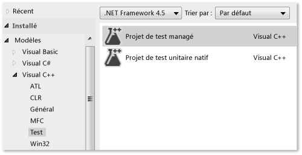
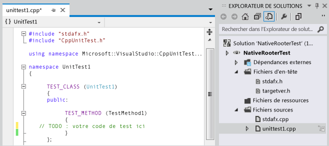
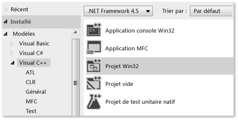
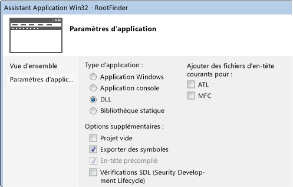
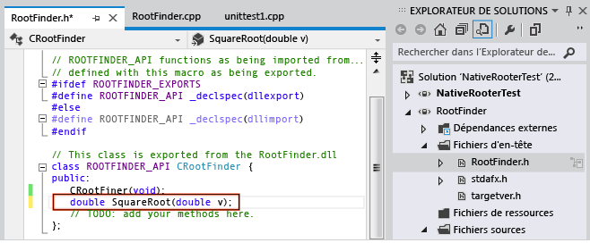
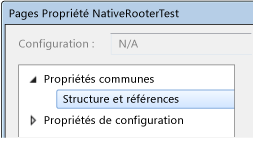
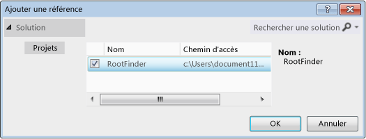
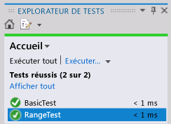

# <a name="writing-unit-tests-for-cc-with-the-microsoft-unit-testing-framework-for-c"></a>Écriture de tests unitaires pour C/C++ à l’aide du framework de tests unitaires Microsoft pour C++
Dans Visual Studio, vous pouvez créer des tests unitaires pour le code non managé écrit en C++. Le code non managé est parfois appelé code natif.  
  
 La procédure suivante contient les informations essentielles qui vous aideront à démarrer. Les sections suivantes fournissent une procédure pas à pas qui décrit les étapes plus en détail.  
  
### <a name="to-write-unit-tests-for-an-unmanaged-code-dll"></a>Pour écrire les tests unitaires d'une DLL de code non managé  
  
1.  Utilisez le modèle **Projet de test natif** afin de créer un projet Visual Studio distinct pour vos tests.  
  
     Le projet contient un exemple de code de test.  
  
2.  Rendez la DLL accessible au projet de test :  
  
    -   `#include` un fichier `.h` contenant les déclarations de fonctions de la DLL accessibles de l’extérieur.  
  
         Le fichier `.h` doit contenir les déclarations de fonction marquées avec `_declspec(dllimport)`. Vous pouvez également exporter les méthodes à l'aide d'un fichier DEF. Pour plus d’informations, consultez [Importation et exportation](/cpp/build/importing-and-exporting).  
  
         Vos tests unitaires peuvent uniquement accéder aux fonctions exportées à partir de la DLL de test.  
  
    -   Ajoutez le projet de DLL aux références du projet de test :  
  
         dans la page **Propriétés** du projet de test, développez **Propriétés communes**, **Structure et références**, puis choisissez **Ajouter une référence**.  
  
3.  Dans le projet de test, créez les classes de test et les méthodes de test à l'aide des macros TEST et de la classe Assert de la façon suivante :  
  
    ```cpp  
    #include "stdafx.h"  
    #include <CppUnitTest.h>  
    #include "..\MyProjectUnderTest\MyCodeUnderTest.h"  
    using namespace Microsoft::VisualStudio::CppUnitTestFramework;  
    TEST_CLASS(TestClassName)  
    {  
    public:  
      TEST_METHOD(TestMethodName)  
      {  
        // Run a function under test here.  
        Assert::AreEqual(expectedValue, actualValue, L"message", LINE_INFO());  
      }  
    }  
    ```  
  
    -   `Assert` contient plusieurs fonctions statiques qui vous permettent de vérifier le résultat d'un test.  
  
    -   Le paramètre `LINE_INFO()` est optionnel. Dans les cas où il n'existe aucun fichier PDB, il permet à Test Runner d'identifier l'emplacement d'un échec.  
  
    -   Vous pouvez également écrire les méthodes de configuration et de nettoyage du test. Pour plus d'informations, ouvrez la définition de la macro `TEST_METHOD` et lisez les commentaires de CppUnitTest.h  
  
    -   Vous ne pouvez pas imbriquer les classes de test.  
  
4.  Utilisez l'Explorateur de tests pour exécuter les tests :  
  
    1.  Dans le menu **Affichage** , choisissez **Autres fenêtres**, **Explorateur de tests**.  
  
    2.  Générez la solution Visual Studio.  
  
    3.  Dans l'Explorateur de tests, choisissez **Exécuter tout**.  
  
    4.  Pour examiner un test plus en détail dans l'Explorateur de tests :  
  
        1.  Sélectionnez le nom du test pour afficher plus de détails, tels qu'un message d'échec et une trace de la pile.  
  
        2.  Ouvrez le nom du test (par exemple en double-cliquant dessus) pour accéder à l'emplacement de l'échec ou au code du test.  
  
        3.  Dans le menu contextuel d'un test, choisissez **Déboguer le test sélectionné** pour exécuter le test dans le débogueur.  
  
##  <a name="walkthrough"></a>Procédure pas à pas : Développement d’une DLL non managée avec l’Explorateur de tests  
 Vous pouvez adapter cette procédure pas à pas pour développer votre propre DLL. Les étapes principales sont les suivantes :  
  
1.  [Créer un projet de test natif](#unitTestProject). Les tests sont créés dans un projet distinct de la DLL que vous développez.  
  
2.  [Créer un projet DLL](#createDllProject). Cette procédure pas à pas crée une DLL, mais la procédure de test d'une DLL existante est similaire.  
  
3.  [Rendre les fonctions DLL visibles par les tests](#coupleProjects).  
  
4.  [Augmenter itérativement les tests](#iterate). Nous recommandons un cycle « Rouge-Vert-Refactoriser », dans lequel le développement du code est conduit par les tests.  
  
5.  [Déboguer les tests ayant échoué](#debug). Vous pouvez exécuter les tests en mode débogage.  
  
6.  [Refactoriser tout en maintenant les tests inchangés](#refactor). La refactorisation signifie une amélioration de la structure du code sans modification de son comportement externe. Vous pouvez procéder ainsi pour améliorer les performances, l'extensibilité ou la lisibilité du code. Comme le but n'est pas de changer le comportement, vous ne modifiez pas les tests en même temps que vous effectuez une modification de refactorisation du code. Les tests permettent de vous assurer que vous n'introduisez pas de bogues lors de la refactorisation. Vous pouvez donc apporter ces modifications avec beaucoup plus de confiance que si vous n'aviez pas les tests.  
  
7.  [Vérifier la couverture](https://msdn.microsoft.com/en-us/library/fc8hec9e.aspx). Les tests unitaires sont plus utiles lorsqu'ils impliquent une plus grande partie de votre code. Vous pouvez découvrir quelles parties de votre code ont été utilisées par les tests.  
  
8.  [Isoler les unités des ressources externes](https://msdn.microsoft.com/library/hh549174.aspx). En règle générale, une DLL dépend des autres composants du système que vous développez, tels que les autres DLL, les bases de données ou les sous-systèmes à distance. Il est utile de tester chaque unité isolément de ses dépendances. Les composants externes peuvent ralentir les tests. Pendant le développement, les autres composants peuvent ne pas être achevés.  
  
###  <a name="unitTestProject"></a> Créer un projet de test unitaire natif  
  
1.  Dans le menu **Fichier** , choisissez **Nouveau**, **Projet**.  
  
     Dans la boîte de dialogue, développez **Installé**, **Modèles**, **Visual C++**, **Test**.  
  
     Sélectionnez le modèle **Projet de test natif** .  
  
     Dans cette procédure pas à pas, le projet de test se nomme `NativeRooterTest`.  
  
       
  
2.  Dans le nouveau projet, inspectez **unittest1.cpp**  
  
       
  
     Notez que :  
  
    -   Chaque test est défini à l'aide de `TEST_METHOD(YourTestName){...}`.  
  
         Vous n'avez pas à écrire une signature de fonction classique. La signature est créée par la macro TEST_METHOD. La macro génère une fonction d'instance qui retourne void. Elle génère également une fonction statique qui retourne des informations sur la méthode de test. Ces informations permettent à l'Explorateur de tests de trouver la méthode.  
  
    -   Les méthodes de test sont regroupées en classes à l'aide de `TEST_CLASS(YourClassName){...}`.  
  
         Lorsque les tests sont exécutés, une instance de chaque classe de test est créée. Les méthodes de test sont appelées dans un ordre non défini. Vous pouvez définir des méthodes spéciales qui sont appelées avant et après chaque module, classe ou méthode.  
  
3.  Vérifiez que les tests s'exécutent dans l'Explorateur de tests :  
  
    1.  Insérez le code de test :  
  
        ```cpp  
        TEST_METHOD(TestMethod1)  
        {  
        Assert::AreEqual(1,1);  
        }  
        ```  
  
         Notez que la classe `Assert` fournit plusieurs méthodes statiques que vous pouvez utiliser pour vérifier les résultats dans les méthodes de test.  
  
    2.  Dans le menu **Test** , choisissez **Exécuter** , **Tous les tests**.  
  
         Le test est généré et s'exécute.  
  
         L'Explorateur de tests s'affiche.  
  
         Le test s'affiche sous **Tests réussis**.  
  
           
  
###  <a name="createDllProject"></a> Créer un projet de DLL non managée  
  
1.  Créez un projet **Visual C++** à l'aide du modèle **Projet Win32** .  
  
     Dans cette procédure pas à pas, le projet se nomme `RootFinder`.  
  
       
  
2.  Sélectionnez **DLL** et **Exporter les symboles** dans l'Assistant Application Win32.  
  
     L'option **Exporter les symboles** génère une macro pratique qui permet de déclarer les méthodes exportées.  
  
       
  
3.  Déclarez une fonction exportée dans le fichier .h principal :  
  
       
  
     Le déclarateur `__declspec(dllexport)` permet que les membres publics et protégés de la classe soient visibles en dehors de la DLL. Pour plus d'informations, consultez [Utilisation de dllimport et dllexport dans les classes C++](/cpp/cpp/using-dllimport-and-dllexport-in-cpp-classes).  
  
4.  Dans le fichier .cpp principal, ajoutez un corps minimal pour la fonction :  
  
    ```cpp  
    // Find the square root of a number.  
    double CRootFinder::SquareRoot(double v)  
    {  
      return 0.0;  
    }  
    ```  
  
###  <a name="coupleProjects"></a> Associer le projet de test au projet DLL  
  
1.  Ajoutez le projet DLL aux références de projet du projet de test :  
  
    1.  Ouvrez les propriétés du projet de test et choisissez **Propriétés communes**, **Structure et références**.  
  
           
  
    2.  Choisissez **Ajouter une nouvelle référence**.  
  
         Dans la boîte de dialogue **Ajouter une référence** , sélectionnez le projet DLL et choisissez **Ajouter**.  
  
           
  
2.  Dans le fichier .cpp de test unitaire principal, incluez le fichier .h du code de la DLL :  
  
    ```cpp  
    #include "..\RootFinder\RootFinder.h"  
    ```  
  
3.  Ajoutez un test de base qui utilise la fonction exportée :  
  
    ```cpp  
    TEST_METHOD(BasicTest)  
    {  
    CRootFinder rooter;  
    Assert::AreEqual(  
    // Expected value:  
    0.0,   
    // Actual value:  
    rooter.SquareRoot(0.0),   
    // Tolerance:  
    0.01,  
    // Message:  
    L"Basic test failed",  
    // Line number - used if there is no PDB file:  
    LINE_INFO());  
    }  
    ```  
  
4.  Générez la solution.  
  
     Le nouveau test s'affiche dans l'Explorateur de tests.  
  
5.  Dans l'Explorateur de tests, choisissez **Exécuter tout**.  
  
       
  
 Vous avez configuré le test et les projets de code, et vérifié que vous pouviez exécuter des tests exécutant les fonctions du projet de code. Maintenant, vous pouvez commencer à écrire le code et les tests réels.  
  
###  <a name="iterate"></a> Augmenter itérativement les tests et les faire réussir  
  
1.  Ajoutez un nouveau test :  
  
    ```cpp  
    TEST_METHOD(RangeTest)  
    {  
      CRootFinder rooter;  
      for (double v = 1e-6; v < 1e6; v = v * 3.2)  
      {  
        double actual = rooter.SquareRoot(v*v);  
        Assert::AreEqual(v, actual, v/1000);  
      }  
    }  
    ```  
  
    > [!TIP]
    >  Nous vous recommandons de ne pas modifier les tests ayant réussi. Ajoutez à la place un nouveau test, mettez à jour le code afin que le test réussisse, puis ajoutez un autre test, et ainsi de suite.  
    >   
    >  Lorsque vos utilisateurs modifient leurs spécifications, désactivez les tests qui ne sont plus corrects. Écrivez de nouveaux tests et utilisez-les l'un après l'autre, de la même façon incrémentielle.  
  
2.  Générez la solution, puis, dans l'Explorateur de tests, choisissez **Exécuter tout**.  
  
     Le nouveau test échoue.  
  
       
  
    > [!TIP]
    >  Vérifiez que chaque test échoue immédiatement après que vous l'avez écrit. Vous évitez ainsi de commettre l'erreur d'écrire un test qui n'échoue jamais.  
  
3.  Améliorez le code testé afin que le nouveau test réussisse :  
  
    ```cpp  
    #include <math.h>  
    ...  
    double CRootFinder::SquareRoot(double v)  
    {  
      double result = v;  
      double diff = v;  
      while (diff > result/1000)  
      {  
        double oldResult = result;  
        result = result - (result*result - v)/(2*result);  
        diff = abs (oldResult - result);  
      }  
      return result;  
    }  
    ```  
  
4.  Générez la solution, puis, dans l'Explorateur de tests, choisissez **Exécuter tout**.  
  
     Les deux tests réussissent.  
  
       
  
    > [!TIP]
    >  Développez le code en ajoutant les tests individuellement. Assurez-vous que tous les tests réussissent après chaque itération.  
  
###  <a name="debug"></a> Déboguer un test ayant échoué  
  
1.  Ajoutez un autre test :  
  
    ```cpp  
  
    #include <stdexcept>  
    ...  
    // Verify that negative inputs throw an exception.  
    TEST_METHOD(NegativeRangeTest)  
    {  
      wchar_t message[200];  
      CRootFinder rooter;  
      for (double v = -0.1; v > -3.0; v = v - 0.5)  
      {  
        try   
        {  
          // Should raise an exception:  
          double result = rooter.SquareRoot(v);  
  
          _swprintf(message, L"No exception for input %g", v);  
          Assert::Fail(message, LINE_INFO());  
        }  
        catch (std::out_of_range ex)  
        {  
          continue; // Correct exception.  
        }  
        catch (...)  
        {  
          _swprintf(message, L"Incorrect exception for %g", v);  
          Assert::Fail(message, LINE_INFO());  
        }  
      }  
    }  
    ```  
  
2.  Générez la solution et choisissez **Exécuter tout**.  
  
3.  Ouvrez le test ayant échoué (ou double-cliquez dessus).  
  
     L'échec d'assertion est mis en surbrillance. Le message d'échec est visible dans le volet de détails de l'Explorateur de tests.  
  
       
  
4.  Pour voir pourquoi le test échoue, parcourez la fonction :  
  
    1.  Définissez un point d'arrêt au début de la fonction SquareRoot.  
  
    2.  Dans le menu contextuel du test ayant échoué, choisissez **Déboguer les tests sélectionnés**.  
  
         Lorsque l'exécution s'arrête au point d'arrêt, parcourez le code.  
  
5.  Insérez le code de la fonction que vous développez :  
  
    ```cpp  
  
    #include <stdexcept>  
    ...  
    double CRootFinder::SquareRoot(double v)  
    {  
        // Validate parameter:  
        if (v < 0.0)   
        {  
          throw std::out_of_range("Can't do square roots of negatives");  
        }  
  
    ```  
  
6.  Toutes les tests réussissent maintenant.  
  
       
  
> [!TIP]
>  Si les tests individuels n’ont aucune dépendance qui les empêche d’être exécutés dans n’importe quel ordre, activez l’exécution parallèle des tests avec le bouton bascule  dans la barre d’outils. Cela peut réduire sensiblement le temps nécessaire pour exécuter tous les tests.  
  
###  <a name="refactor"></a> Refactoriser le code sans modifier les tests  
  
1.  Simplifiez le calcul central de la fonction SquareRoot :  
  
    ```  
    // old code:  
    //   result = result - (result*result - v)/(2*result);  
    // new code:  
         result = (result + v/result)/2.0;  
  
    ```  
  
2.  Générez la solution et choisissez **Exécuter tout**, pour vous assurer que vous n'avez pas introduit d'erreur.  
  
    > [!TIP]
    >  Un bon jeu de tests unitaires vous garantit que vous n'avez pas introduit de bogues lors de la modification du code.  
    >   
    >  Maintenez la refactorisation distincte des autres modifications.  
  
## <a name="next-steps"></a>Étapes suivantes  
  
-   **Isolement.** La plupart des DLL dépendent d'autres sous-systèmes tels que des bases de données et d'autres DLL. Ces autres composants sont souvent développés en parallèle. Pour permettre que le test unitaire soit exécuté pendant que les autres composants ne sont pas encore disponibles, vous devez remplacer  
  
-   **Tests de vérification de build.** Des tests peuvent être effectués sur le serveur de builds de votre équipe à des intervalles définis. Cela garantit que les bogues ne sont pas introduits lors de l'intégration du travail de plusieurs membres de l'équipe.  
  
-   **Tests d’archivage.** Vous pouvez imposer que certains tests soient effectués avant que chaque membre de l'équipe n'archive le code dans le contrôle de code source. Il s'agit généralement d'un sous-ensemble de l'ensemble complet des tests de vérification de build.  
  
     Vous pouvez également imposer un niveau minimal de couverture du code.  
  
## <a name="see-also"></a>Voir aussi  
 [Ajout de tests unitaires à des applications C++ existantes](../test/unit-testing-existing-cpp-applications-with-test-explorer.md)   
 [Utilisation de Microsoft.VisualStudio.TestTools.CppUnitTestFramework](../test/using-microsoft-visualstudio-testtools-cppunittestframework.md)   
 [Vue d’ensemble de l’interopérabilité entre le code managé et le code non managé](http://msdn.microsoft.com/library/ms973872.aspx)   
 [Débogage du code natif](../debugger/debugging-native-code.md)   
 [Procédure pas à pas : création et utilisation d’une bibliothèque de liens dynamiques (C++)](/cpp/build/walkthrough-creating-and-using-a-dynamic-link-library-cpp)   
 [Importation et exportation](/cpp/build/importing-and-exporting)

