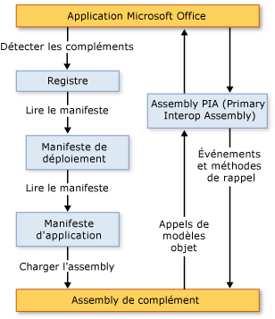

# Architecture des compl&#233;ments VSTO
  Les compléments VSTO créés à l'aide des Outils de développement Office dans Visual Studio ont des fonctionnalités en termes d'architecture qui mettent l'accent sur la stabilité et la sécurité, et qui leur permettent de fonctionner étroitement avec Microsoft Office. Cette rubrique décrit les aspects suivants des compléments VSTO :  
  
-   [Présentation des compléments VSTO](#UnderstandingAddIns)  
  
-   [Composants des compléments VSTO](#AddinComponents)  
  
-   [Fonctionnement des compléments VSTO avec les applications Microsoft Office](#HowAddinsWork)  
  
 [!INCLUDE[appliesto_allapp](../vsto/includes/appliesto-allapp-md.md)]  
  
 Pour obtenir des informations générales sur la création de compléments VSTO, consultez [Vue d'ensemble du développement des solutions Office &#40;VSTO&#41;](../vsto/office-solutions-development-overview-vsto.md) et [Prise en main de la programmation de compléments VSTO](../vsto/getting-started-programming-vsto-add-ins.md).  
  
##   Présentation des compléments VSTO  
 Quand vous utilisez les Outils de développement Office dans Visual Studio pour générer un complément VSTO, vous créez un assembly de code managé chargé par une application Microsoft Office. Une fois l’assembly chargé, le complément VSTO peut répondre aux événements déclenchés dans l’application \(par exemple, quand un utilisateur clique sur un élément de menu\). Le complément VSTO peut également exécuter un appel dans le modèle objet pour automatiser et étendre l’application. En outre, il peut utiliser toutes les classes du [!INCLUDE[dnprdnshort](../sharepoint/includes/dnprdnshort-md.md)].  
  
 L'assembly communique avec les composants COM de l'application à travers l'assembly PIA \(Primary Interop Assembly\) de celle\-ci. Pour plus d’informations, consultez [Assemblys PIA &#40;Primary Interop Assembly&#41; Office](../vsto/office-primary-interop-assemblies.md) et [Vue d'ensemble du développement des solutions Office &#40;VSTO&#41;](../vsto/office-solutions-development-overview-vsto.md).  
  
 Si plusieurs compléments VSTO sont installés pour une même application, chaque complément VSTO est chargé dans un domaine d’application différent. Cela signifie qu’un complément VSTO dont le fonctionnement est incorrect ne peut pas entraîner la défaillance d’autres compléments VSTO. Cela permet également de vérifier que tous les assemblys du complément VSTO sont déchargés de la mémoire à la fermeture de l’application. Pour plus d’informations sur les domaines d’application, consultez [Domaines d'application](http://msdn.microsoft.com/library/113a8bbf-6875-4a72-a49d-ca2d92e19cc8).  
  
> [!NOTE]  
>  Les compléments VSTO que vous créez à l'aide des Outils de développement Office dans Visual Studio sont conçus pour être utilisés seulement quand l'application Microsoft Office hôte est démarrée par un utilisateur final. Si l’application est démarrée par programmation \(par exemple, à l’aide d’Automation\), le complément VSTO risque de ne pas fonctionner correctement.  
  
##   Composants des compléments VSTO  
 Bien que l’assembly du complément VSTO soit le composant principal du complément, il existe plusieurs autres composants qui jouent un rôle important dans la manière dont les applications Microsoft Office découvrent et chargent les compléments VSTO.  
  
### Entrées de Registre  
 Les applications Microsoft Office découvrent des compléments VSTO en recherchant un jeu d'entrées du Registre. Pour obtenir la liste complète des entrées de Registre utilisées par les compléments VSTO, consultez [Entrées de Registre pour les compléments VSTO](../vsto/registry-entries-for-vsto-add-ins.md).  
  
 Quand vous générez votre solution, Visual Studio crée toutes les entrées de Registre obligatoires sur l’ordinateur de développement pour que vous puissiez déboguer et exécuter votre complément VSTO. Pour plus d'informations, consultez [Génération de solutions Office](../vsto/building-office-solutions.md).  
  
 Si vous utilisez ClickOnce pour déployer votre solution, le programme d'installation généré par le processus de publication crée automatiquement les clés de Registre sur l'ordinateur de l'utilisateur final. Pour plus d'informations, consultez [Déploiement d'une solution Office à l'aide de ClickOnce](../vsto/deploying-an-office-solution-by-using-clickonce.md).  
  
### Manifeste de déploiement et manifeste d'application  
 Les compléments VSTO utilisent des manifestes de déploiement et des manifestes d’application pour identifier et charger la version la plus récente de l’assembly du complément VSTO. Le manifeste de déploiement pointe vers le manifeste d'application actuel. Le manifeste de l’application pointe vers l’assembly du complément VSTO et spécifie la classe de point d’entrée à exécuter dans l’assembly. Pour plus d'informations, consultez [Manifestes d'application et de déploiement dans les solutions Office](../vsto/application-and-deployment-manifests-in-office-solutions.md).  
  
### Visual Studio Tools pour Office Runtime  
 Pour pouvoir exécuter des compléments VSTO créés à l'aide des Outils de développement Office dans Visual Studio, [!INCLUDE[vsto_runtime](../vsto/includes/vsto-runtime-md.md)] doit être installé sur les ordinateurs des utilisateurs finaux. Le runtime inclut des composants non managés et un jeu d'assemblys managés. Les composants non managés chargent l’assembly du complément VSTO. Les assemblys managés fournissent le modèle objet que votre code de complément VSTO utilise pour automatiser et étendre l’application hôte.  
  
 Pour plus d'informations, consultez [Vue d'ensemble de Visual Studio Tools pour Office Runtime](../vsto/visual-studio-tools-for-office-runtime-overview.md).  
  
##   Fonctionnement des compléments VSTO avec les applications Microsoft Office  
 Quand un utilisateur démarre une application Microsoft Office, l’application utilise le manifeste de déploiement et le manifeste de l’application pour trouver et charger la version la plus récente de l’assembly du complément VSTO. L'illustration suivante montre l'architecture de base de ces compléments VSTO.  
  
   
  
> [!NOTE]  
>  Dans les solutions Office qui ciblent le [!INCLUDE[net_v40_short](../sharepoint/includes/net-v40-short-md.md)] ou le [!INCLUDE[net_v45](../vsto/includes/net-v45-md.md)], les solutions exécutent un appel dans le modèle objet de l'application hôte à l'aide de les informations de type d'assembly PIA incorporées dans l'assembly de solution, au lieu d'exécuter un appel dans l'assembly PIA directement. Pour plus d'informations, consultez [Conception et création de solutions Office](../vsto/designing-and-creating-office-solutions.md).  
  
### Processus de chargement  
 Les étapes suivantes se produisent quand un utilisateur démarre une application :  
  
1.  L'application vérifie dans le Registre les entrées qui identifient des compléments VSTO créés à l'aide des Outils de développement Office dans Visual Studio.  
  
2.  Si l'application trouve de telles entrées, elle charge VSTOEE.dll, qui charge à son tour VSTOLoader.dll. Il s'agit de DLL non managées qui sont les composants du chargeur pour Visual Studio 2010 Tools pour Office Runtime. Pour plus d'informations, consultez [Vue d'ensemble de Visual Studio Tools pour Office Runtime](../vsto/visual-studio-tools-for-office-runtime-overview.md).  
  
3.  VSTOLoader.dll charge le [!INCLUDE[dnprdnshort](../sharepoint/includes/dnprdnshort-md.md)] et démarre la partie managée de [!INCLUDE[vsto_runtime](../vsto/includes/vsto-runtime-md.md)].  
  
4.  [!INCLUDE[vsto_runtime](../vsto/includes/vsto-runtime-md.md)] recherche des mises à jour de manifeste et télécharge l'application et les manifestes de déploiement les plus récents.  
  
5.  [!INCLUDE[vsto_runtime](../vsto/includes/vsto-runtime-md.md)] effectue une série de vérifications de sécurité. Pour plus d'informations, consultez [Sécurisation des solutions Office](../vsto/securing-office-solutions.md).  
  
6.  Si l’exécution du complément VSTO est approuvée, [!INCLUDE[vsto_runtime](../vsto/includes/vsto-runtime-md.md)] utilise le manifeste de déploiement et le manifeste de l’application pour rechercher des mises à jour de l’assembly. Si une nouvelle version de l'assembly est disponible, le runtime la télécharge dans le cache de [!INCLUDE[ndptecclick](../vsto/includes/ndptecclick-md.md)] sur l'ordinateur client. Pour plus d'informations, consultez [Déploiement d'une solution Office](../vsto/deploying-an-office-solution.md).  
  
7.  [!INCLUDE[vsto_runtime](../vsto/includes/vsto-runtime-md.md)] crée un domaine d’application dans lequel charger l’assembly du complément VSTO.  
  
8.  [!INCLUDE[vsto_runtime](../vsto/includes/vsto-runtime-md.md)] charge l’assembly du complément VSTO dans le domaine d’application.  
  
9. [!INCLUDE[vsto_runtime](../vsto/includes/vsto-runtime-md.md)] appelle la méthode <xref:Microsoft.Office.Tools.AddInBase.RequestComAddInAutomationService%2A> dans votre complément VSTO, si vous l’avez substituée.  
  
     Vous pouvez éventuellement substituer cette méthode pour exposer un objet de votre complément VSTO à d’autres solutions Microsoft Office. Pour plus d'informations, consultez [Appel de code dans des compléments VSTO à partir d'autres solutions Office](../vsto/calling-code-in-vsto-add-ins-from-other-office-solutions.md).  
  
10. [!INCLUDE[vsto_runtime](../vsto/includes/vsto-runtime-md.md)] appelle la méthode <xref:Microsoft.Office.Tools.AddInBase.RequestService%2A> dans votre complément VSTO, si vous l’avez substituée.  
  
     Vous pouvez éventuellement substituer cette méthode pour étendre une fonctionnalité Microsoft Office en retournant un objet qui implémente une interface d'extensibilité. Pour plus d'informations, consultez [Personnalisation des fonctionnalités de l'interface utilisateur à l'aide d'interfaces d'extensibilité](../vsto/customizing-ui-features-by-using-extensibility-interfaces.md).  
  
    > [!NOTE]  
    >  [!INCLUDE[vsto_runtime](../vsto/includes/vsto-runtime-md.md)] effectue des appels séparés à la méthode <xref:Microsoft.Office.Tools.AddInBase.RequestService%2A> pour chaque interface d'extensibilité prise en charge par l'application hôte. Bien que le premier appel à la méthode <xref:Microsoft.Office.Tools.AddInBase.RequestService%2A> se produise généralement avant l’appel à la méthode `ThisAddIn_Startup`, votre complément VSTO ne doit pas établir d’hypothèses concernant le moment où la méthode <xref:Microsoft.Office.Tools.AddInBase.RequestService%2A> est appelée, ou le nombre de fois où elle est appelée.  
  
11. [!INCLUDE[vsto_runtime](../vsto/includes/vsto-runtime-md.md)] appelle la méthode `ThisAddIn_Startup` de votre complément VSTO. Cette méthode est le gestionnaire d'événements par défaut pour l'événement <xref:Microsoft.Office.Tools.AddInBase.Startup>. Pour plus d'informations, consultez [Événements dans les projets Office](../vsto/events-in-office-projects.md).  
  
## Voir aussi  
 [Architecture des solutions Office dans Visual Studio](../vsto/architecture-of-office-solutions-in-visual-studio.md)   
 [Architecture des personnalisations au niveau du document](../vsto/architecture-of-document-level-customizations.md)   
 [Vue d'ensemble de Visual Studio Tools pour Office Runtime](../vsto/visual-studio-tools-for-office-runtime-overview.md)   
 [Programmation de compléments VSTO](../vsto/programming-vsto-add-ins.md)   
 [Développement de solutions Office](../vsto/developing-office-solutions.md)   
 [Sécurisation des solutions Office](../vsto/securing-office-solutions.md)   
 [Déploiement d'une solution Office](../vsto/deploying-an-office-solution.md)  
  
  