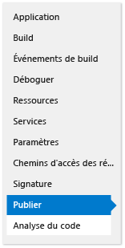
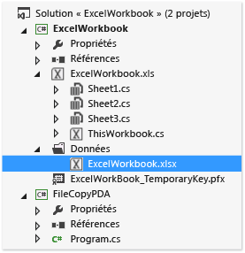
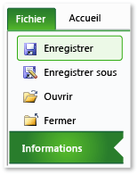
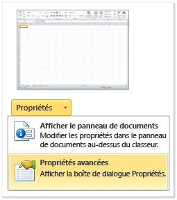
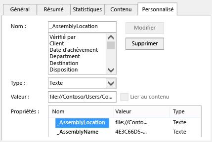

# <a name="deploy-an-office-solution-by-using-clickonce"></a>Déployer une solution Office à l’aide de ClickOnce
  Vous pouvez déployer votre solution Office plus rapidement en utilisant ClickOnce. Si vous publiez des mises à jour, votre solution les détecte et les installe automatiquement. Toutefois, avec ClickOnce, vous devez installer votre solution séparément pour chaque utilisateur d'un ordinateur. Par conséquent, vous devez envisager d’utiliser le programme d’installation de Windows (*.msi*) si plusieurs utilisateurs exécutent votre solution sur le même ordinateur.

## <a name="in-this-topic"></a>Dans cette rubrique

- [Publier la solution](#Publish)

- [Déterminer comment accorder un niveau de confiance à la solution](#Trust)

- [Aider les utilisateurs à installer la solution](#Helping)

- [Placer le document d'une solution sur l'ordinateur de l'utilisateur final (personnalisations au niveau du document uniquement)](#Put)

- [Placer le document d'une solution sur un serveur exécutant SharePoint (personnalisations au niveau du document uniquement)](#SharePoint)

- [Créer un programme d'installation personnalisé](#Custom)

- [Publier une mise à jour](#Update)

- [Modifier l'emplacement d'installation d'une solution](#Location)

- [Restaurer la version antérieure d'une solution](#Roll)

  Pour plus d’informations sur la façon de déployer une solution Office en créant un fichier Windows Installer, consultez [déployer une solution Office à l’aide du programme d’installation de Windows](../vsto/deploying-an-office-solution-by-using-windows-installer.md).

##  <a name="Publish"></a> Publiez la solution
 Vous pouvez publier votre solution à l’aide de la **Assistant Publication** ou **Concepteur de projet**. Dans cette procédure, vous allez utiliser le **Concepteur de projet** , car elle fournit l’ensemble complet des options de publication. Consultez [Assistant Publication &#40;développement Office dans Visual Studio&#41;](../vsto/publish-wizard-office-development-in-visual-studio.md).

#### <a name="to-publish-the-solution"></a>Pour publier la solution

1. Dans **l’Explorateur de solutions**, choisissez le nœud qui est nommé pour votre projet.

2. Dans la barre de menus, choisissez **projet**, *nom_projet* **propriétés**.

3. Dans le **Concepteur de projets**, choisissez le **publier** onglet, qui montre l’illustration suivante.

    

4. Dans le **emplacement du dossier de publication (serveur ftp ou chemin d’accès de fichier)** , entrez le chemin d’accès du dossier où vous souhaitez le **Concepteur de projet** pour copier les fichiers de solution.

    Vous pouvez entrer n'importe lequel des types de chemins d'accès suivants.

   -   Un chemin d’accès local (par exemple, *C:\FolderName\FolderName*).

   -   Un chemin d’accès UNC Uniform Naming Convention () dans un dossier sur votre réseau (par exemple,  *\\\ServerName\FolderName*).

   -   Un chemin d’accès relatif (par exemple, *DossierPublication\\*, qui est le dossier dans lequel le projet est publié par défaut).

5. Dans le **URL du dossier d’Installation** , entrez le chemin d’accès qualifié complet de l’emplacement où les utilisateurs finaux pourra trouver votre solution.

    Si vous ne connaissez pas encore de l’emplacement, n’entrez rien dans ce champ. Par défaut, ClickOnce recherche des mises à jour dans le dossier à partir duquel les utilisateurs installent la solution.

6. Choisissez le bouton **Composants requis** .

7. Dans le **conditions préalables** boîte de dialogue zone, vérifiez que le **créer un programme d’installation pour installer les composants prérequis** case à cocher est activée.

8. Dans le **choisir les composants requis pour installer** , sélectionnez les cases à cocher **Windows Installer 4.5** et le package .NET Framework approprié.

    Par exemple, si votre solution cible les [!INCLUDE[net_v45](../vsto/includes/net-v45-md.md)], sélectionnez les cases à cocher **Windows Installer 4.5** et **Microsoft .NET Framework 4.5 Full**.

9. Si votre solution cible .NET Framework 4.5, vous devez également sélectionner le **Visual Studio 2010 Tools pour Office Runtime** case à cocher.

    > [!NOTE]
    >  Par défaut, cette case à cocher n’apparaît pas. Pour afficher cette case à cocher, vous devez créer un package de programme d'amorçage. Consultez [créer un package de programme d’amorçage pour un Office 2013 VSTO Add-in avec Visual Studio 2012](create-vsto-add-ins-for-office-by-using-visual-studio.md).

10. Sous **spécifier l’emplacement d’installation des composants requis**, choisissez une des options qui s’affichent, puis choisissez le **OK** bouton.

     Le tableau suivant décrit chaque option.

    |Option|Description|
    |------------|-----------------|
    |**Télécharger les composants requis à partir du site web du fournisseur de composants**|L'utilisateur est invité à télécharger et à installer les composants requis du fournisseur.|
    |**Télécharger les composants requis à partir de l'emplacement de mon application**|Les logiciels requis sont installés avec la solution. Si vous choisissez cette option, Visual Studio copie tous les packages de composants requis dans l'emplacement de publication à votre place. Pour que cette option fonctionne, les packages de composants requis doivent être sur l'ordinateur de développement.|
    |**Télécharger les composants requis depuis l'emplacement suivant**|Visual Studio copie tous les packages de composants requis dans l'emplacement que vous spécifiez et les installe avec la solution.|

     Consultez [boîte de dialogue composants requis](../ide/reference/prerequisites-dialog-box.md).

11. Choisissez le **mises à jour** bouton, spécifiez la fréquence à laquelle vous souhaitez chaque utilisateur final VSTO Add-in ou personnalisation à rechercher les mises à jour, puis choisissez le **OK** bouton.

    > [!NOTE]
    >  Si vous effectuez un déploiement à l’aide d’un CD ou un lecteur amovible, choisissez le **ne jamais vérifier les mises à jour** case d’option.

     Pour plus d’informations sur la publication d’une mise à jour, consultez [publier une mise à jour](#Update).

12. Choisissez le **Options** bouton, passez en revue les options dans le **Options** boîte de dialogue zone, puis choisissez le **OK** bouton.

13. Choisissez le **publier maintenant** bouton.

     Visual Studio ajoute les dossiers et les fichiers suivants au dossier de publication que vous avez spécifié précédemment dans cette procédure.

    - Le **fichiers d’Application** dossier.

    - Le programme d'installation.

    - Un manifeste de déploiement qui pointe vers le manifeste de déploiement de la version la plus récente.

      Le **fichiers d’Application** dossier contient un sous-dossier pour chaque version que vous publiez. Chaque sous-dossier spécifique à la version contient les fichiers suivants.

    - Un manifeste d’application.

    - Un manifeste de déploiement.

    - Des assemblys de personnalisation.

      L'illustration suivante représente la structure du dossier de publication pour un complément VSTO Outlook.

      

    > [!NOTE]
    >  ClickOnce ajoute le *.deploy* extension aux assemblys afin qu’une installation sûre d’Internet Information Services (IIS) ne bloque pas les fichiers en raison d’une extension non sécurisée. Lorsque l’utilisateur installe la solution, ClickOnce supprime le *.deploy* extension.

14. Copiez les fichiers solution dans l'emplacement d'installation que vous avez spécifié précédemment dans cette procédure.

##  <a name="Trust"></a> Décidez comment vous souhaitez accorder une confiance à la solution
 Avant qu'une solution puisse s'exécuter sur les ordinateurs des utilisateurs, vous devez soit accorder votre confiance soit les utilisateurs doivent répondre à une invite d'approbation lorsqu'ils installent la solution. Pour accorder un niveau de confiance à la solution, signez les manifestes à l'aide d'un certificat qui identifie un éditeur connu et approuvé. Consultez [approuver la solution en signant les manifestes d’application et de déploiement](../vsto/granting-trust-to-office-solutions.md#Signing).

 Si vous déployez une personnalisation au niveau du document et que vous souhaitez placer le document dans un dossier sur l’ordinateur de l’utilisateur ou rendre le document disponible sur un site SharePoint, assurez-vous qu’Office approuve l’emplacement du document. Consultez [accorder une confiance aux documents](../vsto/granting-trust-to-documents.md).

##  <a name="Helping"></a> Aider les utilisateurs à installer la solution
 Les utilisateurs peuvent installer la solution en exécutant le programme d’installation, en ouvrant le manifeste de déploiement, ou au cours de personnalisation au niveau du document, en ouvrant le document directement. Il est recommandé que les utilisateurs installent votre solution à l'aide du programme d'installation. Les deux autres approches ne garantissent pas que les logiciels requis sont installé. Si les utilisateurs souhaitent ouvrir le document à partir de l'emplacement d'installation, ils doivent l'ajouter à la liste des emplacements approuvés dans le Centre de gestion de la confidentialité des applications Office.

### <a name="opening-the-document-of-a-document-level-customization"></a>Ouverture du document d'une personnalisation au niveau du document
 Les utilisateurs peuvent ouvrir le document d'une personnalisation au niveau du document à partir de l'emplacement d'installation ou en copiant le document sur leur ordinateur local, puis en ouvrant la copie.

 Il est recommandé que les utilisateurs ouvrent une copie du document sur leurs ordinateurs afin que plusieurs utilisateurs n'essayent pas d'ouvrir la même copie simultanément. Pour mettre en œuvre ce principe, vous pouvez configurer votre programme d'installation pour copier le document sur les ordinateurs d'utilisateur. Consultez [placer le document d’une solution sur l’ordinateur de l’utilisateur final (personnalisations au niveau du document uniquement)](#Put).

### <a name="install-the-solution-by-opening-the-deployment-manifest-from-an-iis-website"></a>Installer la solution en ouvrant le manifeste de déploiement à partir d’un site Web IIS
 Les utilisateurs peuvent installer une solution Office en ouvrant le manifeste de déploiement à partir du Web. Toutefois, une installation sûre d’Internet Information Services (IIS) bloquera les fichiers qui ont le *.vsto* extension. Le type MIME doit être défini dans IIS avant de pouvoir déployer une solution Office à l'aide d'IIS.

##### <a name="to-add-the-vsto-mime-type-to-iis-60"></a>Pour ajouter le type MIME .vsto à IIS 6.0

1.  Sur le serveur qui exécute IIS 6.0, choisissez **Démarrer** > **tous les programmes** > **outils d’administration**  >   **Internet Information Services (IIS) Manager**.

2.  Choisissez le nom d’ordinateur, le **Sites Web** dossier ou le site web que vous configurez.

3.  Dans la barre de menus, choisissez **Action** > **propriétés**.

4.  Sur le **en-têtes HTTP** , choisir le **Types MIME** bouton.

5.  Dans le **Types MIME** fenêtre, choisissez le **New** bouton.

6.  Dans le **Type MIME** fenêtre, entrez **.vsto** en tant que l’extension, entrez **application/x-ms-vsto** comme MIME tapez, puis appliquer les nouveaux paramètres.

    > [!NOTE]
    >  Pour que les modifications soient prises en compte, vous devez redémarrer le service de publication World Wide Web ou attendre le recyclage du processus de travail. Vous devez ensuite vider le cache du navigateur disque et réessayez d’ouvrir le *.vsto* fichier à nouveau.

##### <a name="to-add-the-vsto-mime-type-to-iis-70"></a>Pour ajouter le type MIME .vsto à IIS 7,0

1.  Sur le serveur qui exécute IIS 7.0, choisissez **Démarrer** > **tous les programmes** > **Accessoires**.

2.  Ouvrez le menu contextuel pour **invite de commandes**, puis choisissez **exécuter en tant qu’administrateur.**

3.  Dans le **Open** zone, entrez le chemin d’accès suivant, puis choisissez le **OK** bouton.

    ```cmd
    %windir%\system32\inetsrv
    ```

4.  Entrez la commande suivante, puis appliquez les nouveaux paramètres.

    ```cmd
    set config /section:staticContent /+[fileExtension='.vsto',mimeType='application/x-ms-vsto']
    ```

    > [!NOTE]
    >  Pour que les modifications soient prises en compte, vous devez redémarrer le service de publication World Wide Web ou attendre le recyclage du processus de travail. Vous devez ensuite vider le cache du navigateur disque et réessayez d’ouvrir le *.vsto* fichier à nouveau.

##  <a name="Put"></a> Placer le document d’une solution sur l’ordinateur de l’utilisateur final (personnalisations au niveau du document uniquement)
 Vous pouvez copier le document de votre solution sur l’ordinateur de l’utilisateur final pour eux par la création d’une action de post-déploiement. De cette façon, l’utilisateur ne doit manuellement copier le document à partir de l’emplacement d’installation sur son ordinateur après l’installation de votre solution. Vous devrez créer une classe qui définit l’action de post-déploiement, générez et publiez la solution, modifier le manifeste d’application et resigner le manifeste d’application et de déploiement.

 Les procédures suivantes supposent que le nom de votre projet est **ExcelWorkbook** et que vous publiez la solution dans un dossier nommé **C:\publish** sur votre ordinateur.

### <a name="create-a-class-that-defines-the-post-deployment-action"></a>Créer une classe qui définit l'action de post-déploiement

1. Dans la barre de menus, choisissez **fichier** > **ajouter** > **nouveau projet**.

2. Dans le **ajouter un nouveau projet** boîte de dialogue le **modèles installés** volet, choisissez le **Windows** dossier.

3. Dans le **modèles** volet, choisissez le **bibliothèque de classes** modèle.

4. Dans le **nom** , entrez **FileCopyPDA**, puis choisissez le **OK** bouton.

5. Dans **l’Explorateur de solutions**, choisissez le **FileCopyPDA** projet.

6. Dans la barre de menus, choisissez **Projet** > **Ajouter une référence**.

7. Sur le **.NET** onglet, ajoutez des références à `Microsoft.VisualStudio.Tools.Applications.Runtime` et `Microsoft.VisualStudio.Tools.Applications.ServerDocument`.

8. Remplacez le nom de la classe par `FileCopyPDA`, puis remplacez le contenu du fichier par le code. Ce code exécute les tâches suivantes :

   - Il copie le document dans le bureau de l'utilisateur.

   - Modifie la propriété _AssemblyLocation à partir d’un chemin d’accès relatif en un chemin qualifié complet pour le manifeste de déploiement.

   - Il supprime le fichier si l'utilisateur désinstalle la solution.

     [!code-vb[Trin_ExcelWorkbookPDA#7](../vsto/codesnippet/VisualBasic/trin_excelworkbookpda/filecopypda/class1.vb#7)]
     [!code-csharp[Trin_ExcelWorkbookPDA#7](../vsto/codesnippet/CSharp/trin_excelworkbookpda/filecopypda/class1.cs#7)]

### <a name="build-and-publish-the-solution"></a>Générer et publier la solution

1.  Dans **l’Explorateur de solutions**, ouvrez le menu contextuel pour le **FileCopyPDA** de projet, puis choisissez **Build**.

2.  Ouvrez le menu contextuel pour le **ExcelWorkbook** de projet, puis choisissez **Build**.

3.  Ouvrez le menu contextuel pour le **ExcelWorkbook** de projet, puis choisissez **ajouter une référence**.

4.  Dans le **ajouter une référence** boîte de dialogue, sélectionnez le **projets** , choisir **FileCopyPDA**, puis choisissez le **OK** bouton.

5.  Dans **l’Explorateur de solutions**, choisissez le **ExcelWorkbook** projet.

6.  Dans la barre de menus, choisissez **projet** > **nouveau dossier**.

7.  Entrée **données**, puis choisissez le **entrée** clé.

8.  Dans **l’Explorateur de solutions**, choisissez le **données** dossier.

9. Dans la barre de menus, choisissez **projet** > **ajouter un élément existant**.

10. Dans le **ajouter un élément existant** boîte de dialogue, cliquez sur Parcourir pour le répertoire de sortie pour le **ExcelWorkbook** de projet, choisissez le **ExcelWorkbook.xlsx** de fichiers, puis choisissez le  **Ajouter** bouton.

11. Dans **l’Explorateur de solutions** choisir le **ExcelWorkbook.xlsx** fichier.

12. Dans le **propriétés** fenêtre, modifier le **Action de génération** propriété **contenu** et le **Copy to Output Directory** propriété  **Copier si plus récent**.

     Lorsque vous avez terminé ces étapes, votre projet doit ressembler à l’illustration suivante.

     

13. Publier le **ExcelWorkbook** projet.

### <a name="modify-the-application-manifest"></a>Modifier le manifeste d'application

1.  Ouvrez le répertoire de solution, **c:\publish**, à l’aide de **Explorateur de fichiers**.

2.  Ouvrez le **fichiers d’Application** , puis ouvrez le dossier qui correspond à la plus récente publié la version de votre solution.

3.  Ouvrez le **ExcelWorkbook.dll.manifest** fichier dans un éditeur de texte tel que le bloc-notes.

4.  Ajoutez le code suivant après l'élément `</vstav3:update>`. Pour l’attribut class de le `<vstav3:entryPoint>` élément, utilisez la syntaxe suivante : *NamespaceName.ClassName*. Dans l'exemple suivant, les noms de classe et l'espace de noms sont les mêmes, afin que le nom du point d'entrée résultant soit `FileCopyPDA.FileCopyPDA`.

    ```xml
    <vstav3:postActions>
      <vstav3:postAction>
        <vstav3:entryPoint
          class="FileCopyPDA.FileCopyPDA">
          <assemblyIdentity
            name="FileCopyPDA"
            version="1.0.0.0"
            language="neutral"
            processorArchitecture="msil" />
        </vstav3:entryPoint>
        <vstav3:postActionData>
        </vstav3:postActionData>
      </vstav3:postAction>
    </vstav3:postActions>
    ```

### <a name="re-sign-the-application-and-deployment-manifests"></a>Signer à nouveau les manifestes d'application et de déploiement

1.  Dans le **%USERPROFILE%\Documents\Visual Studio 2013\Projects\ExcelWorkbook\ExcelWorkbook** dossier, copiez la **ExcelWorkbook_TemporaryKey.pfx** fichier de certificat, puis collez-la dans la  *DossierPublication* **\Application Files\ExcelWorkbook**\__Dernièreversionpubliée_ dossier.

2.  Ouvrez l’invite de commandes de Visual Studio et puis remplacez les répertoires par le **c:\publish\Application Files\ExcelWorkbook**\__Dernièreversionpubliée_ dossier (par exemple, **c:\publish\Application Files\ExcelWorkbook_1_0_0_4**).

3.  Signez le manifeste d'application modifié en exécutant la commande suivante :

    ```cmd
    mage -sign ExcelWorkbook.dll.manifest -certfile ExcelWorkbook_TemporaryKey.pfx
    ```

     Le message « ExcelWorkbook.dll.manifest signé avec succès » s'affiche.

4.  Remplacez par le **c:\publish** dossier, puis mise à jour et le déploiement de l’authentification du manifeste en exécutant la commande suivante :

    ```cmd
    mage -update ExcelWorkbook.vsto -appmanifest "Application Files\Ex
    celWorkbookMostRecentVersionNumber>\ExcelWorkbook.dll.manifest" -certfile "Application Files\ExcelWorkbookMostRecentVersionNumber>\ExcelWorkbook_TemporaryKey.pfx"
    ```

    > [!NOTE]
    >  Dans l’exemple précédent, remplacez MostRecentVersionNumber par le numéro de version de la version récemment publiée de votre solution (par exemple, **1_0_0_4**).

     Le message « ExcelWorkbook.vsto signé avec succès » s'affiche.

5.  Copie le *ExcelWorkbook.vsto* de fichiers à la **c:\publish\Application Files\ExcelWorkbook**\__MostRecentVersionNumber_ directory.

##  <a name="SharePoint"></a> Placer le document d’une solution sur un serveur qui exécute SharePoint (personnalisations au niveau du document uniquement)
 Vous pouvez publier votre personnalisation au niveau du document pour les utilisateurs finaux à l'aide de SharePoint. Lorsque les utilisateurs accèdent au site SharePoint et ouvrent le document, le runtime installe automatiquement la solution à partir du dossier réseau partagé sur l'ordinateur local de l'utilisateur. Une fois que la solution est installée localement, la personnalisation fonctionne toujours même si le document est copié ailleurs, sur le bureau par exemple.

#### <a name="to-put-the-document-on-a-server-thats-running-sharepoint"></a>Pour placer le document sur un serveur exécutant SharePoint

1.  Ajoutez le document de solution à une bibliothèque de documents située sur un site SharePoint.

2.  Suivez les étapes de l'une des méthodes suivantes :

    -   Utilisez l'outil de configuration d'Office pour ajouter le serveur exécutant SharePoint au Centre de gestion de la confidentialité dans Word ou Excel sur tous les ordinateurs des utilisateurs.

         Consultez [des stratégies de sécurité et les paramètres dans Office 2010](http://go.microsoft.com/fwlink/?LinkId=99227).

    -   Vérifiez que chaque utilisateur effectue les étapes suivantes.

        1.  Sur l’ordinateur local, ouvrez Word ou Excel, choisissez le **fichier** onglet, puis choisissez le **Options** bouton.

        2.  Dans le **centre de confidentialité** boîte de dialogue, sélectionnez le **emplacements approuvés** bouton.

        3.  Sélectionnez le **autoriser les emplacements approuvés sur mon réseau (non recommandé)** case à cocher, puis choisissez le **ajouter un nouvel emplacement** bouton.

        4.  Dans le **chemin d’accès** , entrez l’URL de la bibliothèque de documents SharePoint qui contient le document que vous avez téléchargé (par exemple, *http://SharePointServerName/TeamName/ProjectName/DocumentLibraryName*).

             N’ajoutez pas le nom de la page Web par défaut, tel que *default.aspx* ou *AllItems.aspx*.

        5.  Sélectionnez le **sous-dossiers de cet emplacement sont également approuvés** case à cocher, puis choisissez le **OK** bouton.

             Lorsque les utilisateurs ouvrent le document du site SharePoint, le document s'ouvre, et la personnalisation est installée. Les utilisateurs peuvent copier le document sur leur bureau. La personnalisation fonctionne toujours car les propriétés du document pointent vers l'emplacement réseau du document.

##  <a name="Custom"></a> Créer un programme d’installation personnalisé
 Vous pouvez créer un programme d’installation personnalisé pour votre solution Office, au lieu d’utiliser le programme d’installation qui est créé pour vous lorsque vous publiez la solution. Par exemple, vous pouvez utiliser une connexion dans le script pour démarrer l’installation, ou vous pouvez utiliser un fichier de commandes pour installer la solution sans intervention de l’utilisateur. Ces scénarios conviennent parfaitement si les composants requis sont déjà installés sur les ordinateurs des utilisateurs finaux.

 Dans le cadre du processus d’installation personnalisée, appelez l’outil de programme d’installation pour les solutions Office (*VSTOInstaller.exe*), qui est installé dans l’emplacement suivant par défaut :

 *%commonprogramfiles%\microsoft shared\VSTO\10.0\VSTOInstaller.exe*

 Si l’outil n’est pas dans cet emplacement, vous pouvez utiliser la **HKEY_LOCAL_MACHINE\SOFTWARE\Microsoft\VSTO Runtime Setup\v4\InstallerPath** ou **HKEY_LOCAL_MACHINE\SOFTWARE\Wow6432Node\Microsoft\VSTO Runtime Setup\v4 \InstallerPath** clé de Registre pour rechercher le chemin d’accès à cet outil.

 Vous pouvez utiliser les paramètres suivants avec *VSTOinstaller.exe*.


| Paramètre | Définition |
|------------------| - |
| /Install ou /I | Installe la solution. Vous devez utiliser cette option avec le chemin d'accès d'un manifeste de déploiement. Vous pouvez spécifier un chemin d’accès sur l’ordinateur local, un partage de fichiers UNC (Universal Naming Convention). Vous pouvez spécifier un chemin d’accès local (*C:\FolderName\PublishFolder*), un chemin d’accès relatif (*publier\\*), ou un emplacement qualifié complet (*\\\ServerName\ NomDossier* ou http://<em>nomserveur/nomdossier</em>). |
| /Uninstall ou /U | Désinstalle la solution. Vous devez utiliser cette option avec le chemin d'accès d'un manifeste de déploiement. Vous pouvez spécifier qu’un chemin d’accès peut se trouver sur l’ordinateur local, un partage de fichiers UNC. Vous pouvez spécifier un chemin d’accès local (*c:\FolderName\PublishFolder*), un chemin d’accès relatif (*publier\\*), ou un emplacement qualifié complet (*\\\ServerName\ NomDossier* ou http://<em>nomserveur/nomdossier</em>). |
| /Silent ou /S | Installez ou désinstallez sans inviter l'utilisateur à entrer de texte ni afficher de message. Si une invite d’approbation est requise, la personnalisation n’est pas installée ou mis à jour. |
| /Help ou /? | Affiche les informations d'aide. |

 Lorsque vous exécutez *VSTOinstaller.exe*, les codes d’erreur suivant peuvent s’afficher.

|Code d'erreur|Définition|
|----------------|----------------|
|0|La solution a été installée ou désinstallée ou l’aide de VSTOInstaller s’est affichée.|
|-100|Une ou plusieurs options de ligne de commande ne sont pas valides ou ont été définies plusieurs fois. Pour plus d’informations, entrez « vstoinstaller / ? » ou consultez [créer un programme d’installation personnalisé pour une solution ClickOnce Office](https://msdn.microsoft.com/3e5887ed-155f-485d-b8f6-3c02c074085e).|
|-101|Une ou plusieurs options de ligne de commande ne sont pas valides. Pour plus d'informations, entrez « vstoinstaller/? ».|
|-200|L’URI du manifeste de déploiement n’est pas valide. Pour plus d'informations, entrez « vstoinstaller/? ».|
|-201|La solution n’a pas pu être installée car le manifeste de déploiement n’est pas valide. Consultez [manifestes de déploiement pour les solutions Office](../vsto/deployment-manifests-for-office-solutions.md).|
|-202|La solution n’a pas pu être installée, car Visual Studio Tools pour la section Office du manifeste d’application n’est pas valide. Consultez [manifestes d’Application pour les solutions Office](../vsto/application-manifests-for-office-solutions.md).|
|-203|La solution n’a pas pu être installée car une erreur de téléchargement s’est produite. Vérifiez l'URI ou l'emplacement de fichier réseau du manifeste de déploiement et réessayez.|
|-300|La solution n’a pas pu être installée car une exception de sécurité s’est produite. Consultez [solutions Office Secure](../vsto/securing-office-solutions.md).|
|-400|La solution n’a pas pu être installée.|
|-401|La solution n’a pas pu être désinstallée.|
|-500|L'opération a été annulée parce que la solution n'a pas pu être installée et désinstallée ou le manifeste de déploiement ne peut pas être téléchargé.|

##  <a name="Update"></a> Publier une mise à jour
 Pour mettre à jour d’une solution, vous publiez à nouveau à l’aide de la **Concepteur de projets** ou **Assistant Publication**, puis copier la solution mise à jour à l’emplacement d’installation. Lorsque vous copiez les fichiers dans l'emplacement d'installation, assurez-vous de remplacer les fichiers antérieurs.

 La prochaine fois que la solution vérifie pour une mise à jour, il trouver et charger la nouvelle version automatiquement.

##  <a name="Location"></a> Modifier l’emplacement d’installation d’une solution
 Vous pouvez ajouter ou modifier le chemin d’installation après avoir publié une solution. Vous pourriez vouloir modifier le chemin d’installation pour l’une ou plusieurs des raisons suivantes :

- Le chemin d’installation n’était pas connu lors de la compilation du programme d’installation.

- Les fichiers solution ont été copiés vers un autre emplacement.

- Le serveur qui héberge les fichiers d'installation a un nouveau nom ou emplacement.

  Pour modifier le chemin d'installation d'une solution, vous devez mettre à jour le programme d'installation, puis les utilisateurs doivent l'exécuter. Pour les personnalisations au niveau du document, les utilisateurs doivent également mettre à jour une propriété dans le document pour afficher le nouvel emplacement.

> [!NOTE]
>  Si vous ne souhaitez pas demander aux utilisateurs de mettre à jour leurs propriétés de document, vous pouvez demander aux utilisateurs d’obtenir le document mis à jour à partir de l’emplacement d’installation.

#### <a name="to-change-the-installation-path-in-the-setup-program"></a>Pour modifier le chemin d’installation dans le programme d’installation

1. Ouvrir un **invite de commandes** fenêtre, puis modifiez les répertoires vers le dossier d’installation.

2. Exécutez le programme d'installation et incluez le paramètre `/url`, qui prend le nouveau chemin d'installation comme une chaîne.

    L’exemple suivant indique comment modifier le chemin d’installation dans un emplacement sur le site web Fabrikam, mais vous pouvez remplacer cette URL par le chemin d’accès souhaité :

   ```cmd
   setup.exe /url="http://www.fabrikam.com/newlocation"
   ```

   > [!NOTE]
   >  Si un message apparaît et indique que la signature du fichier exécutable sera invalidée, le certificat utilisé pour signer la solution n'est plus valide, le serveur de publication est inconnu. Par conséquent, les utilisateurs devront confirmer qu'ils font confiance à la source de la solution avant de pouvoir l'installer.

   > [!NOTE]
   >  Pour afficher la valeur actuelle de l'URL, exécutez `setup.exe /url`.

   Pour les personnalisations au niveau du document, les utilisateurs doivent ouvrir le document et puis mettez à jour sa propriété _AssemblyLocation. Les étapes suivantes décrivent comment les utilisateurs peuvent effectuer cette tâche.

#### <a name="to-update-the-assemblylocation-property-in-a-document"></a>Pour mettre à jour la propriété _AssemblyLocation dans un document

1.  Sur le **fichier** , choisir **Info**, qui montre l’illustration suivante.

     

2.  Dans le **propriétés** , choisissez **propriétés avancées**, qui montre l’illustration suivante.

     

3.  Sur le **personnalisé** onglet dans le **propriétés** , choisissez _AssemblyLocation, comme le montre l’illustration suivante.

     

     Le **valeur** boîte contient l’identificateur de manifeste de déploiement.

4.  Avant l’identificateur, tapez le chemin d’accès qualifié complet du document, suivi d’une barre, au format *chemin d’accès*|*identificateur* (par exemple, *File://ServerName/ NomDossier/FileName | 74744e4b-e4d6-41eb-84f7-ad20346fe2d9*.

     Pour plus d’informations sur la mise en forme de cet identificateur, consultez [vue d’ensemble des propriétés de document personnalisées](../vsto/custom-document-properties-overview.md).

5.  Choisissez le **OK** bouton, puis enregistrez et fermez le document.

6.  Exécutez le programme d'installation sans le paramètre /url pour installer la solution à l'emplacement spécifié.

##  <a name="Roll"></a> Restaurer une version antérieure d’une solution
 Lorsque vous restaurez une solution, vous revenez à une version antérieure de cette solution.

#### <a name="to-roll-back-a-solution"></a>Pour restaurer une solution

1.  Ouvrez l'emplacement d'installation de la solution.

2.  Dossier de publication de niveau supérieur, supprimez le manifeste de déploiement (la *.vsto* fichier).

3.  Recherchez le sous-dossier de la version que vous souhaitez restaurer.

4.  Copiez le manifeste de déploiement depuis ce sous-dossier vers le dossier de publication de niveau supérieur.

     Par exemple, pour restaurer une solution appelée **OutlookAddIn1** à partir de la version 1.0.0.1 à la version 1.0.0.0, copiez le fichier **OutlookAddIn1.vsto** à partir de la **OutlookAddIn1_1_0_0_0** dossier. Collez le fichier dans le niveau supérieur publier dossier en remplaçant le manifeste de déploiement spécifique pour **OutlookAddIn1_1_0_0_1** qui existait déjà.

     L’illustration suivante représente la structure des dossiers de publication de cet exemple.

     

     Le changement de manifeste de déploiement sera détecté la prochaine fois qu'un utilisateur ouvre l'application ou le document personnalisé. La version antérieure de la solution Office s'exécute depuis le cache ClickOnce.

> [!NOTE]
>  Les données locales ne sont enregistrées que pour la dernière version d'une solution. Si vous restaurez deux versions, les données locales ne soient pas conservées. Pour plus d’informations sur les données locales, consultez [accéder aux données locales et distantes dans les applications ClickOnce](../deployment/accessing-local-and-remote-data-in-clickonce-applications.md).

## <a name="see-also"></a>Voir aussi

- [Déployer une solution Office](../vsto/deploying-an-office-solution.md)
- [Publier les solutions Office](../vsto/deploying-an-office-solution-by-using-clickonce.md)
- [Procédure : Publier une solution Office à l’aide de ClickOnce](https://msdn.microsoft.com/2b6c247e-bc04-4ce4-bb64-c4e79bb3d5b8)
- [Procédure : Installer une solution ClickOnce Office](https://msdn.microsoft.com/14702f48-9161-4190-994c-78211fe18065)
- [Procédure : Publier une solution de Office au niveau du document sur un serveur SharePoint à l’aide de ClickOnce](https://msdn.microsoft.com/2408e809-fb78-42a1-9152-00afa1522e58)
- [Créer un programme d’installation personnalisé pour une solution office de ClickOnce](https://msdn.microsoft.com/3e5887ed-155f-485d-b8f6-3c02c074085e)