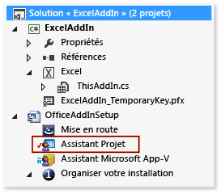
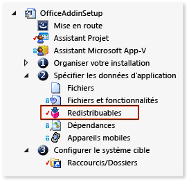

# <a name="deploy-an-office-solution-by-using-windows-installer"></a>Déployer une solution Office à l’aide de Windows Installer

Découvrez comment créer un fichier Windows Installer pour votre solution Office à l'aide de [!INCLUDE[vs_dev12](../vsto/includes/vs-dev12-md.md)].

En utilisant Visual Studio pour créer un fichier Windows Installer, vous pouvez déployer une solution Office qui requiert un accès administrateur sur l'ordinateur de l'utilisateur final. Par exemple, vous pouvez utiliser ce fichier pour installer une solution une seule fois pour tous les utilisateurs d'un ordinateur. Vous pouvez également déployer une solution Office à l'aide de ClickOnce, mais elle doit être installée séparément pour chaque utilisateur de l'ordinateur.

[!include[Add-ins note](includes/addinsnote.md)]

## <a name="in-this-topic"></a>Dans cette rubrique

- [Télécharger les exemples de compléments VSTO](#Download)

- [Obtenir InstallShield Limited Edition](#Obtain)

- [Décider comment accorder un niveau de confiance à la solution](#ApplySecurity)

- [Créer un projet d'installation](#Create)

- [Ajouter la sortie du projet](#Add)

- [Ajouter les manifestes d'application et de déploiement](#AddD)

- [Configurer les modules dépendants comme des composants requis](#Configure)

- [Specify where you want to deploy the solution on the user's computer](#Location)

- [Configurer un complément VSTO](#ConfigureRegistry)

- [Configure a Document-Level Customization](#ConfigureDocument)

- [Build the Setup Project](#Build)

Pour plus d’informations sur le déploiement d’une solution Office à l’aide de ClickOnce, consultez [déployer une solution Office à l’aide de ClickOnce](../vsto/deploying-an-office-solution-by-using-clickonce.md).

Pour plus d’informations sur la création d’un fichier Windows Installer à l’aide de [!INCLUDE[vs_dev10_long](../sharepoint/includes/vs-dev10-long-md.md)] , consultez [déployer une solution Visual Studio 2010 Tools pour Office à l’aide d’Windows Installer](/previous-versions/visualstudio/visual-studio-2010/ff937654(v=msdn.10)).

## <a name="download-samples"></a><a name="Download"></a>Télécharger des exemples
Cette rubrique fait référence aux exemples téléchargeables suivants.

|Exemple<br /><br />|Description<br /><br />|
|----------|---------------|
|[ExcelAddIn](https://code.msdn.microsoft.com/VSTO-Deploy-an-Office-fbcc09ad)<br /><br />|Complément Excel VSTO que vous pouvez installer sur un ordinateur qui exécute une version 32 bits ou 64 bits d’Office.<br /><br />|
|[ExcelWorkbook](https://code.msdn.microsoft.com/VSTO-Deploy-a-Customization-f70fae33)<br /><br />|Personnalisation au niveau du document Excel que vous pouvez installer sur un ordinateur qui exécute une version 32 bits ou 64 bits d'Office.<br /><br />|

## <a name="decide-how-to-grant-trust-to-the-solution"></a><a name="ApplySecurity"></a>Décider comment accorder un niveau de confiance à la solution
Avant qu'une solution puisse s'exécuter sur les ordinateurs des utilisateurs, vous devez lui accorder votre confiance de l'une des façons suivantes, ou les utilisateurs doivent répondre à une invite d'approbation lorsqu'ils installent la solution.

- Signez les manifestes à l'aide d'un certificat qui identifie un éditeur connu et approuvé. Pour plus d’informations, consultez [approuver la solution en signant les manifestes d’application et de déploiement](../vsto/granting-trust-to-office-solutions.md#Signing).

- Installez la solution dans le répertoire Program Files sur l’ordinateur de l’utilisateur.

> [!NOTE]
> Pour les personnalisations au niveau du document, l'emplacement du document doit également être approuvé. Pour plus d’informations, consultez accorder un niveau [de confiance à des documents](../vsto/granting-trust-to-documents.md).

## <a name="get-installshield-limited-edition"></a><a name="Obtain"></a>Obtenir InstallShield Limited Edition

Vous pouvez créer un fichier Windows Installer à l'aide d'ISLE (InstallShield Limited Edition), qui est gratuit si vous avez installé Visual Studio. ISLE remplace les fonctionnalités des modèles de projet pour l'installation et le déploiement qui étaient proposées dans les versions antérieures de Visual Studio.

### <a name="to-get-installshield-limited-edition"></a>Pour obtenir InstallShield Limited Edition

1. Dans la barre de menus, choisissez **fichier**  >  **nouveau**  >  **projet**.

   La boîte de dialogue **Nouveau projet** s’affiche.

2. Dans le volet des modèles, développez **Autres types de projets**, puis choisissez le modèle **Configuration et déploiement** .

3. Dans la liste des types de projets pour **Configuration et déploiement**, sélectionnez **Activer InstallShield Limited Edition**, puis cliquez sur le bouton **OK** .

   Une page s'affiche avec les informations relatives à l'obtention d'InstallShield Limited Edition.

4. Dans cette page, choisissez le lien **Ouvrez le site web de téléchargement** .

5. Dans la page de téléchargement d'InstallShield Limited Edition, entrez les informations requises dans les champs appropriés, puis choisissez le lien **Télécharger maintenant** .

   Une fois que vous avez téléchargé, installé et activé le produit, le modèle **Projet InstallShield Limited Edition** apparaît dans Visual Studio.

## <a name="create-a-setup-project"></a><a name="Create"></a>Créer un projet d'installation

1. Dans [!INCLUDE[vsprvs](../sharepoint/includes/vsprvs-md.md)], ouvrez le projet Office que vous souhaitez déployer.

   Les exemples de compléments VSTO associés à cette rubrique contiennent un projet nommé **ExcelAddIn**. Les exemples de personnalisation au niveau du document contiennent un projet nommé **ExcelWorkbook**. Cette rubrique fait référence au projet Office de votre solution en utilisant l'un de ces deux noms.

2. Dans la barre de menus, choisissez **fichier**  >  **Ajouter**  >  **un nouveau projet**.

   La boîte de dialogue **Ajouter un nouveau projet** s'ouvre.

3. Dans le volet des modèles, développez **Autres types de projets**, puis choisissez le modèle **Configuration et déploiement** .

4. Dans la liste des types de projets pour **Configuration et déploiement**, sélectionnez **Projet InstallShield Limited Edition**, nommez le projet, puis choisissez le bouton **OK** .

   Le projet d’installation InstallShield que vous avez créé apparaît dans votre solution.

   Les exemples de cette rubrique contiennent un projet d'installation nommé **OfficeAddInSetup**. Cette rubrique fait référence au projet d'installation de votre solution en utilisant le même nom.

## <a name="add-the-project-output"></a><a name="Add"></a>Ajouter la sortie du projet

Vous configurez le projet **OfficeAddInSetup** pour inclure la sortie de votre projet Office. Pour les projets de complément VSTO, la sortie du projet est seulement l'assembly de solution. Pour les projets de personnalisation au niveau du document, la sortie de projet inclut non seulement l'assembly de solution, mais également le document lui-même.

### <a name="to-add-the-project-output"></a>Pour ajouter la sortie du projet

1. Dans l' **Explorateur de solutions**, développez le nœud de projet **OfficeAddInSetup** , puis choisissez le fichier **Assistant Projet** , illustré ci-dessous.

   

2. Dans la barre de menus, choisissez **Afficher**  >  **ouvrir**.

3. En bas de la page **Assistant Projet** , choisissez le bouton **Fichiers d'application** , comme le montre l'illustration suivante.

   

4. Dans la page **Fichiers d'application** , choisissez le bouton **Ajouter les sorties du projet** .

5. Dans la boîte de dialogue **Sélecteur de sortie de Visual Studio** , activez la case à cocher **Sortie principale** , puis choisissez le bouton **OK** .

## <a name="add-the-deployment-and-application-manifests"></a><a name="AddD"></a>Ajouter les manifestes d'application et de déploiement

1. Dans la page **Fichiers d'application** , choisissez le bouton **Ajouter des fichiers** .

2. Dans la boîte de dialogue **Ouvrir** , accédez au répertoire de sortie du projet **ExcelAddIn** .

   Généralement, le répertoire de sortie est le sous-dossier **bin\Release** du répertoire racine du projet, selon la configuration de build que vous choisissez.

3. Dans le répertoire de sortie, choisissez les fichiers **ExcelAddIn.vsto** et **ExcelAddIn.dll.manifest** , puis sélectionnez le bouton **Ouvrir** .

   La page **Fichiers d'application** contient maintenant le fichier de sortie du projet, le manifeste de déploiement et le manifeste d'application, comme le montre l'illustration suivante.

   

## <a name="configure-the-dependent-components-as-prerequisites"></a><a name="Configure"></a>Configurer les modules dépendants comme des composants requis

Dans votre application d'installation, vous devez inclure non seulement les composants suivants, mais également tous les autres composants requis pour que votre solution s'exécute.

- Version de .NET Framework ciblée par votre solution Office.

- Microsoft Visual Studio 2010 Tools pour Office Runtime.

### <a name="add-the-net-framework-4-or-the-net-framework-45-as-a-prerequisite"></a>Ajoutez le .NET Framework 4 ou le .NET Framework 4,5 comme condition préalable

1. Dans l' **Explorateur de solutions**, développez le nœud de projet **OfficeAddInSetup** , le nœud **Spécifiez les données d'application** , puis choisissez le fichier **Composants redistribuables** , comme le montre l'illustration suivante.

   

2. Dans la barre de menus, choisissez **Afficher**  >  **ouvrir**.

   La page **Composants redistribuables** s'ouvre.

3. Dans la liste des composants redistribuables, activez la case à cocher appropriée pour la version de .NET Framework ciblée par votre solution.

   Par exemple, si votre solution cible [!INCLUDE[net_v45](../vsto/includes/net-v45-md.md)], activez la case à cocher **Microsoft .Net Framework 4.5 Full** . Une boîte de dialogue peut s'afficher pour vous inviter à installer le composant redistribuable, qui est requis par InstallShield avant de pouvoir ajouter le composant comme composant requis. Si cette boîte de dialogue n’apparaît pas, c’est que le composant existe déjà sur votre ordinateur.

4. Si cette boîte de dialogue apparaît, choisissez le bouton **Non** .

### <a name="add-the-visual-studio-2010-tools-for-office-runtime"></a><a name="AddToolsForOffice"></a>Ajouter Visual Studio 2010 Tools pour Office Runtime

La page **Composants redistribuables** contient un élément nommé **Runtime Microsoft VSTO 2010**, mais il fait référence à une version antérieure du runtime. Par conséquent, vous pouvez créer manuellement un fichier de configuration qui fait référence à la dernière version. Vous devez ensuite placer ce fichier dans le même répertoire que les fichiers de configuration pour tous les autres éléments qui apparaissent dans la page **Composants redistribuables** .

#### <a name="to-add-the-visual-studio-2010-tools-for-office-runtime-as-a-prerequisite"></a>Pour ajouter Visual Studio 2010 Tools pour Office Runtime comme composant requis

1. Ouvrez le Bloc-notes et collez le code XML suivant dans un fichier texte.

   ```xml
   <?xml version="1.0" encoding="UTF-8"?>
   <SetupPrereq>
   <conditions>
       <condition Type="32" Comparison="2" Path="HKEY_LOCAL_MACHINE\SOFTWARE\Microsoft\VSTO Runtime Setup\v4R" FileName="Version" ReturnValue="10.0.50903" Bits="2"></condition>
   <condition Type="32" Comparison="2" Path="HKEY_LOCAL_MACHINE\SOFTWARE\Wow6432Node\Microsoft\VSTO Runtime Setup\v4R" FileName="Version" ReturnValue="10.0.50903" Bits="2"></condition>
   </conditions>
   <files>
       <file LocalFile="<ISProductFolder>\SetupPrerequisites\VSTOR\vstor_redist.exe" URL="http://download.microsoft.com/download/C/0/0/C001737F-822B-48C2-8F6A-CDE13B4B9E9C/vstor_redist.exe" CheckSum="88b8aa9e8c90818f98c80ac4dd998b88" FileSize=" 0,40117912"></file>
   </files>
   <execute file="vstor_redist.exe" returncodetoreboot="1641,3010" requiresmsiengine="1">
   </execute>
   <properties Id="{15965040-56BB-49B8-A88F-3525C48D9BA8}" Description="This prerequisite installs the most recent version of the Microsoft Visual Studio 2010 Tools for Office Runtime." >
   </properties>

   </SetupPrereq>
   ```

2. Générer un GUID dans Visual Studio. Dans le menu **Outils** , choisissez **Créer un Guid**.

3. Dans le programme **Générateur de GUID** , sélectionnez la case d'option **Format du Registre** , choisissez le bouton **Copier** , puis le bouton **Quitter** .

4. Dans le Bloc-notes, remplacez le texte **Your GUID goes here** en collant le GUID à la place.

   L’élément **&lt; Properties &gt;** de votre fichier ressemble à ce qui suit.

   ```xml
   <properties Id="{87989B73-21DC-4403-8FD1-0C68A41A6D8C}" Description="This prerequisite installs the most recent version of the Microsoft Visual Studio 2010 Tools for Office Runtime." >
   </properties>
   ```

5. Dans la barre de menus du bloc-notes, choisissez **fichier**  >  **Enregistrer**.

6. Dans la boîte de dialogue **Enregistrer sous** , recherchez votre dossier **Bureau** .

7. Dans la liste **type** de fichier, choisissez **tous les fichiers (&#42;. &#42;)**.

8. Dans la zone **Nom de fichier** , entrez **Visual Studio 2010 Tools for Office Runtime.prq**, puis choisissez le bouton **Enregistrer** .

   > [!NOTE]
   > Assurez-vous d'ajouter **.prq** à la fin du nom de fichier pour identifier ce fichier en tant que fichier requis.

9. Fermez le Bloc-notes.

10. À partir de votre dossier **Bureau** , copiez le fichier *Visual Studio 2010 Tools pour Office Runtime. PRQ* dans l’un des répertoires suivants sur votre ordinateur.

   Pour les systèmes d’exploitation 32 bits *: \\ %ProgramFiles%\InstallShield\2013LE\SetupPrerequisites*

   Pour les systèmes d’exploitation 64 bits : *% ProgramFiles (x86)% \ 2013LE \ \\ SetupPrerequisites*

11. Dans la page **Redistribuable** du projet InstallShield, choisissez le bouton **Actualiser** pour actualiser la liste des composants redistribuables, comme le montre l'illustration suivante.

   

12. Dans la liste de composants redistribuables, activez la case à cocher **Visual Studio 2010 Tools pour Office Runtime** .

   Une boîte de dialogue peut s'afficher et vous inviter à installer le composant redistribuable. Si cette boîte de dialogue n’apparaît pas, vous pouvez passer à la section [spécifier l’emplacement où vous souhaitez déployer la solution sur l’ordinateur de l’utilisateur](#Location) de cette rubrique.

13. Si cette boîte de dialogue apparaît, choisissez le bouton **Non** .

## <a name="specify-where-to-install-the-solution-on-the-users-computer"></a><a name="Location"></a>Spécifier où installer la solution sur l'ordinateur de l'utilisateur

1. Dans l' **Explorateur de solutions**, développez le nœud **OfficeAddInSetup** , le nœud **Planifier votre installation** , puis choisissez le fichier **Informations générales** .

2. Dans la barre de menus, choisissez **Afficher**  >  **ouvrir**.

3. Dans la liste des propriétés, sélectionnez le bouton **Parcourir** en regard de la propriété **INSTALLDIR** .

4. Dans la boîte de dialogue **définir INSTALLDIR** , choisissez un dossier sur l’ordinateur de l’utilisateur sur lequel vous souhaitez installer la solution.

   > [!NOTE]
   > Vous pouvez également créer des sous-répertoires dans la boîte de dialogue **Définir INSTALLDIR** en ouvrant le menu contextuel d'un dossier de la liste.

## <a name="configure-a-vsto-add-in"></a><a name="ConfigureRegistry"></a>Configurer un complément VSTO

Vous pouvez spécifier si vous souhaitez que votre complément VSTO soit installé pour tous les utilisateurs de l’ordinateur (par ordinateur) ou uniquement pour celui qui procède à son installation (par utilisateur).

Si vous souhaitez prendre en charge les installations par ordinateur, créez deux programmes d'installation distincts. Vous pouvez fractionner des programmes d'installation selon la version d'Office (32 bits et 64 bits) ou la version de Windows (32 bits et 64 bits) exécutée par l'utilisateur.

Les installations par utilisateur requièrent un seul programme d'installation quelle que soit la version d'Office ou de Windows.

> [!NOTE]
> Cette section s’applique uniquement si vous déployez un complément VSTO. Si vous déployez une personnalisation au niveau du document, vous pouvez accéder immédiatement à la section [configurer une personnalisation au niveau du document](#ConfigureDocument) .

### <a name="to-specify-whether-you-want-to-support-per-user-or-per-computer-installations"></a>Pour spécifier si vous souhaitez prendre en charge les installations par utilisateur ou par ordinateur

1. Dans l' **Explorateur de solutions**, développez le nœud de projet **OfficeAddInSetup** , le nœud **Planifier votre installation** , puis choisissez le fichier **Informations générales** .

2. Dans la barre de menus, choisissez **Afficher**  >  **ouvrir**.

   Les propriétés du projet d'installation s'affichent.

3. Dans la liste pour la propriété **AllUSERS** , spécifiez si vous souhaitez que cette solution soit installée pour tous les utilisateurs de l'ordinateur ou uniquement pour l'utilisateur qui installe la solution.

   Pour installer le complément VSTO pour l’utilisateur actuel, choisissez **ALLUSERS = "" (installation par utilisateur)**. Pour installer le complément VSTO pour tous les utilisateurs de l’ordinateur, choisissez **ALLUSERS=1 (installation par ordinateur)**.

   Dans la procédure suivante, vous allez créer des clés de Registre pour permettre à l’application Office de découvrir et de charger le complément VSTO. Consultez [entrées du Registre pour les compléments VSTO](../vsto/registry-entries-for-vsto-add-ins.md).

### <a name="to-create-registry-keys"></a>Pour créer des clés de Registre

1. Dans l' **Explorateur de solutions**, sélectionnez le nœud **Assistant Projet** .

   Dans la barre de menus, choisissez **Afficher**  >  **ouvrir**.

2. En bas de la page **Assistant Projet** , choisissez le bouton **Registre de l'application** , comme le montre l'illustration suivante.

   

   La page **Registre de l'application** s'affiche.

3. Sous **Voulez-vous configurer les données de Registre que votre application installe ?**, sélectionnez la case d'option **Oui** .

4. Dans la liste Affichage du registre de l' **ordinateur de destination** , ajoutez la hiérarchie de clé qui active le type de programme d’installation que vous souhaitez créer.

   Le chemin d'accès que vous configurez dans cette section varie selon que vous créez un programme d'installation par utilisateur ou par ordinateur.

   **Programme d'installation par utilisateur**

   **HKEY_CURRENT_USER\Software\Microsoft\Office\Excel\Addins\SampleCompany.ExcelAddIn**

   **Programmes d'installation par ordinateur selon la version d'Office**

| Version d’Office<br /><br /> | Chemin d'accès de configuration d'InstallShield<br /><br /> |
|----------------------------| - |
| 32 bits<br /><br /> | **HKEY_LOCAL_MACHINE\SOFTWARE(32-Bit)\Microsoft\Office\Excel\Addins\SampleCompany.ExcelAddIn**<br /><br /> |
| 64 bits<br /><br /> | **HKEY_LOCAL_MACHINE\SOFTWARE(64-Bit)\Microsoft\Office\Excel\Addins\SampleCompany.ExcelAddIn**<br /><br /> |

   **Programmes d'installation par ordinateur selon la version de Windows**

| Version de Windows<br /><br /> | Chemin d'accès de configuration d'InstallShield<br /><br /> |
|-----------------------------| - |
| 32 bits<br /><br /> | **HKEY_LOCAL_MACHINE\SOFTWARE(32-Bit)\Microsoft\Office\Excel\Addins\SampleCompany.ExcelAddIn**<br /><br /> |
| 64 bits<br /><br /> | **HKEY_LOCAL_MACHINE\SOFTWARE(32-Bit)\Microsoft\Office\Excel\Addins\SampleCompany.ExcelAddIn**<br /><br />**HKEY_LOCAL_MACHINE\SOFTWARE(64-Bit)\Microsoft\Office\Excel\Addins\SampleCompany.ExcelAddIn**<br /><br /> |

   > [!NOTE]
   > Un programme d’installation pour Windows 64 bits requiert deux chemins d’accès au registre car il est possible que les utilisateurs exécutent les versions 32 bits et 64 bits d’Office sur un ordinateur qui exécute Windows 64 bits.

   > [!NOTE]
   > Il est recommandé de placer le nom de votre société au début du nom de votre complément VSTO. Cette Convention augmente le risque que la clé soit unique et réduit le risque de conflit avec un complément VSTO d’un autre fournisseur. Les compléments qui ont le même nom peuvent par exemple remplacer leurs clés d'inscription respectives. Cette approche ne peut pas garantir que la clé sera unique, mais peut réduire les conflits de nom potentiels.

5. Une fois que vous avez créé la hiérarchie des clés, ouvrez le menu contextuel pour la clé **clé SampleCompany. ExcelAddIn** , choisissez **nouveau**, puis **valeur de chaîne**.

   La nouvelle valeur de chaîne apparaît dans la liste des **données de registre de l’ordinateur de destination** . Le nom de la valeur de chaîne est mis en surbrillance afin que vous puissiez le modifier.

6. Renommez la valeur en **Description**.

7. Répétez ce processus pour créer les valeurs suivantes.

|Type de valeur<br /><br />|Nom<br /><br />|
|--------------|--------|
|Valeur de chaîne<br /><br />|**FriendlyName**<br /><br />|
|Valeur DWORD<br /><br />|**LoadBehavior**<br /><br />|
|Valeur de chaîne<br /><br />|**Manifeste**<br /><br />|

8. Ouvrez le menu contextuel de la valeur **Description** , puis choisissez **Modifier**.

   La boîte de dialogue **Modifier les données** s'affiche.

9. Dans la zone de texte **Données de la valeur** , entrez **Complément Démo Excel**, puis choisissez le bouton **OK** .

   Cette description s’affiche lorsque l’utilisateur ouvre l’application Office, ouvre la boîte de dialogue **Options** , puis choisit le complément VSTO dans le volet **Compléments** .

10. Ouvrez le menu contextuel de la valeur **FriendlyName** , puis choisissez **Modifier**.

   La boîte de dialogue **Modifier les données** s'affiche.

11. Dans la zone de texte **Données de la valeur** , entrez **Complément Démo Excel**, puis choisissez le bouton **OK** .

   Cette chaîne apparaît dans la boîte de dialogue **Compléments COM** de l'application Office. Par défaut, la valeur de la chaîne est l’ID du complément VSTO.

12. Ouvrez le menu contextuel de la valeur **LoadBehavior** , puis choisissez **Modifier**.

   La boîte de dialogue **Modifier les données** s'affiche.

13. Dans la zone de texte **Données de la valeur** , entrez **3**, puis choisissez le bouton **OK** .

   La valeur 3 charge le complément VSTO lorsque l’application démarre. Pour plus d’informations sur les valeurs LoadBehavior, consultez [Registry Entries for VSTO Add-ins](../vsto/registry-entries-for-vsto-add-ins.md).

14. Ouvrez le menu contextuel de la valeur **Manifest** , puis choisissez **Modifier**.

   La boîte de dialogue **Modifier les données** s'affiche.

15. Dans la zone de texte **Données de la valeur** , entrez **file:///[INSTALLDIR]ExcelAddIn.vsto|vstolocal**, puis choisissez le bouton **OK** .

   Visual Studio 2010 Tools pour Office Runtime utilise ce chemin d'accès pour trouver le manifeste du déploiement. La partie **[INSTALLDIR]** de ce chemin d'accès est une macro mappée à la propriété **INSTALLDIR** dans la page de propriétés **Informations générales** de votre projet d'installation InstallShield. Cette propriété spécifie l’emplacement sur l’ordinateur cible où installer le complément VSTO. Le suffixe **|vstolocal** garantit que votre solution est chargée à partir du dossier d'installation et non à partir du cache ClickOnce.

> [!IMPORTANT]
> Si vous créez une zone de formulaire personnalisée dans un complément VSTO pour Outlook, vous devez créer d’autres entrées de Registre pour inscrire la région auprès d’Outlook. Pour plus d’informations, consultez [entrées de Registre pour les zones de formulaire Outlook](../vsto/registry-entries-for-vsto-add-ins.md#OutlookEntries).

## <a name="configure-a-document-level-customization"></a><a name="ConfigureDocument"></a>Configure a Document-Level Customization

Cette section s’applique uniquement si vous déployez une personnalisation au niveau du document. Si vous déployez un complément VSTO, vous pouvez passer immédiatement à la section [générer le projet d’installation](#Build) .

Les personnalisations au niveau du document n’utilisent pas de clés de registre. Au lieu de cela, des propriétés de document personnalisées contiennent l'emplacement du manifeste de déploiement.

Pour modifier des propriétés personnalisées, vous créez un programme qui supprime la personnalisation au niveau du document du document, modifie les propriétés appropriées, puis rattache la personnalisation au document. Vous créez ensuite une action personnalisée qui exécute le programme et vous ajoutez cette action à votre projet d'installation.

### <a name="to-create-a-program-that-modifies-document-properties"></a>Pour créer un programme qui modifie les propriétés d'un document

1. Dans la barre de menus, choisissez **fichier**  >  **Ajouter**  >  **un nouveau projet**.

   La boîte de dialogue **Ajouter un nouveau projet** apparaît.

2. Dans le volet des modèles, sous le nœud correspondant au langage à utiliser, choisissez le dossier **Windows** .

3. Dans la liste des types de projets pour **Windows**, choisissez le modèle **Application console** .

4. Nommez le projet **SetExcelDocumentProperties**, puis choisissez le bouton **OK** .

5. Dans l' **Explorateur de solutions**, choisissez le bouton **Afficher tous les fichiers** , ouvrez le menu contextuel du nœud de projet **SetExcelDocumentProperties** , puis choisissez **Ajouter une référence**.

6. Dans la boîte de dialogue **Gestionnaire de références** , choisissez l'onglet **Extensions** , activez la case à cocher en regard des assemblys suivants, puis choisissez le bouton **OK** .

   - Microsoft.VisualStudio.Tools.Applications.Runtime

   - Microsoft.VisualStudio.Tools.Applications.ServerDocument

7. Dans l' **Explorateur de solutions**, choisissez le fichier **Program.cs** (pour les applications C#) ou le fichier **Module1.vb** (pour les applications Visual Basic).

8. Dans la barre de menus, choisissez **Afficher**  >  **ouvrir**.

9. Remplacez le contenu du fichier entier par le code suivant.

:::code language="vb" source="../vsto/codesnippet/VisualBasic/setexceldocumentproperties/module1.vb" id="Snippet1":::
:::code language="csharp" source="../vsto/codesnippet/CSharp/setexceldocumentproperties/program.cs" id="Snippet1":::

10. Compilez le projet.

### <a name="to-add-a-custom-action-that-runs-your-program"></a>Pour ajouter une action personnalisée qui exécute votre programme

1. Dans l' **Explorateur de solutions**, développez le nœud de projet **OfficeAddInSetup** , puis choisissez le fichier **Assistant Projet** , illustré ci-dessous.

   

2. Dans la barre de menus, choisissez **Afficher**  >  **ouvrir**.

3. En bas de la page **Assistant Projet** , choisissez le bouton **Fichiers d'application** , comme le montre l'illustration suivante.

   

4. Dans la page **Fichiers d'application** , choisissez le bouton **Ajouter les sorties du projet** .

   La boîte de dialogue **Sélecteur de sortie de Visual Studio** apparaît.

5. Sous le nœud **SetExcelDocumentProperties** , activez la case à cocher **Sortie principale** , puis choisissez le bouton **OK** .

6. Dans l' **Explorateur de solutions**, sous le nœud **OfficeAddInSetup** , développez le nœud **Définir des spécifications et des actions d'installation** , puis choisissez le dossier **Actions personnalisées** .

7. Dans la barre de menus, choisissez **Afficher**  >  **ouvrir**.

   Une liste d'événements s'affiche dans un volet à côté de l'écran.

   > [!NOTE]
   > Seuls quelques événements affichés dans cette liste sont disponibles dans InstallShield Limited Edition. Dans cette procédure, vous allez exécuter le programme à l’aide de l’événement de la **boîte de dialogue une fois l’installation terminée avec succès** .

8. Dans la liste des événements, sous **Actions personnalisées pendant l'installation**, ouvrez le menu contextuel pour l'événement **After Setup Complete Success dialog** (Boîte de dialogue de succès de l'installation), puis choisissez **Nouvel EXE**.

   Une action personnalisée nommée **NewCustomAction1** apparaît sous l'événement **After Setup Complete Success dialog** . Un ensemble de propriétés pour l'action personnalisée s'affiche dans un volet en regard des événements.

   > [!IMPORTANT]
   > Deux événements **After Setup Complete Success dialog** (Boîte de dialogue de succès de l'installation) apparaissent dans la liste des événements. Veillez à choisir l'instance de l'événement **After Setup Complete Success dialog** (Boîte de dialogue de succès de l'installation) qui apparaît sous le nœud **Custom Actions During Installation** (Actions personnalisées durant l'installation).

9. Dans la liste de la propriété **Emplacement source** , choisissez **Installée avec le produit**.

10. Choisissez le bouton **Parcourir** en regard de la propriété **Nom de fichier** .

11. Dans la boîte de dialogue **Rechercher un fichier de destination** , recherchez le fichier **SetExcelDocumentProperties.Primary.output** , puis choisissez le bouton **Ouvrir** .

    L'emplacement de ce fichier dépend du dossier que vous avez spécifié pour la propriété **INSTALLDIR** du projet d'installation. Par exemple, si vous définissez cette propriété sur un dossier nommé **[PersonalFolder]DemoWorkbookApp**, vous pouvez rechercher le fichier **SetExcelDocumentProperties.Primary.output** en accédant à **[ProgramFilesFolder]\DemoWorkbookApp**.

    Dans les étapes suivantes, vous obtiendrez l’ID de solution du document, puis passerez cet ID en tant que paramètre à l’application console. Vous allez également passer l’emplacement du document, le manifeste de déploiement et l’assembly de document.

12. Ouvrez le menu contextuel pour le projet **ExcelWorkbook** , puis choisissez **Ouvrir le dossier dans l'Explorateur Windows** ou **Ouvrir le dossier dans l'Explorateur de fichiers** selon votre système d'exploitation.

    Le dossier qui contient votre solution s'ouvre.

13. Ouvrez le fichier projet de votre solution dans le Bloc-notes. Pour les projets Visual Basic, le nom du fichier est *ExcelWorkbook. vbproj*. Pour les projets C#, le nom du fichier est *ExcelWorkbook. csproj*.

14. Dans le fichier projet, recherchez l’élément **&lt; SolutionId &gt;** , copiez sa valeur dans le presse-papiers, puis fermez le bloc-notes.

    Vous passez cette valeur à l'application console comme paramètre.

15. Dans la page de propriétés de **NewCustomAction1**, définissez la propriété **Ligne de commande** sur la ligne de texte suivante.

   ```cmd
   /assemblyLocation="[INSTALLDIR]ExcelWorkbook.dll" /deploymentManifestLocation="[INSTALLDIR]ExcelWorkbook.vsto" /documentLocation="[INSTALLDIR]ExcelWorkbook.xlsx" /solutionID="Your Solution ID"
   ```

16. Remplacez **Your Solution ID** par l'ID de solution que vous avez copié dans le Presse-papiers.

   > [!IMPORTANT]
   > Testez votre programme d'installation pour vérifier si l'application console exécutée par cette action personnalisée peut accéder aux documents du répertoire [INSTALLDIR]. Certains répertoires sur l’ordinateur de l’utilisateur peuvent nécessiter un accès administratif (par exemple, le répertoire Program Files). Si vous déployez votre solution dans un répertoire qui requiert un accès administratif, vous devez ouvrir la boîte de dialogue **Propriétés** du fichier *setup.exe* , choisir l’onglet **compatibilité** , puis activer la case à cocher **exécuter ce programme en tant qu’administrateur** avant de distribuer le programme d’installation. Si vous ne souhaitez pas que les utilisateurs exécutent le programme d’installation avec des autorisations d’administration, définissez la propriété [INSTALLDIR] sur un répertoire auquel l’utilisateur a probablement déjà accès, par exemple le répertoire **documents** . Pour plus d’informations, consultez la section [spécifier l’emplacement où vous souhaitez installer la solution sur l’ordinateur de l’utilisateur dans](#Location) cette rubrique.

## <a name="build-the-setup-project"></a><a name="Build"></a>Build the Setup Project

1. Dans l' **Explorateur de solutions**, développez le nœud **Préparer à la version** , puis choisissez le fichier **Versions** .

2. Dans la barre de menus, choisissez **Afficher**  >  **ouvrir**.

   L'Explorateur **Builds** s'ouvre dans un volet latéral pour vous permettre de choisir le type de version que vous souhaitez créer.

3. Dans l'Explorateur **Builds** , choisissez le dossier **SingleImage** .

4. Dans le volet en regard de l'explorateur **Builds** , choisissez l'onglet **Setup.exe** .

5. Dans la page de propriétés **Setup.exe** , dans la liste **Emplacement de composants requis d'InstallShield** , choisissez **Téléchargement à partir du Web**.

6. Dans la barre de menus, choisissez **générer**  >  **Configuration Manager**.

7. Dans la zone de liste **Configuration de la solution active** , choisissez **SingleImage**.

8. Dans la table **Contextes des projets** , dans la colonne **Configuration** du projet **OfficeAddInSetup** , sélectionnez **SingleImage**, puis choisissez le bouton **Fermer** .

9. Dans la barre de menus, choisissez **générer**  >  **générer OfficeAddInSetup**.

   Une fois la génération terminée, vous pouvez localiser le fichier *setup.exe* du projet **OfficeAddInSetup** à l’emplacement suivant : <em>OfficeAddInSetupProjectRoot</em>**\OfficeAddInSetup\Express\SingleImage\DiskImages\DISK1 \\**

## <a name="see-also"></a>Voir aussi

- [Conditions préalables pour le déploiement de solutions Office](/previous-versions/bb608617(v=vs.110))
- [Déployer une solution Office](../vsto/deploying-an-office-solution.md)
- [Entrées de Registre pour les compléments VSTO](../vsto/registry-entries-for-vsto-add-ins.md)
- [Vue d’ensemble des propriétés de document personnalisées](../vsto/custom-document-properties-overview.md)
- [Accorder un niveau de confiance à des solutions Office](../vsto/granting-trust-to-office-solutions.md)
- [Accorder un niveau de confiance à des documents](../vsto/granting-trust-to-documents.md)
- [Déployer une solution Visual Studio 2010 Tools pour Office à l’aide de Windows Installer](/previous-versions/visualstudio/visual-studio-2010/ff937654(v=msdn.10))