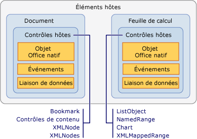

# Éléments hôtes et la vue d’ensemble des contrôles hôtes
  Les éléments hôtes et les contrôles hôtes sont des types qui fournissent un modèle de programmation pour les solutions Office créées à l’aide des outils de développement Office dans Visual Studio. Les éléments hôtes et les contrôles hôtes apparentent l’interaction avec les modèles objet Microsoft Office Word et Microsoft Office Excel, qui sont basés sur COM, davantage à l’interaction entre des objets managés tels que les contrôles Windows Forms.  
  
 [!INCLUDE[appliesto_controls](../vsto/includes/appliesto-controls-md.md)]  
  
## Éléments hôtes  
 Les éléments hôtes sont des types qui se trouvent en haut des hiérarchies de modèles objet dans les projets Office. [!INCLUDE[vsto_runtime](../vsto/includes/vsto-runtime-md.md)] définit les éléments hôtes suivants pour les solutions Word et Excel :  
  
- <xref:Microsoft.Office.Tools.Word.Document>  
  
- <xref:Microsoft.Office.Tools.Excel.Workbook>  
  
- <xref:Microsoft.Office.Tools.Excel.Worksheet>  
  
- <xref:Microsoft.Office.Tools.Excel.ChartSheet>  
  
  Chacun de ces types étend un objet qui existe en mode natif dans le modèle objet Word ou Excel, appelé *objet Office natif*. Par exemple, l’élément hôte <xref:Microsoft.Office.Tools.Word.Document> étend l’objet <xref:Microsoft.Office.Interop.Word.Document> , qui est défini dans l’assembly PIA (Primary Interop Assembly) pour Word.  
  
  Les éléments hôtes possèdent généralement les mêmes fonctionnalités de base que les objets Office correspondants, mais ils sont améliorés avec les fonctionnalités suivantes :  
  
- la capacité d’héberger des contrôles managés, y compris des contrôles hôtes et Windows Forms,  
  
- des modèles d’événement enrichis. Certains événements de document, de classeur et de feuille de calcul dans les objets Word et Excel natifs sont déclenchés uniquement au niveau de l'application. Les éléments hôtes fournissent ces événements au niveau du document, afin qu'il soit plus facile de les gérer pour un document spécifique.  
  
### Comprendre les éléments hôtes dans les projets au niveau du document  
 Dans les projets au niveau du document, les éléments hôtes fournissent un point d’entrée pour votre code et disposent de concepteurs qui vous aident à développer votre solution.  
  
 Les éléments hôtes <xref:Microsoft.Office.Tools.Word.Document> et <xref:Microsoft.Office.Tools.Excel.Worksheet> disposent de concepteurs associés qui sont la représentation visuelle du document ou de la feuille de calcul, comme un concepteur Windows Forms. Vous pouvez utiliser ce concepteur pour modifier le contenu du document ou de la feuille de calcul directement dans Word ou Excel, ainsi que pour faire glisser des contrôles sur l’aire de conception. Pour plus d’informations, consultez [élément hôte de Document](../vsto/document-host-item.md) et [élément hôte de feuille de calcul](../vsto/worksheet-host-item.md).  
  
 L’élément hôte <xref:Microsoft.Office.Tools.Excel.Workbook> n’agit pas comme un conteneur pour les contrôles qui possèdent une interface utilisateur. À la place, le concepteur de cet élément hôte fonctionne comme une barre d’état des composants, ce qui vous permet de faire glisser un composant, tel qu’un <xref:System.Data.DataSet>, sur son aire de conception. Pour plus d’informations, consultez [élément hôte de classeur](../vsto/workbook-host-item.md).  
  
 Il n’est pas possible de créer par programmation des éléments hôtes dans des projets au niveau du document. Utilisez plutôt les classes `ThisDocument`, `ThisWorkbook`, ou `Sheet`*n* que Visual Studio génère automatiquement dans votre projet au moment du design. Ces classes générées dérivent des éléments hôtes et fournissent un point d’entrée pour votre code. Pour plus d’informations, consultez [limitations de programmation des éléments hôtes et contrôles hôtes](../vsto/programmatic-limitations-of-host-items-and-host-controls.md).  
  
### Comprendre les éléments hôtes dans les projets de complément VSTO  
 Lorsque vous créez un complément, VSTO, vous n’avez pas les accès à tous les éléments hôte par défaut. Toutefois, vous pouvez générer <xref:Microsoft.Office.Tools.Word.Document>, <xref:Microsoft.Office.Tools.Excel.Workbook>, et <xref:Microsoft.Office.Tools.Excel.Worksheet> héberger les éléments dans Word et Excel VSTO Add-ins lors de l’exécution.  
  
 Après avoir généré un élément hôte, vous pouvez effectuer des tâches telles que l’ajout de contrôles à des documents. Pour plus d’informations, consultez [documents Word d’étendre et classeurs Excel dans des Compléments VSTO lors de l’exécution](../vsto/extending-word-documents-and-excel-workbooks-in-vsto-add-ins-at-run-time.md).  
  
## Contrôles hôtes  
 Les contrôles hôtes étendent différents objets interface utilisateur dans les modèles objet Word et Excel, tels que les objets `Microsoft.Office.Interop.Word.ContentControl` et <xref:Microsoft.Office.Interop.Excel.Range>.  
  
 Les contrôles hôtes suivants sont disponibles pour les projets Excel :  
  
- [Contrôle de graphique](../vsto/chart-control.md)  
  
- [ListObject (contrôle)](../vsto/listobject-control.md)  
  
- [NamedRange (contrôle)](../vsto/namedrange-control.md)  
  
- [XmlMappedRange, contrôle](../vsto/xmlmappedrange-control.md)  
  
  Les contrôles hôtes suivants sont disponibles pour les projets Word :  
  
- [Bookmark (contrôle)](../vsto/bookmark-control.md)  
  
- [Contrôles de contenu](../vsto/content-controls.md)  
  
- [XMLNode, contrôle](../vsto/xmlnode-control.md)  
  
- [XMLNodes, contrôle](../vsto/xmlnodes-control.md)  
  
  Les contrôles hôtes qui sont ajoutés aux documents Office se comportent comme les objets Office natifs ; toutefois, les contrôles hôtes possèdent des fonctionnalités supplémentaires, notamment des événements et des fonctionnalités de liaison de données. Par exemple, lorsque vous souhaitez capturer les événements d’un objet <xref:Microsoft.Office.Interop.Excel.Range> natif dans Excel, vous devez d’abord gérer l’événement de modification de la feuille de calcul. Vous devez ensuite déterminer si la modification s’est produite dans le <xref:Microsoft.Office.Interop.Excel.Range>. En revanche, le contrôle hôte <xref:Microsoft.Office.Tools.Excel.NamedRange> possède un événement <xref:Microsoft.Office.Tools.Excel.NamedRange.Change> que vous pouvez gérer directement.  
  
  La relation entre un élément hôte et des contrôles hôtes est similaire à la relation entre un contrôle Windows Form et Windows Forms. De la même manière que vous placez un contrôle de zone de texte sur un Windows Form, vous placez un contrôle <xref:Microsoft.Office.Tools.Excel.NamedRange> sur un élément hôte <xref:Microsoft.Office.Tools.Excel.Worksheet> . L’illustration suivante montre la relation entre les éléments hôtes et les contrôles hôtes.  
  
    
  
  Vous pouvez également utiliser des contrôles Windows Forms dans vos solutions Office en les ajoutant directement à la surface du document Word et Excel. Pour plus d’informations, consultez [des contrôles de Windows Forms dans les documents Office](../vsto/windows-forms-controls-on-office-documents-overview.md).  
  
> [!NOTE]  
>  L’ajout de contrôles hôtes ou de contrôles Windows Forms à un sous-document Word n’est pas pris en charge.  
  
### Ajouter des contrôles hôtes à vos documents  
 Dans les projets au niveau du document, vous pouvez ajouter des contrôles hôtes à vos documents Word ou à vos feuilles de calcul Excel au moment du design, en procédant comme suit :  
  
- Ajoutez des contrôles hôtes à votre document au moment du design de la même manière que vous ajouteriez un objet natif.  
  
- Faites glisser des contrôles hôtes de la **boîte à outils** vers vos documents et feuilles de calcul. Les contrôles hôtes Excel sont disponibles sous l’onglet **Contrôles Excel** des projets Excel, et les contrôles hôtes Word sont disponibles sous l’onglet **Contrôles Word** des projets Word.  
  
- Faites glisser des contrôles hôtes de la fenêtre **Sources de données** vers vos documents et feuilles de calcul. Vous pouvez ainsi ajouter des contrôles déjà liés à des données. Pour plus d’informations, consultez [lier des données aux contrôles dans les solutions Office](../vsto/binding-data-to-controls-in-office-solutions.md).  
  
  Au niveau du document et les projets de complément VSTO, vous pouvez également ajouter des contrôles hôtes aux documents lors de l’exécution. Pour plus d’informations, consultez [ajouter des contrôles aux documents Office au moment de l’exécution](../vsto/adding-controls-to-office-documents-at-run-time.md).  
  
  Pour plus d’informations sur la manière d’ajouter des contrôles hôtes à des documents, consultez les rubriques suivantes :  
  
- [Comment : ajouter des contrôles Chart aux feuilles de calcul](../vsto/how-to-add-chart-controls-to-worksheets.md)  
  
- [Comment : ajouter des contrôles ListObject aux feuilles de calcul](../vsto/how-to-add-listobject-controls-to-worksheets.md)  
  
- [Comment : ajouter des contrôles NamedRange aux feuilles de calcul](../vsto/how-to-add-namedrange-controls-to-worksheets.md)  
  
- [Comment : ajouter des contrôles XMLMappedRange aux feuilles de calcul](../vsto/how-to-add-xmlmappedrange-controls-to-worksheets.md)  
  
- [Comment : ajouter des contrôles Bookmark à des documents Word](../vsto/how-to-add-bookmark-controls-to-word-documents.md)  
  
- [Comment : ajouter du contenu des contrôles à des documents Word](../vsto/how-to-add-content-controls-to-word-documents.md)  
  
- [Comment : ajouter des contrôles XMLNode à des documents Word](../vsto/how-to-add-xmlnode-controls-to-word-documents.md)  
  
- [Comment : ajouter des contrôles XMLNodes à des documents Word](../vsto/how-to-add-xmlnodes-controls-to-word-documents.md)  
  
### Nommer des contrôles hôtes  
 Lorsque vous faites glisser un contrôle hôte de la **boîte à outils** vers votre document, le contrôle est nommé automatiquement à l’aide du type de contrôle et d’un nombre incrémentiel à la fin. Par exemple, les signets sont nommés **bookmark1**, **bookmark2**, et ainsi de suite. Si vous utilisez les fonctionnalités natives de Word ou Excel pour ajouter le contrôle, vous pouvez lui attribuer un nom spécifique au moment de sa création. Vous pouvez également renommer vos contrôles en modifiant la valeur de la propriété **Name** dans la fenêtre **Propriétés** .  
  
> [!NOTE]  
>  Vous ne pouvez pas utiliser de mots réservés pour nommer des contrôles hôtes. Par exemple, si vous ajoutez un contrôle <xref:Microsoft.Office.Tools.Excel.NamedRange> à une feuille de calcul et que vous remplacez son nom par **System**, des erreurs se produisent lorsque vous générez le projet.  
  
### Supprimer des contrôles hôtes  
 Dans les projets au niveau du document, vous pouvez supprimer des contrôles hôtes au moment du design en sélectionnant le contrôle dans la feuille de calcul Excel ou un document Word et en appuyant sur la **supprimer** clé. Toutefois, vous devez utiliser la boîte de dialogue **Définir un nom** dans Excel pour supprimer les contrôles <xref:Microsoft.Office.Tools.Excel.NamedRange> .  
  
 Si vous ajoutez un contrôle hôte à un document au moment du design, vous ne devez pas le supprimer par programmation lors de l’exécution, car la prochaine fois que vous essayez d’utiliser le contrôle dans le code, une exception est levée. Le `Delete` méthode d’un contrôle hôte supprime uniquement les contrôles hôtes qui sont ajoutés au document lors de l’exécution. Si vous appelez la méthode `Delete` d’un contrôle hôte qui a été créé au moment du design, une exception est levée.  
  
 Par exemple, la méthode <xref:Microsoft.Office.Tools.Excel.NamedRange.Delete%2A> d’un <xref:Microsoft.Office.Tools.Excel.NamedRange> supprime correctement le <xref:Microsoft.Office.Tools.Excel.NamedRange> uniquement s’il a été ajouté par programmation à la feuille de calcul, ce qui correspond à la création dynamique de contrôles hôtes. Les contrôles hôtes créés dynamiquement peuvent également être supprimés en passant le nom du contrôle à la méthode `Remove` de la propriété <xref:Microsoft.Office.Tools.Excel.Worksheet.Controls%2A> ou <xref:Microsoft.Office.Tools.Word.Document.Controls%2A> Pour plus d’informations, consultez [ajouter des contrôles aux documents Office au moment de l’exécution](../vsto/adding-controls-to-office-documents-at-run-time.md).  
  
 Si les utilisateurs finaux suppriment un contrôle hôte à partir du document lors de l’exécution, la solution peut échouer de façon inattendue. Vous pouvez utiliser les fonctionnalités de protection de document dans Word et Excel pour empêcher la suppression des contrôles hôtes. Pour plus d’informations, consultez [exemples de développement Office et des procédures pas à pas](../vsto/office-development-samples-and-walkthroughs.md).  
  
> [!NOTE]  
>  Ne supprimez pas les contrôles par programmation lorsque le gestionnaire d’événements `Shutdown` du document ou de la feuille de calcul est actif. Les éléments d’interface utilisateur ne sont plus disponibles quand l’événement `Shutdown` se produit. Pour supprimer les contrôles avant la fermeture de l’application, ajoutez votre code à un autre gestionnaire d’événements tel que `BeforeClose` ou `BeforeSave`.  
  
### Programmer des événements de contrôle hôte  
 Pour étendre les objets Office, les contrôles hôtes peuvent, entre autres, ajouter des événements. Par exemple, l’objet <xref:Microsoft.Office.Interop.Excel.Range> dans Excel et l’objet <xref:Microsoft.Office.Interop.Word.Bookmark> dans Word n’ont pas d’événements, mais [!INCLUDE[vsto_runtime](../vsto/includes/vsto-runtime-md.md)] étend ces objets en ajoutant des événements programmables. Vous pouvez accéder à ces événements et les coder de la même manière que vous accédez aux événements des contrôles sur les Windows Forms : à l’aide de la liste déroulante d’événements en Visual Basic et de la page de propriétés d’événement en C#. Pour plus d’informations, consultez [procédure pas à pas : programmer des événements d’un contrôle NamedRange](../vsto/walkthrough-programming-against-events-of-a-namedrange-control.md).  
  
> [!NOTE]  
>  Vous ne devez pas attribuer la valeur <xref:Microsoft.Office.Interop.Excel._Application.EnableEvents%2A> à la propriété <xref:Microsoft.Office.Interop.Excel.Application> de l'objet **T:Microsoft.Office.Interop.Excel.Application**. Si cette propriété a la valeur **false** , Excel ne peut pas déclencher d’événements, y compris les événements de contrôles hôtes.  
  
## Voir aussi  
 [Limitations de programmation des éléments hôtes et contrôles hôtes](../vsto/programmatic-limitations-of-host-items-and-host-controls.md)   
 [Programmer des Compléments VSTO](../vsto/programming-vsto-add-ins.md)   
 [Programmer des personnalisations au niveau du document](../vsto/programming-document-level-customizations.md)   
 [Automatiser Word à l’aide d’objets étendus](../vsto/automating-word-by-using-extended-objects.md)   
 [Automatiser Excel à l’aide d’objets étendus](../vsto/automating-excel-by-using-extended-objects.md)   
 [Contrôles sur des documents Office](../vsto/controls-on-office-documents.md)   
 [Lier des données aux contrôles dans les solutions Office](../vsto/binding-data-to-controls-in-office-solutions.md)  
  