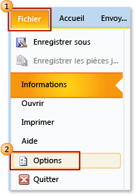
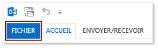
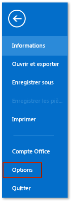
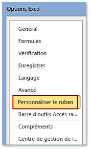
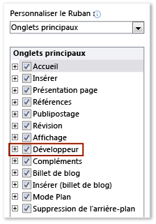

# Comment : afficher l'onglet Développeur sur le ruban
  Pour accéder à la **développeur** onglet sur le ruban d’une application Office, vous devez le configurer pour afficher l’onglet, car il ne s’affiche pas par défaut. Par exemple, vous devez afficher cet onglet pour ajouter un <xref:Microsoft.Office.Tools.Word.GroupContentControl> à une personnalisation au niveau du document pour Word.  
  
> [!NOTE]  
>  Ces informations d'aide s'appliquent uniquement aux applications Office 2010 ou version ultérieure. Si vous souhaitez afficher cet onglet dans Microsoft Office System 2007, consultez la version suivante de cette rubrique [Comment : afficher l’onglet Développeur sur le ruban](http://msdn.microsoft.com/library/bb608625(v=vs.90).aspx).  
  
 [!INCLUDE[appliesto_ribbon](../vsto/includes/appliesto-ribbon-md.md)]  
  
> [!NOTE]  
>  Access n’a pas un **développeur** onglet.  
  
### Pour afficher l'onglet Développeur  
  
1.  Démarrez l'une des applications Office prises en charge dans cette rubrique. Consultez le **s’applique à :** Remarque plus haut dans cette rubrique.  
  
2.  Sur le **fichier** , choisir le **Options** bouton.  
  
     L’illustration suivante montre le **fichier** onglet et **Options** bouton dans Office 2010.  
  
       
  
     L’illustration suivante montre le **fichier** onglet dans Office 2013.  
  
       
  
     L’illustration suivante montre le **Options** bouton dans Office 2013.  
  
       
  
3.  Dans le *ApplicationName***Options** boîte de dialogue, choisissez le **personnaliser le ruban** bouton.  
  
     L’illustration suivante montre le **Options** boîte de dialogue et les **personnaliser le ruban** bouton dans Excel 2010. L'emplacement de ce bouton est similaire dans toutes les autres applications répertoriées dans la section « S'applique à » au début de cette rubrique.  
  
       
  
4.  Dans la liste des onglets principaux, sélectionnez le **développeur** case à cocher.  
  
     L’illustration suivante montre le **Developer** case à cocher dans Word 2010 et [!INCLUDE[Word_15_short](../vsto/includes/word-15-short-md.md)]. L'emplacement de cette case à cocher est similaire dans toutes les autres applications répertoriées dans la section « S'applique à » au début de cette rubrique.  
  
       
  
5.  Choisissez le **OK** pour fermer la **Options** boîte de dialogue.  
  
## Voir aussi  
 [Personnalisation de l’interface utilisateur Office](../vsto/office-ui-customization.md)  
  
  