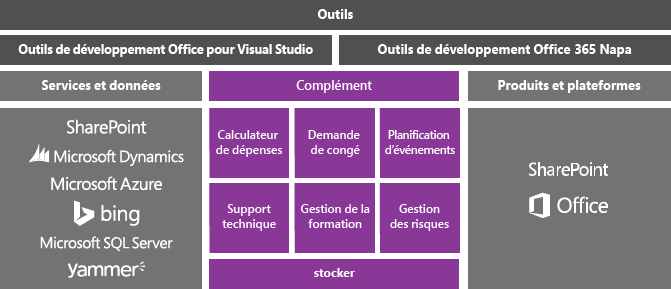
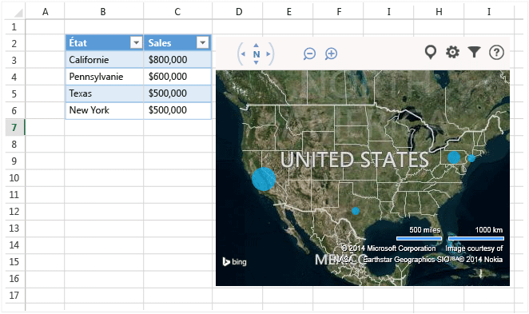
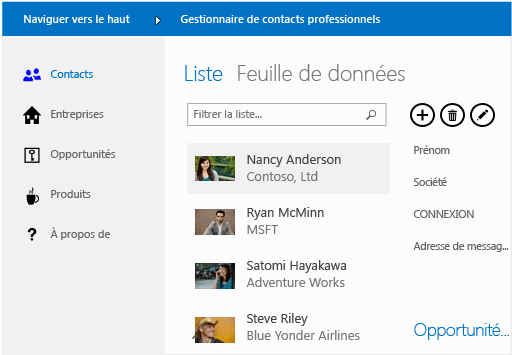

# Développement Office et SharePoint dans Visual Studio
  Vous pouvez étendre Microsoft Office et SharePoint en créant une application légère ou un complément que les utilisateurs téléchargent à partir d’ [Office Store](https://store.office.com/) ou d’un catalogue d’organisation, ou en créant une solution .NET Framework que les utilisateurs installent sur un ordinateur.  
  
 Dans cette rubrique :  
  
-   [Créer des compléments pour Office et SharePoint](#Apps)  
  
-   [Créer un complément VSTO](#Add-ins)  
  
-   [Créer une solution SharePoint](#Solutions)  
  
##   Créer des compléments pour Office et SharePoint  
 Office 2013 et SharePoint 2013 présentent un nouveau modèle de complément qui vous permet de créer, de distribuer et de monétiser des compléments qui étendent Office et SharePoint.  Ces compléments peuvent être exécutés dans Office ou SharePoint Online, et les utilisateurs ont la possibilité d’utiliser de nombreux appareils pour interagir avec.  
  
 Découvrez comment utiliser le nouveau [modèle de complément Office](https://msdn.microsoft.com/library/office/jj220082.aspx) pour étendre l’expérience Office de vos utilisateurs.  
  
 Ces compléments ont une empreinte très faible par rapport aux compléments et solutions VSTO, et vous pouvez les créer en utilisant presque toutes les technologies de programmation web, comme HTML5, JavaScript, CSS3 et XML.  Pour commencer, utilisez les outils de développement Office dans Visual Studio ou les outils de développement Office 365, outils web légers dont le nom de code est Napa, pour créer des projets, écrire du code et exécuter vos compléments dans un navigateur.  
  
   
  

  
### Créer un complément Office  
 Pour étendre les fonctionnalités d’Office, créez un complément Office. Il s’agit essentiellement d’une page Web qui est hébergée dans une application Office comme Excel, Word, Outlook et PowerPoint. Votre application peut ajouter des fonctionnalités à des documents, des feuilles de calcul, des messages électroniques, des rendez-vous, des présentations et des projets.  
  
 Vous pouvez vendre votre application dans Office Store.  [Office Store](https://store.office.com/) facilite la monétisation de vos compléments, la gestion des mises à jour et le suivi de la télémétrie. Vous pouvez également publier votre application pour les utilisateurs via un catalogue d'applications dans SharePoint ou sur Exchange Server.  
  
 L'application suivante pour Office affiche des données de feuille de calcul dans une carte Bing.  
  
   
  
 **En savoir plus**  
  
|À|Voir|  
|--------|---------|  
|En savoir plus sur les compléments Office, puis en créer un.|[Compléments Office](http://msdn.microsoft.com/office/dn448457)|  
|Comparez les différentes façons dont vous pouvez étendre Office et décidez si vous devez utiliser une application ou un complément Office.|[Feuille de route pour les compléments Office, VSTO et VBA](http://blogs.msdn.com/b/officeapps/archive/2013/06/18/roadmap-for-apps-for-office-vsto-and-vba.aspx)|  
  
### Créer un complément SharePoint  
 Pour étendre SharePoint à vos utilisateurs, créez un complément SharePoint. Il s’agit essentiellement d’une application autonome, petite, facile à utiliser qui répond à un besoin de vos utilisateurs ou d’une entreprise.  
  
 Vous pouvez vendre votre application pour SharePoint dans [Office Store](https://store.office.com/). Vous pouvez également publier votre complément pour les utilisateurs via un catalogue de compléments dans SharePoint.  Les propriétaires de sites peuvent installer, mettre à niveau et désinstaller votre complément sur leurs sites SharePoint sans l’aide d’un serveur de batterie ou d’un administrateur de collections de sites.  
  
 Voici un exemple d’une application pour SharePoint qui permet aux utilisateurs de gérer les contacts professionnels.  
  
   
  
 **En savoir plus**  
  
|À|Voir|  
|--------|---------|  
|En savoir plus sur les compléments SharePoint, puis en créer un.|[Compléments SharePoint](https://msdn.microsoft.com/library/office/fp179930.aspx)|  
|Comparer les compléments pour SharePoint avec les solutions SharePoint traditionnelles.|[Comparaison des compléments SharePoint et des solutions SharePoint](http://msdn.microsoft.com/library/office/jj163114.aspx)|  
|Choisir entre la création d’un complément SharePoint et la création d’une solution SharePoint.|[Choix entre des compléments SharePoint et des solutions SharePoint](https://msdn.microsoft.com/library/office/jj163114.aspx)|
  
##   Créer un complément VSTO  
 Créer un complément VSTO pour cibler Office 2007 ou Office 2010, ou pour étendre Office 2013 et Office 2016 au-delà de ce qui est possible avec les compléments Office. Les compléments VSTO s’exécutent uniquement sur le bureau. Les utilisateurs doivent installer les Compléments VSTO, afin qu’elles soient généralement plus difficiles à déployer et à prendre en charge.  Votre complément VSTO peut cependant être intégré plus étroitement à Office. Par exemple, il peut ajouter des onglets et des contrôles au ruban Office et effectuer des tâches d'automatisation avancées telles que la fusion de documents ou la modification de graphiques. Vous pouvez tirer parti du .NET Framework, et utiliser C# et Visual Basic pour interagir avec des objets Office.  
  
 Voici un exemple quelles un complément VSTO peut faire. Ce complément VSTO ajoute des contrôles de ruban, un volet des tâches personnalisé et une boîte de dialogue dans PowerPoint.  
  
   
  
 **En savoir plus**  
  
|À|Lecture|  
|--------|----------|  
|Comparer les différentes façons dont vous pouvez étendre Office et déterminer si vous devez utiliser un complément VSTO ou un complément Office.|[Feuille de route pour les compléments Office, VSTO et VBA](http://blogs.msdn.com/b/officeapps/archive/2013/06/18/roadmap-for-apps-for-office-vsto-and-vba.aspx)|  
|Créer un complément VSTO.|[Création de compléments VSTO avec Visual Studio](https://msdn.microsoft.com/library/jj620922.aspx)|  
  
##   Créer une solution SharePoint  
 Créez une solution SharePoint pour cibler SharePoint Foundation 2010 et SharePoint Server 2010, ou pour étendre SharePoint 2013 et SharePoint 2016 au-delà de ce qui est possible avec un complément SharePoint.  
  
 Les solutions SharePoint nécessitent des serveurs de batterie SharePoint locaux. Les administrateurs doivent les installer. De plus, comme les solutions s'exécutent dans SharePoint, elles peuvent affecter les performances du serveur. Toutefois, les solutions fournissent un accès plus détaillé aux objets SharePoint. En outre, lorsque vous créez une solution SharePoint, vous pouvez tirer parti du .NET Framework, et utiliser C# et Visual Basic pour interagir avec des objets SharePoint.  
  
 **En savoir plus**  
  
|À|Voir|  
|--------|---------|  
|Comparer des solutions SharePoint et des compléments SharePoint.|[Comparaison des compléments SharePoint et des solutions SharePoint](http://msdn.microsoft.com/library/office/jj163114.aspx)|  
|Créer une solution SharePoint.|[Créer des solutions SharePoint](../sharepoint/create-sharepoint-solutions.md)|  
  
  
