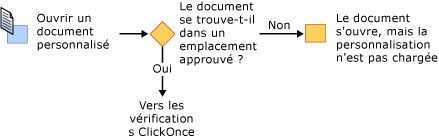
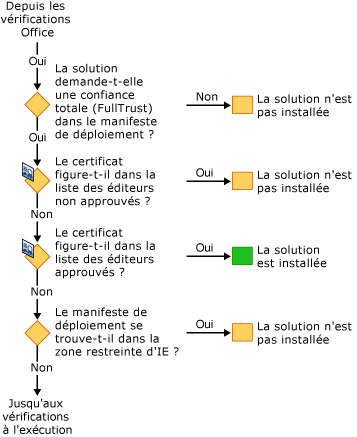

# S&#233;curisation des solutions Office
  Le modèle de sécurité des solutions Office implique plusieurs technologies : [!INCLUDE[vsto_runtime](../vsto/includes/vsto-runtime-md.md)], [!INCLUDE[ndptecclick](../vsto/includes/ndptecclick-md.md)], le Centre de gestion de la confidentialité de Microsoft Office et la zone des sites sensibles d'Internet Explorer. Les sections suivantes décrivent le fonctionnement de ces différentes fonctionnalités de sécurité :  
  
-   [Octroi de niveaux de confiance à des solutions Office](#GrantingTrustToSolutions)  
  
-   [Octroi de niveaux de confiance à des documents](#GrantingTrustToDocuments)  
  
-   [Octroi de niveaux de confiance lors de l'utilisation de Windows Installer](#GrantingTrustWindowsInstaller)  
  
-   [Considérations spécifiques sur la sécurité pour les solutions Office](#Security)  
  
-   [Sécurité pendant le développement](#SecurityDuringDeployment)  
  
-   [Visual Studio Tools pour Office Runtime](#VisualStudioToolsForOfficeRuntime)  
  
 [!INCLUDE[appliesto_all](../vsto/includes/appliesto-all-md.md)]  
  
##   Octroi de niveaux de confiance à des solutions Office  
 L'octroi de niveaux de confiance à des solutions Office implique de modifier la stratégie de sécurité de chaque utilisateur final pour approuver la solution Office sur la base des éléments suivants :  
  
-   le certificat utilisé pour signer le manifeste de déploiement,  
  
-   l'URL du manifeste de déploiement.  
  
 Pour plus d'informations, consultez [Octroi de niveaux de confiance à des solutions Office](../vsto/granting-trust-to-office-solutions.md).  
  
##   Octroi de niveaux de confiance à des documents  
 Pour une personnalisation au niveau du document, le document doit se trouver dans un répertoire désigné comme un emplacement approuvé.  Pour plus d'informations, consultez [Octroi de niveaux de confiance à des documents](../vsto/granting-trust-to-documents.md).  
  
##   Octroi de niveaux de confiance lors de l'utilisation de Windows Installer  
 Vous pouvez utiliser Windows Installer pour créer un fichier MSI afin d'installer des solutions Office dans le répertoire Program Files, ce qui requiert des droits d'administrateur.  Pour les solutions Office dans le répertoire Program Files, Visual Studio 2010 Tools pour Office Runtime considère ces solutions Office fiables et n'affiche pas l'invite d'approbation ClickOnce.  
  
##   Considérations spécifiques sur la sécurité pour les solutions Office  
 Les fonctionnalités de sécurité fournies par [!INCLUDE[net_v40_short](../sharepoint/includes/net-v40-short-md.md)], [!INCLUDE[net_v45](../vsto/includes/net-v45-md.md)] et Microsoft Office peuvent aider à protéger contre diverses menaces possibles pour la sécurité dans les solutions Office.  Pour plus d'informations, consultez [Considérations spécifiques sur la sécurité pour les solutions Office](../vsto/specific-security-considerations-for-office-solutions.md).  
  
##   Sécurité pendant le développement  
 Pour faciliter votre processus de développement, Visual Studio définit la stratégie de sécurité requise pour exécuter et déboguer votre solution sur votre ordinateur chaque fois que vous générez un projet.  Dans certains scénarios, le développement du projet pourra nécessiter des étapes de sécurité supplémentaires.  
  
### Solutions au niveau du document  
 Le chemin d'accès complet d'un document doit être ajouté à la liste des emplacements approuvés dans l'application Microsoft Office si vous développez les types de projets suivants :  
  
-   solutions au niveau du document qui se trouvent sur un partage de fichiers réseau tel que *\\\\nom\_serveur\\nom\_partage*,  
  
-   solutions au niveau du document pour Word qui utilisent des fichiers .doc ou .docm.  
  
 Incluez les sous\-répertoires quand vous ajoutez l'emplacement du document à la liste des emplacements approuvés, ou incluez spécifiquement les dossiers de débogage et de génération.  Pour plus d'informations, consultez l'article d'aide en ligne de Microsoft Office [Créer, supprimer ou modifier un emplacement approuvé pour vos fichiers](https://support.office.com/en-au/article/Create-remove-or-change-a-trusted-location-for-your-files-f5151879-25ea-4998-80a5-4208b3540a62).  
  
### Certificats temporaires  
 Visual Studio crée un certificat temporaire si un certificat de signature n'existe pas encore.  Vous devez utiliser ce certificat temporaire uniquement pendant le développement et acheter un certificat officiel pour le déploiement.  
  
 Le certificat temporaire est généré après la génération initiale d'un projet Office.  Quand vous appuyez une nouvelle fois sur F5, le projet est régénéré car il est marqué comme modifié lors de l'ajout du certificat.  
  
 Il est conseillé de supprimer les certificats temporaires de temps à autre car leur nombre peut augmenter fortement.  
  
##   Visual Studio Tools pour Office Runtime  
 [!INCLUDE[vsto_runtime](../vsto/includes/vsto-runtime-md.md)] propose des fonctionnalités permettant de vérifier l'identité de l'éditeur et les autorisations qui sont accordées à une personnalisation.  Il vérifie ces autorisations via une série de vérifications de sécurité.  
  
### Sécurité pendant le chargement de la personnalisation  
 Lors du chargement d'une personnalisation au niveau du document, [!INCLUDE[vsto_runtime](../vsto/includes/vsto-runtime-md.md)] vérifie toujours si le document figure dans la liste des emplacements approuvés.  En outre, le runtime vérifie si la solution nécessite une confiance totale \(FullTrust\) dans le manifeste d'application. Il n'effectue aucune vérification de la sécurité supplémentaire pendant le chargement de la personnalisation.  
  
### Série de vérifications de sécurité pendant l'installation  
 Quand une solution Office est installée ou mise à jour, [!INCLUDE[vsto_runtime](../vsto/includes/vsto-runtime-md.md)] exécute un ensemble de vérifications de sécurité dans un ordre spécifique pour prendre une décision d'approbation.  Une solution est installée ou mise à jour seulement si le runtime détermine que la solution est approuvée.  
  
 Vous pouvez démarrer le processus d'installation de quatre manières : en exécutant le programme d'installation, en ouvrant le manifeste de déploiement, en ouvrant l'hôte d'application Microsoft Office ou en exécutant VSTOInstaller.exe.  
  
 La première vérification de sécurité s'applique uniquement aux solutions au niveau du document.  Le document d'une solution au niveau du document doit être dans un emplacement approuvé.  Si le document se trouve sur un partage de fichiers réseau distant ou possède une extension de nom de fichier .doc ou .docm, l'emplacement du document doit être ajouté à la liste des emplacements approuvés.  Pour plus d'informations, consultez [Octroi de niveaux de confiance à des documents](../vsto/granting-trust-to-documents.md).  
  
   
  
 L'ensemble de vérifications de sécurité suivant est effectué par [!INCLUDE[vsto_runtime](../vsto/includes/vsto-runtime-md.md)] et ClickOnce.  Pour satisfaire à ces vérifications, les solutions Office doivent exiger des autorisations FullTrust, être signées à l'aide d'un certificat qui n'est pas répertorié dans la liste des éditeurs non approuvés et se trouver dans un emplacement qui n'est pas dans la zone limitée d'Internet Explorer.  Si le certificat figure dans la liste des éditeurs approuvés, la solution est installée immédiatement.  Sinon, si elle a satisfait à toutes ces vérifications, le dernier ensemble de vérifications est appliqué.  
  
   
  
 Si l'invite d'approbation [!INCLUDE[ndptecclick](../vsto/includes/ndptecclick-md.md)] est autorisée et que la solution n'a pas encore été approuvée, le runtime autorisera l'utilisateur final à prendre la décision d'approbation.  Si l'utilisateur approuve la solution, une entrée est ajoutée dans la liste d'inclusions de l'utilisateur.  Toutes les solutions répertoriées dans la liste d'inclusions de l'utilisateur disposent d'un niveau de confiance totale et peuvent être installées et exécutées.  
  
 À partir de Visual Studio 2010, la liste d'inclusions est ignorée si la solution Office est installée à l'aide de Windows Installer \(MSI\) dans le répertoire Program Files.  Pour plus d'informations, consultez [Octroi de niveaux de confiance à des solutions Office à l'aide de listes d'inclusion](../vsto/trusting-office-solutions-by-using-inclusion-lists.md).  
  
   
  
## Voir aussi  
 [Octroi de niveaux de confiance à des solutions Office](../vsto/granting-trust-to-office-solutions.md)   
 [Octroi de niveaux de confiance à des documents](../vsto/granting-trust-to-documents.md)   
 [Octroi de niveaux de confiance à des solutions Office à l'aide de listes d'inclusion](../vsto/trusting-office-solutions-by-using-inclusion-lists.md)   
 [Comment : configurer la sécurité de la liste d'inclusion](../vsto/how-to-configure-inclusion-list-security.md)   
 [Comment : signer des solutions Office](../vsto/how-to-sign-office-solutions.md)   
 [Dépannage de la sécurité des solutions Office](../vsto/troubleshooting-office-solution-security.md)   
 [Manifestes d'application pour les solutions Office](../vsto/application-manifests-for-office-solutions.md)   
 [Manifestes de déploiement pour les solutions Office](../vsto/deployment-manifests-for-office-solutions.md)   
 [ClickOnce Reference](../deployment/clickonce-reference.md)   
 [Déploiement d'une solution Office](../vsto/deploying-an-office-solution.md)  
  
  