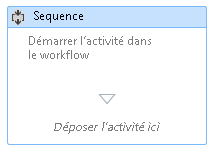
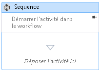

# Procédure : Ajouter des commentaires à un workflow dans le concepteur de workflow

Pour faciliter la création de flux de travail plus vastes et plus complexes, .NET Framework 4.5 permet au développeur d’ajouter des annotations aux types suivants de l’élément dans le concepteur :

-   <xref:System.Activities.Activity>

-   <xref:System.Activities.Statements.State>

-   <xref:System.Activities.Statements.Transition>

-   Classes dérivées de <xref:System.Activities.Statements.FlowNode>.

-   <xref:System.Activities.Variable>

-   <xref:System.Activities.Argument>

> [!IMPORTANT]
> Le contenu d'une annotation est stocké sous forme de texte brut dans le fichier XAML associé au workflow, et peut être par d'autres utilisateurs. Évitez d'entrer des informations sensibles dans une annotation.

## Ajout d'une annotation à une activité dans le concepteur

1. Dans le Concepteur de flux de travail, cliquez sur un élément dans le Concepteur de workflow et sélectionnez **Annotations**, **ajouter une Annotation**.

1. Ajoutez le texte de l'annotation dans l'espace disponible.

   L’élément affiche une icône d’annotation. Pointez sur l’icône d’annotation affiche le texte de l’annotation.

## Afficher une annotation dans le concepteur d'une activité

1. Avec un concepteur d’activités qui a une annotation affichée en dehors de l’activité, cliquez sur le **Pin** icône dans l’ornement d’annotation.

   L’annotation s’affiche dans le Concepteur de l’activité. Dans la capture d'écran ci-dessous, l'annotation « Démarrage de l'activité dans le workflow » s'affiche dans le concepteur de l'activité.

   

2. Pour afficher l’annotation en dehors du Concepteur de l’activité, placez le curseur sur la zone d’annotation dans le Concepteur de l’activité et cliquez sur le **Unpin** icône

   

## Affichage ou masquage de toutes les annotations

1. Cliquez avec le bouton droit sur une activité qui a une annotation. Sélectionnez **Annotations**, **afficher toutes les Annotations**.

   Toutes les annotations sont affichées dans les concepteurs de l’activité.

1. Pour afficher toutes les annotations en dehors des concepteurs de l’activité, cliquez sur l’activité et sélectionnez **Annotations**, **masquer toutes les Annotations**.

## Modification ou suppression d'une annotation pour une activité

1. Cliquez avec le bouton droit sur une activité qui a une annotation.

1. Sélectionnez **Annotations**, **modifier une Annotation** ou **supprimer l’Annotation**.

   L’annotation est ouvert pour être modifié ou supprimée.

1. Pour supprimer toutes les annotations à la fois, cliquez sur le Concepteur de workflow et sélectionnez **Annotation**, **supprimer toutes les Annotations**.

## Ajout, modification et suppression d’une annotation pour une variable ou un argument

1. Cliquez avec le bouton droit sur une variable ou un argument et sélectionnez Ajouter une annotation.

1. Entrez le texte de l'annotation. La variable ou un argument affiche une icône d’annotation.

1. Cliquez avec le bouton droit sur une variable ou un argument qui a une annotation. Sélectionnez Modifier une annotation.

   L’annotation est ouvert pour modification.

1. Cliquez avec le bouton droit sur une variable ou un argument qui a une annotation. Sélectionnez Supprimer l'annotation.

   L’annotation est supprimée.