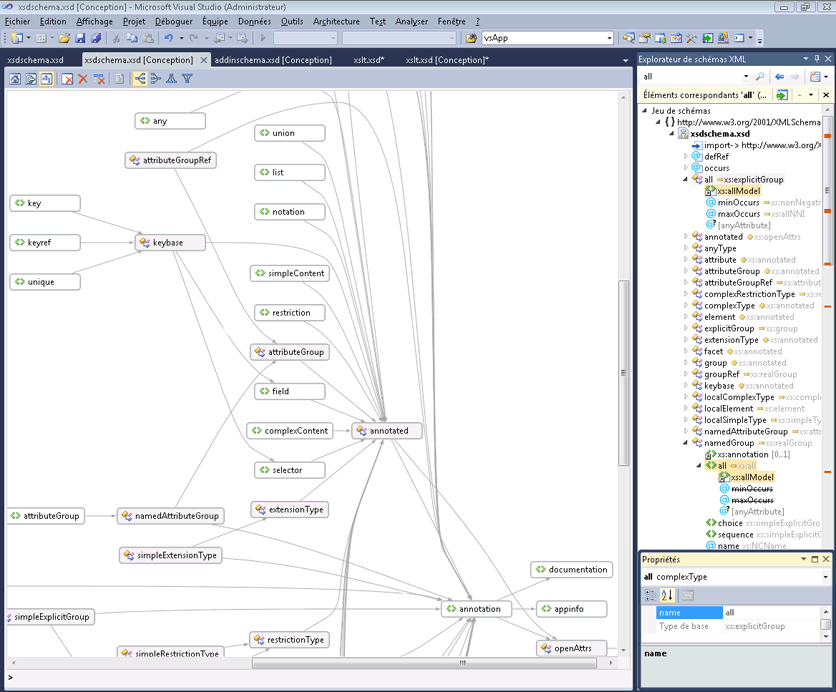
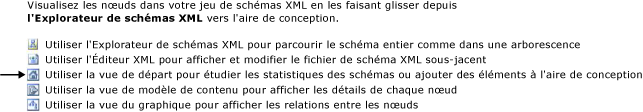

# Vue du graphique

La vue du graphique fournit une représentation graphique des nœuds de schéma globaux et des relations entre les nœuds. Notez que la vue du graphique ne vous permet pas de modifier la disposition du jeu de schémas sur l'aire de conception. La vue du graphique comprend également la barre d'outils Concepteur de schémas XML et la barre de fil d'Ariane (breadcrumb).

L'image suivante montre la vue du graphique avec six nœuds globaux sur son aire de conception.

## Aire de conception

L’aire de conception de la vue du graphique affiche le contenu de l' [espace de travail du concepteur de schémas XML](../xml-tools/xml-schema-designer-workspace.md). Si l'espace de travail contient des nœuds globaux du jeu de schémas, les nœuds sont représentés sur l'aire de conception de la vue du graphique et des flèches sont dessinées entre les nœuds qui ont des relations.

Si vous double-cliquez sur un nœud dans la vue du graphique, l’éditeur XML s’affiche.

Pour supprimer des nœuds sélectionnés de l’espace de travail, utilisez la barre d’outils du concepteur XSD ou la touche **Suppr** .

Si l’aire de conception est vide, l’éditeur XML, l' **Explorateur de schémas XML**et le filigrane sont affichés. Le *filigrane* est une liste de liens vers toutes les vues du concepteur XSD.

Si le jeu de schémas comporte des erreurs, le texte suivant est affiché à la fin de la liste : « Utilisez la liste d'erreurs pour afficher et résoudre les erreurs dans le jeu ».

## Barre de navigation

La barre de fil d'Ariane (breadcrumb) en bas de la vue du graphique indique l'emplacement du nœud sélectionné dans le jeu de schémas. Si plusieurs éléments sont sélectionnés, la barre de fil d'Ariane (breadcrumb) est vide.

## Menu contextuel (clic droit)

Le tableau décrit les options disponibles pour tous les nœuds sur l'aire de conception de la vue du graphique.

|Option|Description|
|-|-----------------|
|**Afficher dans l’Explorateur de schémas XML**|Met le focus sur l'Explorateur de schémas et met en surbrillance le nœud de jeu de schémas.|
|**Afficher dans la vue du graphique**|Bascule vers la vue du graphique (grisée).|
|**Générer un exemple de code XML**|Disponible uniquement pour les éléments globaux. Génère un exemple de fichier XML pour l'élément global.|
|**Effacer l’espace de travail**|Efface l'espace de travail et l'aire de conception.|
|**Supprimer de l’espace de travail**|Supprime les nœuds sélectionnés de l'espace de travail et de l'aire de conception.|
|**Supprimer tout sauf la sélection dans l’espace de travail**|Supprime les nœuds qui ne sont pas sélectionnés dans l'espace de travail et l'aire de conception.|
|**Exporter le diagramme en tant qu’image**|Enregistre l'aire de conception dans un fichier XPS.|
|**Sélectionner tout**|Sélectionne tous les nœuds sur l'aire de conception.|
|**Afficher le code**|Ouvre le fichier qui contient le nœud sélectionné dans l’éditeur XML. L’élément sélectionné dans l’Explorateur de **schémas XML** est également sélectionné dans l’éditeur XML.|
|**Propriétés, fenêtre**|Ouvre la fenêtre **Propriétés** (si elle n’est pas déjà ouverte). Cette fenêtre affiche des informations sur le nœud.|

En plus des options communes décrites ci-dessus, le menu contextuel pour les éléments globaux comprend les options suivantes :

|Option|Description|
|-|-----------------|
|**Ajouter une définition de type**|Ajoute le type de base au diagramme.|
|**Ajouter toutes les références**|Ajoute tous les nœuds qui font référence à l'élément et dessine des flèches pour indiquer les relations entre eux.|
|**Ajouter des membres au groupe de substitution**|Ajoute tous les membres du groupe de substitution. Cette option s'affiche dans la vue si l'élément est l'en-tête ou membre d'un groupe de substitution.|
|**Générer un exemple de code XML**|Génère un exemple de fichier XML pour l'élément global.|

En plus des options communes décrites ci-dessus, le menu contextuel pour les types simples et complexes globaux comprend les options suivantes :

|Option|Description|
|-|-----------------|
|**Ajouter un type de base**|Si le type sélectionné est dérivé d'un type global, ajoute le type de base du type sélectionné.|
|**Ajouter toutes les références**|Ajoute toutes les références du type sélectionné. Ceci inclut les éléments et les attributs du type sélectionné, ainsi que les types dérivés du type sélectionné.|
|**Ajouter tous les types dérivés**|Ajoute tous les types qui sont directement et indirectement dérivés du type sélectionné.|
|**Ajouter tous les ancêtres**|Ajoute tous les types parents (de base).|

En plus des options communes décrites ci-dessus, le menu contextuel pour les groupes globaux et les groupes d'attributs comprend les options suivantes :

|Option|Description|
|-|-----------------|
|**Ajouter toutes les références**|Ajoute tous les nœuds qui font référence au groupe et dessine des flèches pour indiquer les relations entre eux.|
|**Ajouter tous les membres**|Ajoute tous les membres du groupe et dessine des flèches pour indiquer les relations entre eux.|

En plus des options communes décrites ci-dessus, le menu contextuel pour les attributs globaux comprend les options suivantes :

|Option|Description|
|-|-----------------|
|**Ajouter toutes les références**|Ajoute tous les nœuds qui font référence au groupe et dessine des flèches pour indiquer les relations entre eux.|

## Propriétés (fenêtre)

Utilisez le menu contextuel (clic droit) pour ouvrir initialement la fenêtre **Propriétés** . Par défaut, la fenêtre **Propriétés** s’affiche dans le coin inférieur droit de Visual Studio. Lorsque vous cliquez sur un nœud affiché dans la vue de modèle de contenu, les propriétés de ce nœud s’affichent dans la fenêtre **Propriétés** .

## Barre d’outils XSD

Les boutons suivants de la barre d'outils XSD sont activés lorsque la vue du graphique est active.

|Option|Description|
|-|-----------------|
|**Afficher la vue de départ**|Bascule vers la [vue de départ](../xml-tools/start-view.md). Cette vue est accessible à l’aide du raccourci clavier : **Ctrl** +**1**.|
|**Afficher la vue de modèle de contenu**|Bascule vers la [vue de modèle de contenu](../xml-tools/content-model-view.md). Cette vue est accessible à l’aide du raccourci clavier : **Ctrl** +**2**.|
|**Afficher la vue du graphique**|Bascule vers la [vue du graphique](../xml-tools/graph-view.md). Cette vue est accessible à l’aide du raccourci clavier : **Ctrl** +**3**.|
|**Effacer l’espace de travail**|Efface l'espace de travail et l'aire de conception.|
|**Supprimer de l’espace de travail**|Supprime les nœuds sélectionnés de l'espace de travail et de l'aire de conception.|
|**Supprimer tout sauf la sélection dans l’espace de travail**|Supprime les nœuds qui ne sont pas sélectionnés dans l'espace de travail et l'aire de conception. Cette option est activée dans la vue de modèle de contenu et dans la vue du graphique.|
|**De gauche à droite**|Modifie la disposition de la vue du graphique pour représenter hiérarchiquement les nœuds de gauche à droite. Cette option est accessible à l’aide du raccourci clavier : **Alt** +**flèche droite**.|
|**De droite à gauche**|Modifie la disposition de la vue du graphique pour représenter hiérarchiquement les nœuds de droite à gauche. Cette option est accessible à l’aide du raccourci clavier : **Alt** +**flèche gauche**.|
|**De haut en bas**|Modifie la disposition de la vue du graphique pour représenter hiérarchiquement les nœuds de haut en bas. Cette option est accessible à l’aide du raccourci clavier : **Alt** +**flèche bas**.|
|**De bas en haut**|Modifie la disposition de la vue du graphique pour représenter hiérarchiquement les nœuds de bas en haut. Cette option est accessible à l’aide du raccourci clavier : **Alt** +**flèche haut**.|

## Panoramique/Défilement

Vous pouvez effectuer un panoramique de l’aire de conception à l’aide des barres de défilement ou en maintenant la touche **CTRL** enfoncée tout en cliquant et en faisant glisser la souris. Lorsque vous affichez un panoramique de l'aire de conception en cliquant et en faisant glisser la souris, le curseur se transforme en cercle contenant quatre flèches qui pointent dans quatre directions.

## Annuler/Rétablir

La fonction d'annulation/de rétablissement est activée dans la vue du graphique pour les actions suivantes :

- Ajout d'un nœud unique par glisser-déplacer.

- Ajout de plusieurs nœuds de la fenêtre des résultats de la recherche dans des requêtes de l'Explorateur de schémas ou de la vue de départ.

- Suppression d'un ou plusieurs nœuds.

## Zoom

Le zoom est disponible dans le coin inférieur droit de la vue du graphique.

Le zoom peut être contrôlé des façons suivantes :

- En maintenant la touche **CTRL** enfoncée et en tournant la roulette de la souris lorsque la souris pointe sur la surface de la vue du graphique.

- En utilisant le contrôle Slider. Le curseur affiche le niveau de zoom actuel.

Le curseur de zoom est opaque quand vous le sélectionnez, pointez dessus, ou utilisez **CTRL** avec la molette de la souris pour effectuer un zoom. à tous les autres moments, il est transparent.

## Intégration de l’éditeur XML

Vous pouvez basculer entre la vue du graphique et l’éditeur XML en cliquant sur un nœud et en utilisant le menu Afficher le contexte du code (clic droit).

Si vous apportez des modifications au jeu de schémas dans l’éditeur XML, les modifications sont synchronisées dans la vue du graphique. Pour plus d’informations, consultez [intégration avec l’éditeur XML](../xml-tools/integration-with-xml-editor.md).

## Voir aussi

- [Aire de conception](../xml-tools/xml-schema-designer-workspace.md)