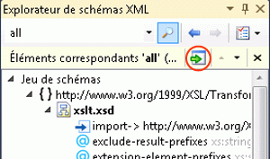

# Procédure : ajouter des nœuds à l’espace de travail à partir de l’Explorateur de schémas XML

Cette rubrique explique comment ajouter des nœuds à l' [espace de travail du concepteur de schémas XML](../xml-tools/xml-schema-designer-workspace.md) à partir de l’Explorateur de **schémas XML**. Pour ce faire, vous pouvez faire glisser et déposer des nœuds de l' **Explorateur de schémas XML** vers une vue du concepteur XSD, ou en utilisant le menu contextuel **de l’Explorateur de schémas XML** . Vous pouvez également ajouter des nœuds mis en surbrillance suite à une recherche effectuée par l' **Explorateur de schémas XML**. Pour plus d’informations, consultez [Comment : ajouter des nœuds de résultat de recherche de jeu de schémas à l’espace de travail](../xml-tools/how-to-add-schema-set-search-result-nodes-to-the-workspace.md).

> [!NOTE]
> Seuls les nœuds globaux peuvent être ajoutés à l' [espace de travail du concepteur de schémas XML](../xml-tools/xml-schema-designer-workspace.md).

## Pour ajouter des nœuds via le menu contextuel de l’Explorateur XML

1. Suivez les étapes décrites dans [Comment : créer et modifier un fichier de schéma XSD](../xml-tools/how-to-create-and-edit-an-xsd-schema-file.md).

2. Cliquez avec le bouton droit sur le nœud `PurchaseOrderType` dans l’Explorateur XSD. Sélectionnez **afficher dans la vue du graphique**.

     Le nœud `purchaseOrderType` apparaît sur l'aire de conception de la vue du graphique.

## Pour faire glisser-déplacer un nœud sur une vue

1. Cliquez avec le bouton droit sur le nœud `PurchaseOrderType` dans la vue du graphique. Sélectionnez **afficher dans l’Explorateur de schémas XML**.

     Le nœud est mis en surbrillance dans l' **Explorateur de schémas XML**.

2. Cliquez avec le bouton droit sur le nœud `PurchaseOrderType` dans l **'Explorateur de schémas XML** , puis sélectionnez **afficher toutes les références**.

     Le nœud `purchaseOrder` est mis en surbrillance.

3. Faites glisser le nœud `purchaseOrder` sur la vue du graphique.

     Le nœud `purchaseOrder` et le nœud `PurchaseOrderType` apparaissent en regard l'un de l'autre sur l'aire de conception de la vue du graphique. Étant donné que les deux nœuds sont associés (l'élément `purchaseOrder` est du type `PurchaseOrderType`), une flèche est dessinée entre eux.

## Pour ajouter des nœuds à l'aide de la fonction de recherche de l'Explorateur de schémas

1. Tapez « purchaseOrder » dans la zone de texte Rechercher de la barre d’outils de l' [Explorateur XML](../xml-tools/xml-schema-explorer.md) , puis cliquez sur le bouton Rechercher.

     

     Les résultats de la recherche sont mis en surbrillance dans l' **Explorateur de schémas XML** et marqués par des graduations sur la barre de défilement verticale.

2. Ajoutez les résultats de la recherche à l’espace de travail en cliquant sur le bouton **Ajouter les nœuds en surbrillance à l’espace de travail** dans le volet de synthèse des résultats.

     

     Le nœud `purchaseOrder` et le nœud `PurchaseOrderType` s’affichent à côté l’un de l’autre sur l’aire de conception de la [vue du graphique](../xml-tools/graph-view.md). Étant donné que les deux nœuds sont associés (l'élément `purchaseOrder` est du type `PurchaseOrderType`), une flèche est dessinée entre eux.

## Voir aussi

- [Explorateur de schémas XML](../xml-tools/xml-schema-explorer.md)