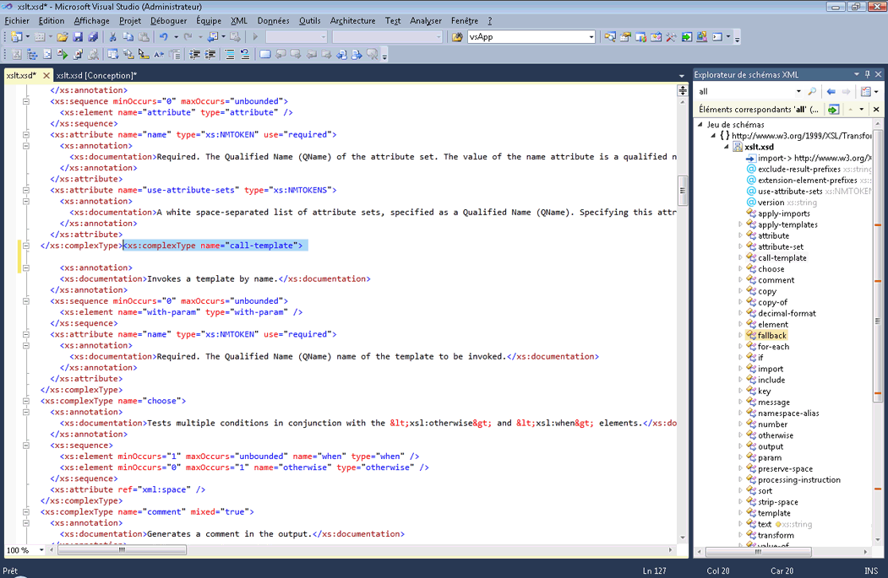

# Intégration de littéraux XML avec l’Explorateur de schémas XML

Visual Basic prend en charge les littéraux XML, ce qui signifie que vous pouvez incorporer directement des fragments XML dans votre code Visual Basic. Pour plus d’informations, consultez [vue d’ensemble des littéraux XML](/dotnet/visual-basic/programming-guide/language-features/xml/xml-literals-overview).

## Procédures

Si un fichier XSD dans votre projet Visual Basic comprend un littéral XML, vous pouvez afficher le jeu de schémas XML dans l' **Explorateur de schémas XML**. Pour afficher le jeu de schémas associé à un littéral XML, cliquez avec le bouton droit sur un nœud XML dans un littéral XML ou une importation d’espace de noms XML, puis sélectionnez **afficher dans l’Explorateur de schémas**.

Cela ouvre l' **Explorateur de schémas XML** côte à côte avec votre fichier Visual Basic.

## Voir aussi

- [Comment : utiliser le concepteur de schémas XML avec des littéraux XML](../xml-tools/how-to-use-the-xml-schema-designer-with-xml-literals.md)
