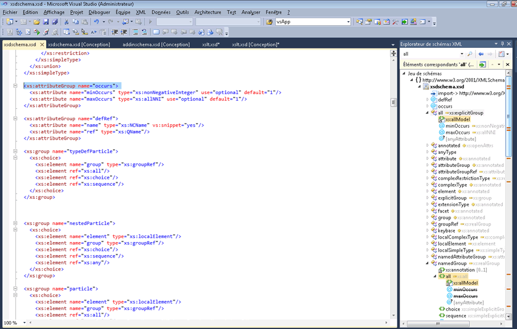
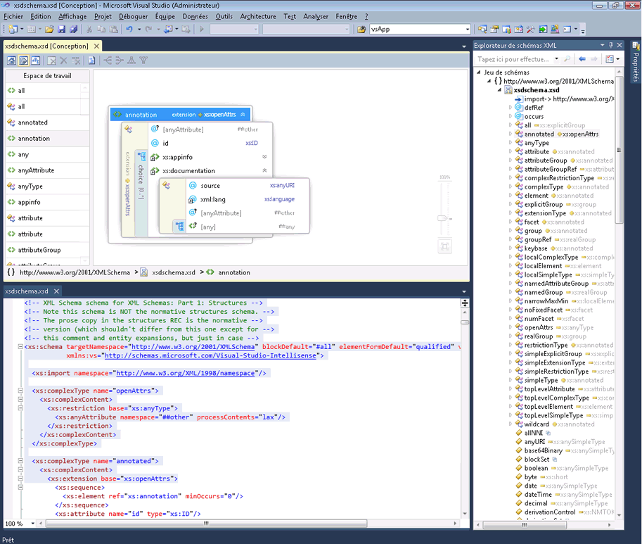

# Intégration avec l’éditeur XML

Le Concepteur de schémas XML est intégré avec l’éditeur XML. Si vous modifiez un fichier XSD dans l’éditeur XML, la modification apparaîtront dans le [Explorateur de schémas XML](../xml-tools/xml-schema-explorer.md). Si vous avez le [vue du graphique](../xml-tools/graph-view.md) ou [affichage du modèle de contenu](../xml-tools/content-model-view.md) ouvert, la modification est également répercutée il. Vous pouvez naviguer entre le Concepteur de schémas XML et l’éditeur XML comme suit :

-   Dans l’éditeur XML, cliquez sur un nœud, puis sélectionnez **afficher dans l’Explorateur de schémas XML**.

-   Dans la vue du graphique et le **Explorateur de schémas XML**, double-cliquez sur un nœud, ou cliquez sur un nœud et sélectionnez **afficher le Code**. Dans la vue de modèle de contenu, cliquez sur un nœud et sélectionnez **afficher le Code**.

La capture d’écran suivante montre un schéma XML ouvert dans le **Explorateur de schémas XML**. Le **Explorateur de schémas XML** affiche le schéma défini dans une arborescence. L’éditeur XML affiche la vue de texte du nœud qui est actuellement actif dans le **Explorateur de schémas XML**.

Il est parfois utile de voir le code dans l’éditeur XML et le concepteur graphique côte à côte. Pour afficher les deux fichiers en même temps, avec le bouton droit n’importe où dans l’éditeur XML, puis sélectionnez **Concepteur de vues**. Dans le menu Visual Studio Windows, sélectionnez **nouveau Horizontal (ou Vertical) groupe d’onglets**.

## Voir aussi

- [Explorateur de schémas XML](../xml-tools/xml-schema-explorer.md)