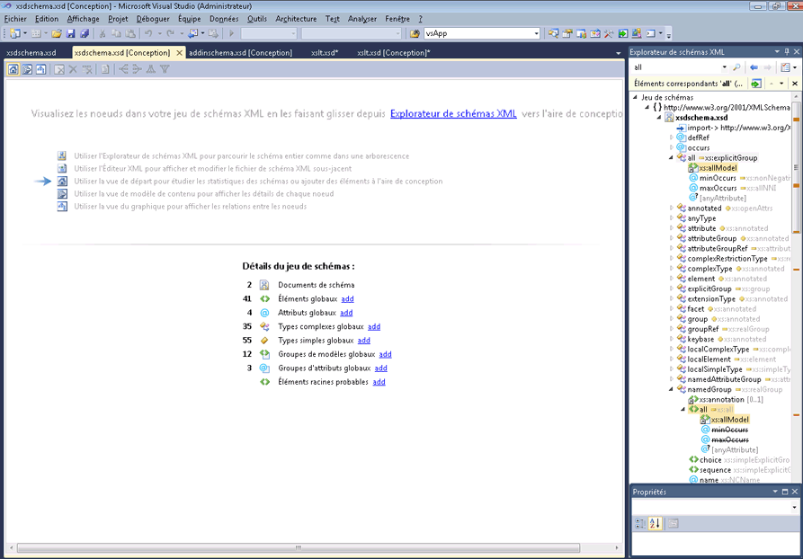

# vue de départ

La vue de départ est le point de lancement du Concepteur de schémas XML (XSD). Lorsque vous créez un fichier XSD, la vue de départ est initialement affichée.

La vue de départ contient deux sections principales, le *filigrane* et **détails du jeu de schéma** volet. Elle comprend également la barre d'outils, qui est disponible dans toutes les vues du Concepteur XSD.

## Filigrane

Le volet de filigrane contient une liste de liens vers toutes les vues du concepteur XSD, l’éditeur XML, et **Explorateur de schémas XML**. Si le jeu de schémas comporte des erreurs, le texte suivant s’affiche à la fin de la liste : « Utiliser la liste d’erreurs pour afficher et corriger les erreurs dans le jeu. »

## Détails du jeu de schémas

Le **détails du jeu de schéma** volet répertorie les types de nœud de schéma global et affiche le nombre d’instances de chaque type dans le schéma. Vous pouvez utiliser la **ajouter** liens en regard des types de nœud pour ajouter de nouveaux nœuds à l’espace de travail.

## ToolBar

Vous pouvez naviguer entre la vue de départ, le [affichage du modèle de contenu](../xml-tools/content-model-view.md) et [vue du graphique](../xml-tools/graph-view.md) à partir de la barre d’outils du Concepteur de schémas XML.

Les boutons suivants sont activés dans la barre d'outils du Concepteur XSD lorsque la vue de départ est active :

|Option|Description|
|-|-----------------|
|**Afficher la vue de départ**|Bascule vers la vue de départ. Cette vue est accessible en utilisant le raccourci clavier : **Ctrl**+**1**.|
|**Afficher la vue de modèle de contenu**|Bascule vers la vue de modèle de contenu. Cette vue est accessible en utilisant le raccourci clavier : **Ctrl**+**2**.|
|**Afficher la vue du graphique**|Bascule vers la vue du graphique. Cette vue est accessible en utilisant le raccourci clavier : **Ctrl**+**3**.|

## Voir aussi

- [Explorateur de schémas XML](../xml-tools/xml-schema-explorer.md)
- [Vue Graphique](../xml-tools/graph-view.md)
- [Vue Modèle de contenu](../xml-tools/content-model-view.md)
- [Éditeur XML](../xml-tools/xml-editor.md)