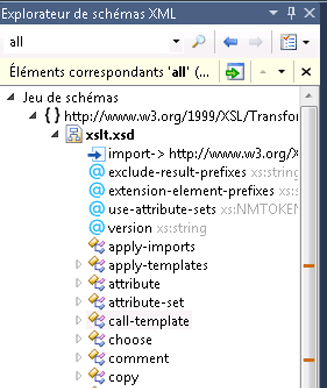

# Explorateur de schémas XML

Le **Explorateur de schémas XML** est intégré à Microsoft Visual Studio et l’éditeur XML pour vous permettre de travailler avec des schémas de langage (XSD XML) XML Schema definition. Lorsque vous ouvrez un fichier de schéma XML, le **jeu de schémas** nœud s’affiche dans le **Explorateur de schémas XML**. Tous les schémas inclus, importés ou redéfinis pour votre fichier cible, ainsi que tous les fichiers qui sont référencées par un `include` ou `import` instruction, apparaissent également dans le **Explorateur de schémas XML**.

 Le **Explorateur de schémas XML** vous permet d’effectuer les opérations suivantes :

-   obtenir une vue d'ensemble rapide du jeu de schémas ;

-   Parcourir et naviguer l'arborescence.

-   Effectuer des recherches par mot clé et spécifiques au schéma. Pour plus d’informations, consultez [recherche le jeu de schémas](../xml-tools/searching-the-schema-set.md).

-   Ajouter les résultats de recherche à la vue du graphique ou une vue de modèle de contenu

-   trier l’arborescence par ordre des documents, par type ou par nom ; Pour plus d’informations, consultez [tri, filtrage et de regroupement](../xml-tools/sorting-filtering-and-grouping-xml-schema-explorer.md).

-   Ouvrez l’éditeur XML et accéder à des emplacements de code dans le fichier XSD. Pour plus d’informations, consultez [intégration avec l’éditeur XML](../xml-tools/integration-with-xml-editor.md).

-   générer un exemple de code XML pour les éléments globaux.

Le **Explorateur de schémas XML** fournit une vue hiérarchique de jeu à travers une arborescence de schémas. Le **Explorateur de schémas XML** fournit également la recherche, filtrage, navigation et le tri. Pour accéder à la **Explorateur de schémas XML**, effectuez l’une des opérations suivantes :

-   Si vous êtes sur le [vue de départ](../xml-tools/start-view.md), cliquez sur le **Explorateur de schémas XML** lien.

-   Si vous êtes sur le [vue du graphique](../xml-tools/graph-view.md) ou [affichage du modèle de contenu](../xml-tools/content-model-view.md) et avoir des nœuds dans votre espace de travail, utilisez le menu contextuel (clic droit) pour sélectionner le **Explorateur de schémas XML**.

-   Vous pouvez également sélectionner le **Explorateur de schémas XML** à partir de la **vue** menu.

-   Vous pouvez accéder à la **Explorateur de schémas XML** à partir d’un *.vb* fichier ayant un littéral XML Visual Basic associé à un *.xsd* fichier. Pour afficher le schéma définis dans le **Explorateur de schémas XML**, cliquez sur un nœud XML dans un littéral XML ou une importation d’espace de noms XML et sélectionnez le **afficher dans l’Explorateur de schémas** commande. Pour plus d’informations, consultez [littéraux d’intégration de données XML avec l’Explorateur de schémas XML](../xml-tools/integration-of-xml-literals-with-xml-schema-explorer.md).

## arborescence
 Le **Explorateur de schémas XML** affiche précompilés schéma définie les informations dans une structure arborescente. L'arborescence est organisée comme suit :

-   Au niveau supérieur se trouve le nœud de jeu de schémas.

-   Le deuxième niveau contient les espaces de noms.

-   Le troisième niveau contient les fichiers.

-   Le quatrième niveau contient les nœuds globaux. Ceci peut inclure les éléments, les groupes, les types complexes, les types simples, les attributs, les groupes d'attributs, et les instructions `include`, `import` et `redefine`.

Voici un exemple d’arborescence :

## Sélection et activation
 Pour mettre en surbrillance et sélectionner un nœud, cliquez une fois dans l'Explorateur de schémas.

 Pour activer un nœud, double-cliquez dessus ou appuyez sur **entrée** lorsque le nœud est sélectionné.

-   L'activation d'un nœud ouvre le fichier dans lequel ce nœud est défini (si le fichier n'est pas déjà ouvert) et sélectionne le nœud dans le fichier.

-   L'activation d'un nœud de fichier ouvre le fichier sélectionné (s'il n'est pas déjà ouvert) et met en surbrillance le nœud `<schema>`.

-   L'activation d'un jeu de schémas ou d'un nœud d'espace de noms n'aboutit à rien.

## Glissez -déplacez les nœuds
 Vous pouvez déplacer des nœuds, des nœuds de fichier et des nœuds d'espace de noms par glisser-déplacer dans une vue du concepteur XSD. Si la vue actuelle est la [vue de départ](../xml-tools/start-view.md), faire glisser un nœud à la vue s’ouvre le [vue du graphique](../xml-tools/graph-view.md). Si la vue actuelle est la [affichage du modèle de contenu](../xml-tools/content-model-view.md) ou de la vue du graphique, la vue ne change pas lorsque vous supprimez un nœud sur celle-ci.

 Suppression des fichiers sur la vue ajoutera tous les nœuds globaux dans le fichier pour le [espace de travail concepteur XSD](../xml-tools/xml-schema-designer-workspace.md). Le dépôt d’espaces de noms sur la vue ajoute tous les nœuds globaux dans l’espace de noms à l’espace de travail. L'espace de travail est partagé entre toutes les vues.

 Vous ne pouvez pas faire glisser-déplacer des importations ou des nœuds locaux.

## Voir aussi

- [Guide pratique pour Ajouter des nœuds à l’espace de travail à partir de l’Explorateur de schémas XML](../xml-tools/how-to-add-nodes-to-the-workspace-from-the-xml-schema-explorer.md)