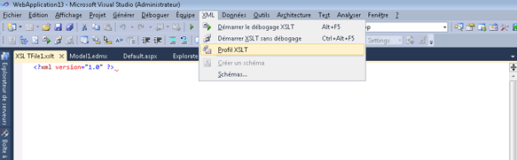

# Profileur XSLT
Le Générateur de profils XSLT est un outil de génération de profils pour l'analyse des performances qui vous aide à développer et à déboguer des documents XSLT. Le Générateur de profils XSLT est un outil qui permet aux développeurs de mesurer et d'évaluer les problèmes liés aux performances dans le code XSLT en créant des rapports de performances XSLT détaillés. Le Générateur de profils XSLT fournit des conseils utiles pour les  optimisations de feuille de style XSL et XSLT, qui sont essentielles pour les applications basées sur XSLT qui nécessitent des performances maximales.  
  
Le Générateur de profils XSLT fait partie de Visual Studio et est disponible à partir de la **XML** menu.  
  

  
> [!NOTE]
>  Certains écrans peuvent apparaître différemment dans votre version de Visual Studio dans ces rubriques, car certains éléments visuels ont été modifiés dans la mesure où ces captures d’écran ont été capturées.  
  
## Voir aussi  
[Procédure pas à pas : Générateur de profils XSLT](../xml-tools/walkthrough-xslt-profiler.md)