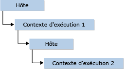

# <a name="targeting-edge-vs-legacy-engines-in-jsrt-apis"></a>Ciblage du moteur Edge ou des moteurs hérités dans les API JsRT
Dans la logique de la stratégie du navigateur de Windows 10 de prendre en charge un nouveau moteur de rendu Edge, le moteur Chakra (JavaScript) a été modifié dans Windows 10 pour offrir une prise en charge de deux moteurs Chakra différents :  
  
-   L'ancien moteur Chakra (également appelé *moteur hérité* ou jscript9.dll, comme ci-dessous), inclus dans Internet Explorer 11. Ce moteur, figé dans le temps, restera fondamentalement le même après la version Win8.1/IE11.  
  
-   Le nouveau moteur Chakra (également appelé *moteur Edge* ou chakra.dll, comme ci-dessous), inclus dans le nouveau navigateur Microsoft Edge de Windows 10. Ce moteur est continuellement mis à jour et prend en charge un moteur [Edge](http://blogs.msdn.com/b/ie/archive/2014/11/11/living-on-the-edge-our-next-step-in-interoperability.aspx) « vivant ». À la différence du moteur hérité, un moteur Edge « vivant » implique que le moteur Edge ne propose aucune fonctionnalité de script de contrôle de version, sous quelque forme que ce soit.  
  
 Quand vous créez une application à l'aide de l'API d'hébergement JsRT (JavaScript Runtime), vous pouvez choisir de cibler le moteur hérité ou le moteur Edge.  
  
-   Si la compatibilité descendante de vos applications existantes est votre préoccupation majeure, ciblez le moteur hérité.  
  
-   Si vous voulez que votre application puisse évoluer et prendre en charge les nouvelles fonctionnalités JavaScript qui seront publiées (par exemple, ECMAScript 6), ciblez le moteur Edge.  
  
 Cette rubrique fournit des informations détaillées sur le ciblage des différents moteurs.  
  
## <a name="target-your-preferred-version"></a>Cibler votre version préférée  
 Quand vous créez une application, vous pouvez choisir la version JsRT qui prend en charge le moteur Edge ou le moteur hérité. Pour vous aider dans ce choix, suivez les conseils donnés précédemment. Pour prendre en compte ces différences, nous avons apporté les modifications suivantes à `JsCreateRuntime`, `JsCreateContext`et `JsStartDebugging`.  
  
 Pour `JsCreateRuntime`:  
  
-   Si vous ciblez le moteur hérité, la valeur d'énumération `JsRuntimeVersionEdge` est déconseillée, et un message vous proposera d'utiliser la valeur `JsRuntimeVersionInternetExplorer11` à la place.  
  
-   Si vous ciblez le moteur Edge, le paramètre version n'est pas spécifié dans la fonction `JsCreateRuntime` .  
  
    ```cpp  
    JsErrorCode JsCreateRuntime(JsRuntimeAttributes attributes, JsThreadServiceCallback callback, _Out_ JsRuntimeHandle* runtime);  
    ```  
  
 Pour `JsCreateContext` et `JsStartDebugging`:  
  
-   Si vous ciblez le moteur hérité, l'interface `IDebugApplication` est utilisée pour fournir vos propres méthodes de débogage non distant. Pour le débogage, les fonctions `JsCreateContext` et `JsStartDebugging` acceptent le paramètre `IDebugApplication` .  
  
-   Si vous ciblez le moteur Edge, l'interface `IDebugApplication` est déconseillée. Le moteur Chakra offre des fonctionnalités de débogage natif et de script avec le débogueur Visual Studio, sans que l'utilisateur ne doive implémenter `IDebugApplication` . L'interface n'est plus un paramètre pour `JsCreateContext` et donc pour `JsStartDebugging` .  
  
 Les signatures pour les API précédentes dans le moteur hérité sont les suivantes :  
  
```cpp  
JsErrorCode JsCreateRuntime(JsRuntimeAttributes attributes, JsRuntimeVersion version, JsThreadServiceCallback callback, _Out_ JsRuntimeHandle* runtime);  
  
JsErrorCode JsCreateContext(JsRuntimeHandle runtime, IDebugApplication *debugApplication, JsContextRef *newContext);  
  
JsErrorCode JsStartDebugging(IDebugApplication *debugApplication);  
```  
  
 Les signatures pour les API précédentes dans le moteur Edge sont les suivantes :  
  
```cpp  
JsErrorCode JsCreateRuntime(JsRuntimeAttributes attributes, JsThreadServiceCallback callback, _Out_ JsRuntimeHandle* runtime);  
  
JsErrorCode JsCreateContext(JsRuntimeHandle runtime, JsContextRef *newContext);  
  
JsErrorCode JsStartDebugging();  
```  
  
## <a name="compile-for-your-preferred-version-using-visual-c"></a>Compiler votre version préférée à l'aide de Visual C++  
 Dans Visual C++, importez l'API JsRT en incluant l'en-tête jsrt.h et vérifiez que jsrt.lib figure dans votre liste de fichiers d'entrée de l'éditeur de liens :  
  
```cpp  
#include <jsrt.h>  
```  
  
   
  
 Si vous souhaitez cibler les binaires du moteur Edge, vous devez définir la macro `USE_EDGEMODE_JSRT` avant d'inclure jsrt.h, et créer une liaison à chakrart.lib au lieu de jsrt.lib :  
  
```cpp  
#define USE_EDGEMODE_JSRT  
#include <jsrt.h>  
```  
  
   
  
 Si vous débutez avec une nouvelle application, vous êtes maintenant prêt à commencer à écrire du code pour l’API JsRT.  
  
## <a name="compile-for-your-preferred-version-using-net"></a>Compiler votre version préférée à l'aide de .NET  
 Si vous utilisez .NET et P/Invoke, vous devez modifier les déclarations [DllImport] de l’API JsRT pour importer chakra.dll au lieu de jscript9.dll. Modifiez également la définition de `JsCreateRuntime` pour supprimer le paramètre `JsRuntimeVersion` , ainsi que la définition de `JsCreateContext` et `JsStartDebugging` pour supprimer le paramètre `IDebugApplication` .  
  
 Pour le moteur hérité, utilisez le code suivant.  
  
```c#  
[DllImport("jscript9.dll")]  
public static extern JsErrorCode JsCreateRuntime(  
    JsRuntimeAttributes attributes,  
    JsRuntimeVersion version,  
    JsThreadServiceCallback callback,  
    out JsRuntimeSafeHandle runtime  
);  
  
[DllImport("jscript9.dll")]  
public static extern JsErrorCode JsCreateContext(  
    JsRuntimeSafeHandle runtime,  
    IDebugApplication debugApplication,  
    out JsContextRef newContext  
);   
  
[DllImport("jscript9.dll")]  
public static extern JsErrorCode JsStartDebugging(  
    IDebugApplication debugApplication,  
);  
```  
  
 Pour le moteur Edge, utilisez le code suivant.  
  
```c#  
[DllImport("chakra.dll")]  
public static extern JsErrorCode JsCreateRuntime(  
    JsRuntimeAttributes attributes,  
    JsThreadServiceCallback callback,  
    out JsRuntimeSafeHandle runtime  
);  
  
[DllImport("chakra.dll")]  
public static extern JsErrorCode JsCreateContext(  
    JsRuntimeSafeHandle runtime,  
    out JsContextRef newContext  
);   
  
[DllImport("chakra.dll")]  
public static extern JsErrorCode JsStartDebugging();  
```  
  
> [!CAUTION]
>  Si vous marshalez manuellement le pointeur de fonction (par exemple, via LoadLibrary/GetProcAddress), vous ne devez pas combiner les déclarations de la méthode. Sinon, vous créez un déséquilibre de la pile, ce qui entraîne un comportement imprévisible, tel que le blocage de votre application. Le même problème se produit si vous effectuez une opération globale de recherche et de remplacement des instances de jscript9.dll dans votre code d’importation, car le paramètre `version` déposé n’est pas détecté.  
  
## <a name="summary"></a>Résumé  
 Dans Windows 10, les API hébergeant JavaScript Runtime sont divisées en deux. Ces API prennent désormais en charge un moteur Edge « vivant », dont les fonctionnalités de langage seront alignées sur le moteur Edge « vivant » dans Microsoft Edge. Vous pouvez optimiser ces fonctionnalités de votre Bureau ou des applications de Store pour offrir de nouvelles façons intéressantes d'étendre votre application et d'enrichir votre base de code existante avec les possibilités web actuelles. Il existe toutefois des différences subtiles entre les versions précédentes. Gardez à l'esprit les points suivants quand vous ciblez le moteur Edge ou le moteur hérité.  
  
-   Votre application ne peut prendre en charge qu'une seule version de JsRT par processus.  
  
     Par exemple, vous ne pouvez pas créer un runtime du moteur Edge, puis un runtime du moteur hérité, et vous attendre à ce qu’ils soient exécutés correctement dans le même processus. Cela n'est pas pris en charge et peut entraîner un comportement non documenté, tel que l'échec du chargement de la deuxième DLL.  
  
-   Si vous ciblez le moteur Edge, votre application risque d'acquérir de nouvelles fonctionnalités de manière inattendue au moment où la plateforme sous-jacente est automatiquement mise à jour.  
  
     Par exemple, le mode Internet Explorer 11 du runtime hérité prend en charge les déclarations de variable à portée de bloc, telles que `let` et `const`. Si le contrôle automatique des versions du moteur Edge était le comportement standard, le code qui fonctionnait dans le mode Internet Explorer 10, qui n'utilisait pas de règles de portée de bloc, pouvait ne plus s'exécuter aussi bien après la mise à jour automatique de la plateforme. C'est un facteur à prendre en compte dans le choix du modèle d'exécution à utiliser. Nous vous encourageons à cibler le moteur Edge autant que possible, mais assurez-vous quand même de ne pas utiliser des structures de code JavaScript qui risquent de ne plus être valides dans le futur.  
  
-   JsRT pour le Windows Store prend uniquement en charge le moteur Edge (chakra.dll). Les applications qui tentent d'établir une liaison à l'une des API JsRT dans jscript9.dll n'obtiendront pas la certification.  
  
-   Il est très important de ne pas confondre pas la déclaration de `JsCreateRuntime`, `JsCreateContext`et `JsStartDebugging` entre jscript9.dll et chakra.dll, car cela entraînerait un déséquilibre de la pile.  
  
     Dans C et C++, l’éditeur de liens affiche une erreur si vous essayez d’utiliser la mauvaise déclaration, sauf si vous effectuez une opération telle qu’un appel à `LoadLibrary` puis à `GetProcAddress`. Les développeurs .NET risquent de ne pas détecter ce problème aussi facilement. Vérifiez donc attentivement votre code si vous utilisez cette fonctionnalité.  
  
## <a name="see-also"></a>Voir aussi  
 [Hébergement JavaScript Runtime](../chakra-hosting/javascript-runtime-hosting.md)